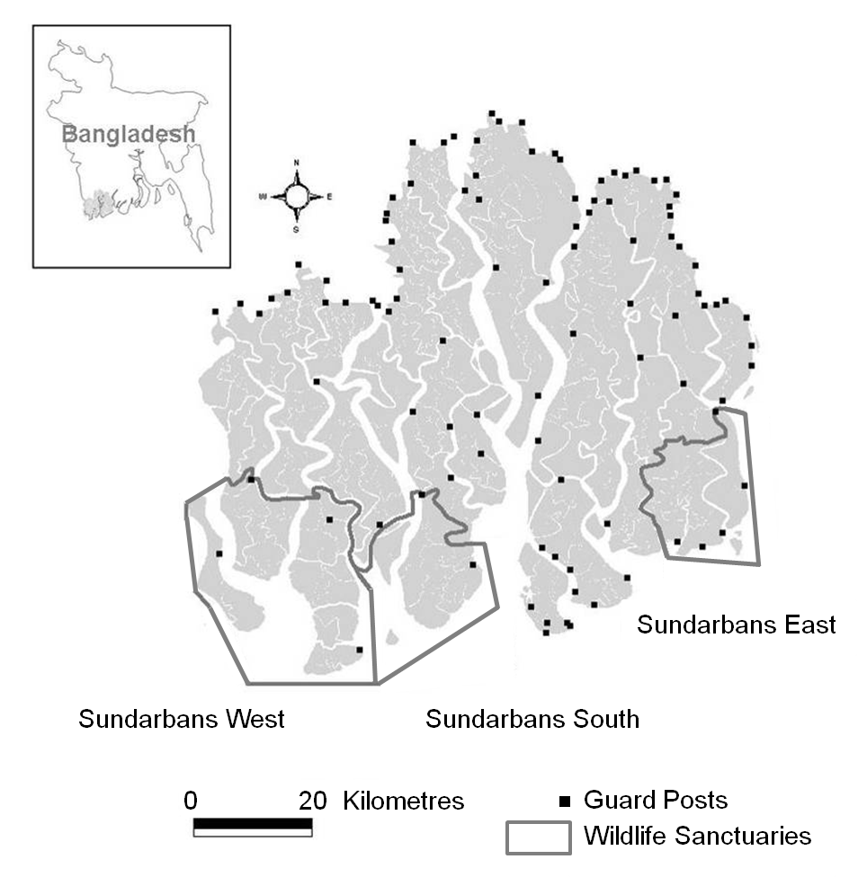
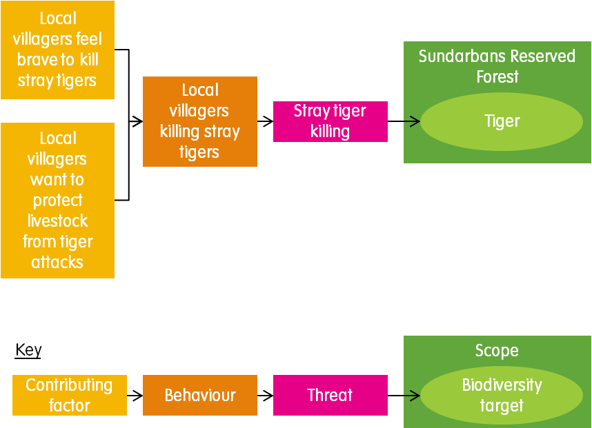
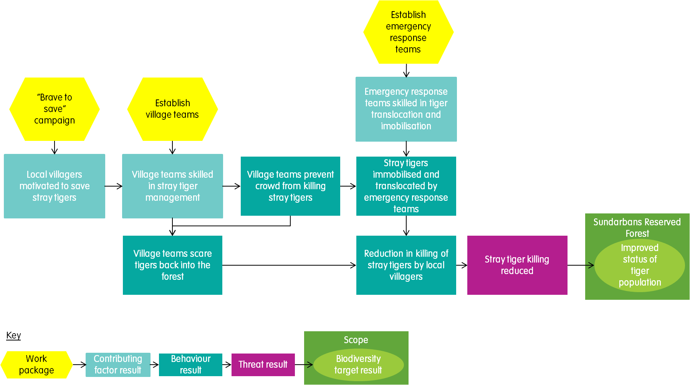
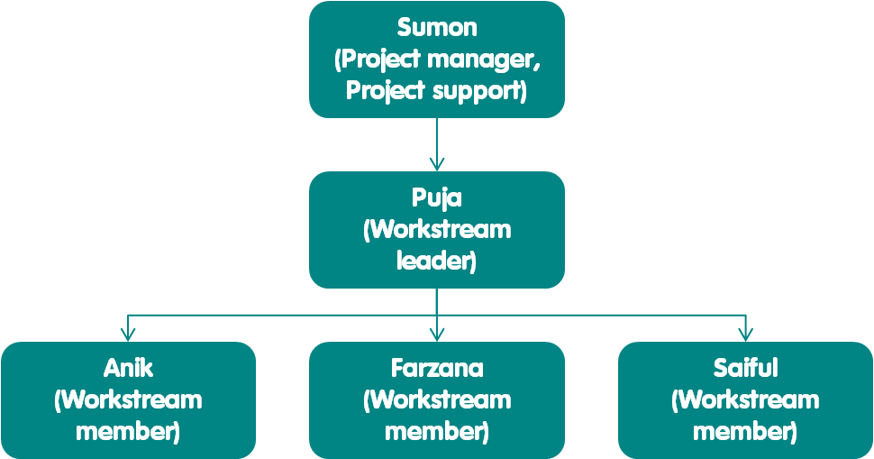
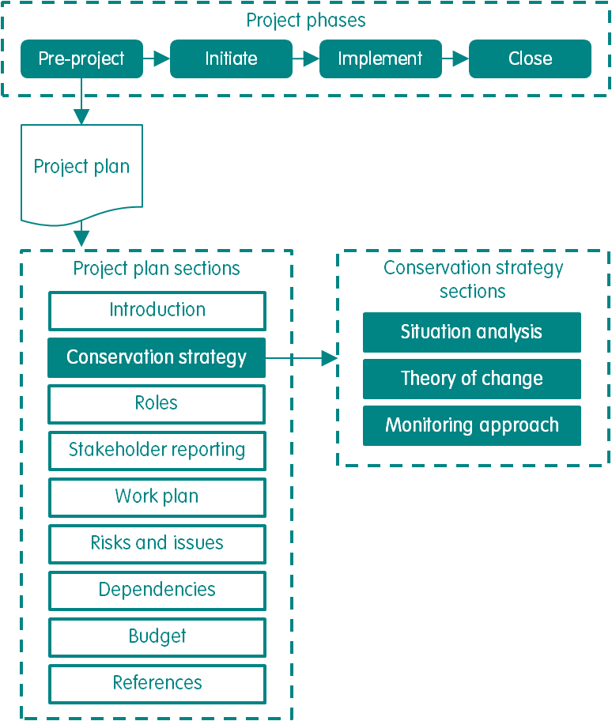
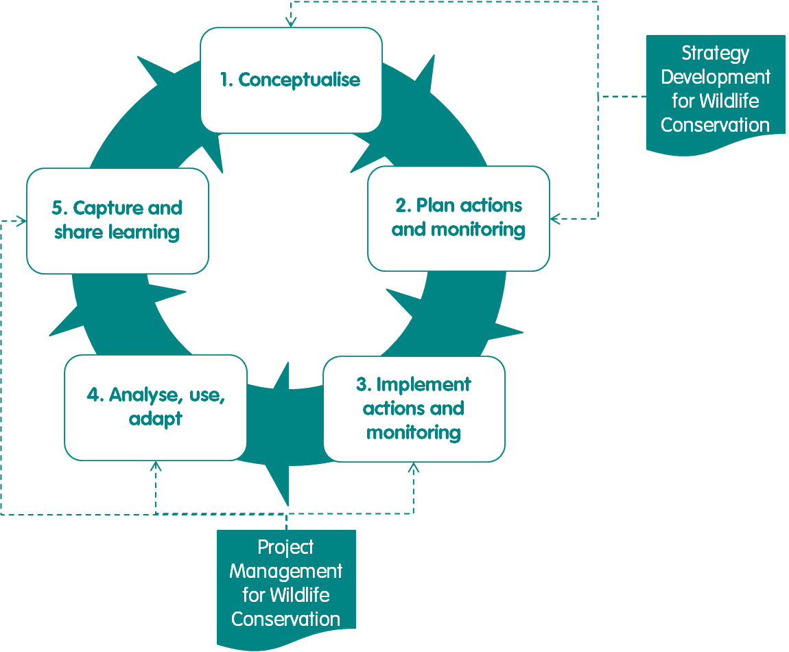

# Apendices

### 1.-Ejemplo de Plan de proyecto

Este plan de proyecto de ejemplo ilustra el tipo de captura de contenido en cada sección del plan de proyecto. A los efectos de este ejemplo, se han omitido algunas secciones del plan del proyecto \(introducción, presupuesto y referencias\) y no se citan fuentes de información. cited. Solo se utiliza un pequeño número de entradas en cada sección como contenido ilustrativo. Las definiciones de todos los términos utilizados en la sección de estrategia de conservación del plan del proyecto se proporcionan en el enfoque de Desarrollo de estrategia para la conservación de la vida silvestre \[7\].

#### 1.1.- Estrategia de conservación

**1.1.1.- Análisis situacional**

El alcance del proyecto se muestra en la Figura 26, el modelo conceptual de análisis de situación se muestra en la Figura 27 y la evaluación de amenazas se detalla en la Tabla 9.

Figura 26. El bosque reservado de Sundarbans de Bangladesh.

Figura 27. Situación Análisis Conceptual Modelo. Cuadro 9. Amenazas Evaluación.

Tabla 9 Evalucaion de amenaza

<table>
  <thead>
    <tr>
      <th style="text-align:left">Amenaza</th>
      <th style="text-align:left">Grado</th>
      <th style="text-align:left">Severidad</th>
      <th style="text-align:left">Irreversibilidad</th>
      <th style="text-align:left">Magnitud</th>
      <th style="text-align:left">Clasificaci&#xF3;n</th>
      <th style="text-align:left">Fuente de informaci&#xF3;n y fundamento para la clasificaci&#xF3;n</th>
    </tr>
  </thead>
  <tbody>
    <tr>
      <td style="text-align:left">Asesinato de tigres callejeros</td>
      <td style="text-align:left">L</td>
      <td style="text-align:left">M</td>
      <td style="text-align:left">H</td>
      <td style="text-align:left">L</td>
      <td style="text-align:left">L</td>
      <td style="text-align:left">
        
<b>Alcance:</b> n&#xFA;mero relativamente bajo de tigres afectados, seg&#xFA;n
          los registros de conflicto entre humanos y tigres

        
<b>Gravedad:</b> De los que tigres afectados, aproximadamente 1 de cada
          2 tigres muertos o heridos

        
<b>Irreversibilidad:</b> Matar a tigres callejeros profundamente inmersos
          en la cultura Local

      </td>
    </tr>
  </tbody>
</table>

Nota: L a bajo, M a medio, H a alto. Los criterios para las puntuaciones y calificaciones de la evaluación de amenazas se proporcionan en el enfoque de Desarrollo de estrategias para la conservación de la vida silvestre \[8\].

**1.1.2.- Teoría del cambio**

La teoría del cambio se muestra en la Figura 28.

Figura 28. Teoría del cambio.

**1.1.3.- Estrategia de monitoreo**

La estrategia de monitoreo se detalla en el Cuadro 10.

Cuadro 10. Estrategia de monitoreo.

<table>
  <thead>
    <tr>
      <th style="text-align:left">Resultado</th>
      <th style="text-align:left">Objetivo</th>
      <th style="text-align:left">Menor tolerancia</th>
      <th style="text-align:left">Tolerancia superior</th>
      <th style="text-align:left">Indicador</th>
      <th style="text-align:left">M&#xE9;todo</th>
    </tr>
  </thead>
  <tbody>
    <tr>
      <td style="text-align:left">Equipos de aldea expertos en gesti&#xF3;n de tigres callejeros tiger management</td>
      <td
      style="text-align:left">
        
Para 2020, 80%

        
de los miembros del equipo de aldea existentes expertos en la gesti&#xF3;n
          de tigres callejeros tiger management

        </td>
        <td style="text-align:left">-10%</td>
        <td style="text-align:left">+20%</td>
        <td style="text-align:left">
          
N&#xFA;mero de miembros del equipo de la aldea que pasanhabilidades de
            gesti&#xF3;n de tigres extraviados

          
Evaluaci&#xF3;n

        </td>
        <td style="text-align:left">Evaluaci&#xF3;n de habilidades</td>
    </tr>
    <tr>
      <td style="text-align:left">
        
Los equipos de aldea evitan que la multitud mate

        
tigres perdidos

      </td>
      <td style="text-align:left">
        
Para 2020, 60%

        
de tigres callejeros

        
no asesinado por la multitud

      </td>
      <td style="text-align:left">-20%</td>
      <td style="text-align:left">+20%</td>
      <td style="text-align:left">N&#xFA;mero de tigres callejeros muertos por la multitud</td>
      <td style="text-align:left">Encuesta de registros gubernamentales</td>
    </tr>
  </tbody>
</table>

#### 1.2.- Roles

Los roles asignados y la disposición de administración de líneas se muestran en la Figura 29.

Figura 29. Funciones y gestión de líneas.

#### 1.3.- Informes de partes interesadas

Los informes de las partes interesadas se detallan en el Cuadro 11.

Cuadro 11. Informes de partes interesadas.

<table>
  <thead>
    <tr>
      <th style="text-align:left">Partes interesadas</th>
      <th style="text-align:left">Medios de comunicaci&#xF3;n</th>
      <th style="text-align:left">Notas</th>
    </tr>
  </thead>
  <tbody>
    <tr>
      <td style="text-align:left">
        
Bosque

        
Departamento

      </td>
      <td style="text-align:left">
        
Informes trimestrales de estado

        
Informes anuales de situaci&#xF3;n

      </td>
      <td style="text-align:left">
        
Entregar copias impresas a la cabeza

        
Oficina

      </td>
    </tr>
    <tr>
      <td style="text-align:left">
        
Pueblo village local

        
Comit&#xE9;s

      </td>
      <td style="text-align:left">Informes anuales de situaci&#xF3;n</td>
      <td style="text-align:left">
        
Entregar a trav&#xE9;s de la presentaci&#xF3;n

        
y copia impresa

      </td>
    </tr>
  </tbody>
</table>

#### 1.4.- Plan de trabajo

Los hitos para el año 2 se detallan en la Tabla 12.

**Cuadro 12. Hitos.**

<table>
  <thead>
    <tr>
      <th style="text-align:left">Workstream</th>
      <th style="text-align:left">Paquete de trabajo</th>
      <th style="text-align:left">Hito</th>
      <th style="text-align:left">Mes</th>
      <th style="text-align:left"></th>
      <th style="text-align:left"></th>
      <th style="text-align:left"></th>
      <th style="text-align:left"></th>
      <th style="text-align:left"></th>
      <th style="text-align:left"></th>
      <th style="text-align:left"></th>
      <th style="text-align:left"></th>
      <th style="text-align:left"></th>
      <th style="text-align:left"></th>
      <th style="text-align:left"></th>
    </tr>
  </thead>
  <tbody>
    <tr>
      <td style="text-align:left">1</td>
      <td style="text-align:left">2</td>
      <td style="text-align:left">3</td>
      <td style="text-align:left">4</td>
      <td style="text-align:left">5</td>
      <td style="text-align:left">6</td>
      <td style="text-align:left">7</td>
      <td style="text-align:left">8</td>
      <td style="text-align:left">9</td>
      <td style="text-align:left">10</td>
      <td style="text-align:left">11</td>
      <td style="text-align:left">12</td>
      <td style="text-align:left"></td>
      <td style="text-align:left"></td>
      <td style="text-align:left"></td>
    </tr>
    <tr>
      <td style="text-align:left">Empoderamiento de la comunidad</td>
      <td style="text-align:left">Campa&#xF1;a &quot;Brave to save&quot;</td>
      <td style="text-align:left">
        
Talleres para capacitar a 2 x aldeanos expertos como l&#xED;deres de campa&#xF1;a
          en cada una de las 20 aldeas

        
&#xED;ntegro

      </td>
      <td style="text-align:left"></td>
      <td style="text-align:left">X</td>
      <td style="text-align:left"></td>
      <td style="text-align:left"></td>
      <td style="text-align:left"></td>
      <td style="text-align:left"></td>
      <td style="text-align:left"></td>
      <td style="text-align:left"></td>
      <td style="text-align:left"></td>
      <td style="text-align:left"></td>
      <td style="text-align:left"></td>
      <td style="text-align:left"></td>
    </tr>
    <tr>
      <td style="text-align:left">
        
Mensaje message de campa&#xF1;a

        
carteles desplegados en 40 aldeas

      </td>
      <td style="text-align:left"></td>
      <td style="text-align:left"></td>
      <td style="text-align:left"></td>
      <td style="text-align:left"></td>
      <td style="text-align:left"></td>
      <td style="text-align:left">X</td>
      <td style="text-align:left"></td>
      <td style="text-align:left"></td>
      <td style="text-align:left"></td>
      <td style="text-align:left"></td>
      <td style="text-align:left"></td>
      <td style="text-align:left"></td>
      <td style="text-align:left"></td>
      <td style="text-align:left"></td>
    </tr>
    <tr>
      <td style="text-align:left">
        
Espect&#xE1;culos en vivo completos en

        
20 aldeas

      </td>
      <td style="text-align:left"></td>
      <td style="text-align:left"></td>
      <td style="text-align:left"></td>
      <td style="text-align:left"></td>
      <td style="text-align:left"></td>
      <td style="text-align:left"></td>
      <td style="text-align:left"></td>
      <td style="text-align:left"></td>
      <td style="text-align:left"></td>
      <td style="text-align:left">X</td>
      <td style="text-align:left"></td>
      <td style="text-align:left"></td>
      <td style="text-align:left"></td>
      <td style="text-align:left"></td>
    </tr>
  </tbody>
</table>

#### 

#### 1.5.- Riesgos y problemas

Los riesgos y los problemas se detallan en el Cuadro 13.

Cuadro 13.Riesgos y problemas.

<table>
  <thead>
    <tr>
      <th style="text-align:left">Tipo</th>
      <th style="text-align:left">Workstream</th>
      <th style="text-align:left">Paquete de trabajo</th>
      <th style="text-align:left">Descripci&#xF3;n</th>
      <th style="text-align:left">Causa</th>
      <th style="text-align:left">Efecto</th>
      <th style="text-align:left">Probabilidad de ocurrir</th>
      <th style="text-align:left">Efecto</th>
      <th style="text-align:left">Enfoque</th>
      <th style="text-align:left">Respuesta</th>
      <th style="text-align:left"></th>
      <th style="text-align:left"></th>
      <th style="text-align:left"></th>
    </tr>
  </thead>
  <tbody>
    <tr>
      <td style="text-align:left">Impacto</td>
      <td style="text-align:left">Horario</td>
      <td style="text-align:left">Presupuesto</td>
      <td style="text-align:left">Clasificaci&#xF3;n</td>
      <td style="text-align:left"></td>
      <td style="text-align:left"></td>
      <td style="text-align:left"></td>
      <td style="text-align:left"></td>
      <td style="text-align:left"></td>
      <td style="text-align:left"></td>
      <td style="text-align:left"></td>
      <td style="text-align:left"></td>
      <td style="text-align:left"></td>
    </tr>
    <tr>
      <td style="text-align:left">Risk</td>
      <td style="text-align:left">Empoderamiento de la comunidad</td>
      <td style="text-align:left">Establecer equipos de aldea</td>
      <td style="text-align:left">Existe el riesgo de que las habilidades de los miembros del equipo de
        la aldea se pierdan con el tiempo.</td>
      <td style="text-align:left">Esto se debe a la rotaci&#xF3;n de los miembros del equipo de la aldea,
        y a la lenta olvido de las habilidades con el tiempo.</td>
      <td style="text-align:left">
        
Esto podr&#xED;a resultar en un porcentaje reducido de los miembros del
          equipo de la aldea expertos en tigres callejeros

        
Administraci&#xF3;n.

      </td>
      <td style="text-align:left">Probable</td>
      <td style="text-align:left">M</td>
      <td style="text-align:left">L</td>
      <td style="text-align:left">L</td>
      <td style="text-align:left">M</td>
      <td style="text-align:left">Evitar</td>
      <td style="text-align:left">Llevar a cabo la formaci&#xF3;n de actualizaci&#xF3;n cada a&#xF1;o</td>
    </tr>
    <tr>
      <td style="text-align:left">Problema</td>
      <td style="text-align:left">Empoderamiento de la comunidad</td>
      <td style="text-align:left">Campa&#xF1;a &quot;Brave to save&quot;</td>
      <td style="text-align:left">
        
Existe un problema con respecto al suministro de carteles de la

        
Proveedor.

      </td>
      <td style="text-align:left">Esto se debe a que el proveedor no est&#xE1; entregando los carteles ordenados
        a tiempo.</td>
      <td style="text-align:left">
        
Esto ha dado lugar a un retraso en la exposici&#xF3;n de la poblaci&#xF3;n
          local a la campa&#xF1;a

        
Mensajes.

      </td>
      <td style="text-align:left">Cierto</td>
      <td style="text-align:left">M</td>
      <td style="text-align:left">M</td>
      <td style="text-align:left">M</td>
      <td style="text-align:left">M</td>
      <td style="text-align:left">Reducir</td>
      <td style="text-align:left">Cancelar contrato y asegurar nuevo proveedor</td>
    </tr>
  </tbody>
</table>

Notas: L a bajo, M a medio, H a alto. Los criterios para las puntuaciones bajas, medias y altas se proporcionan en el rastreador del proyecto.

#### 1.6.- Dependencias

Las dependencias se detallan en la Tabla 14.

Cuadro 14. Dependencias.

<table>
  <thead>
    <tr>
      <th style="text-align:left">Workstream</th>
      <th style="text-align:left">Paquete de trabajo</th>
      <th style="text-align:left">
        
Dependencia

        
Nivel

      </th>
      <th style="text-align:left">Tipo</th>
      <th style="text-align:left">Descripci&#xF3;n</th>
      <th style="text-align:left">Efecto</th>
    </tr>
  </thead>
  <tbody>
    <tr>
      <td style="text-align:left">Empoderamiento de la comunidad</td>
      <td style="text-align:left">Campa&#xF1;a &quot;Brave to save&quot;</td>
      <td style="text-align:left">Workstream</td>
      <td style="text-align:left">Entrante</td>
      <td style="text-align:left">&quot;Valiente para salvar&quot; campa&#xF1;a actividades de espect&#xE1;culo
        en vivo que dependen de obtener el permiso de lasautoridades locales para
        utilizar los terrenos de la escuela como lugares</td>
      <td style="text-align:left">Si esta dependencia no se realiza,, el impacto ser&#xE1; que los espect&#xE1;culos
        en vivo en algunas aldeas pueden no ser posibles, lo que puede afectar
        el n&#xFA;mero de aldeanos expuestos a los mensajes de la campa&#xF1;a</td>
    </tr>
    <tr>
      <td style="text-align:left">Proyecto</td>
      <td style="text-align:left">Saliente</td>
      <td style="text-align:left">Proyecto de guardianes forestales comunitarios dependiente de la campa&#xF1;a
        &quot;Brave to save&quot; para generar la motivaci&#xF3;n de los aldeanos
        para salvar a los tigres</td>
      <td style="text-align:left">to Si no se realiza esta dependencia, el impacto ser&#xE1; que, el impact
        will be that the proyecto de guardianes forestales comunitarios puede no
        ser capaz de obtener el compromiso suficiente de los aldeanos para alcanzar
        el impacto deseado del proyecto.</td>
      <td style="text-align:left"></td>
      <td style="text-align:left"></td>
    </tr>
  </tbody>
</table>

### 2.- Compatibilidad

#### 2.1.- Desarrollo de estrategias para la conservación de la vida silvestre

El enfoque pmWC es totalmente compatible con el enfoque de Desarrollo de Estrategia para la Conservación de la Vida Silvestre \(SDWC\), que es un enfoque de mejores prácticas para desarrollar una estrategia para el trabajo de conservación de cualquier escala, marco temporal o complejidad \[7\]. El enfoque del SDWC proporciona orientaciones detalladas sobre cómo desarrollar la sección de estrategia de conservación del plan del proyecto, que se crea durante la fase previa al proyecto \(Figura 30\) \[5, 7\].

Figura 30. La estrategia de conservación como parte del plan del proyecto desarrollado en la fase previa al proyecto de un proyecto de conservación. Nota: Estructura del plan de proyecto reproducida a partir de \[5\].

#### 2.2.- Los Estándares Abiertos para la Práctica de la Conservación

Las Normas Abiertas para la Práctica de Conservación \(en adelante Estándares Abiertos\) y los enfoques relacionados proporcionan orientación sobre cómo gestionar de manera adaptativa los proyectos de conservación \[4, 5, 7, 10\]. El enfoque PMWC y el desarrollo de estrategias para la conservación de la vida silvestre están diseñados para alinearse y ser compatibles con los 4 pasos del ciclo de Estándares Abiertos \[4\] \(Figura 31\).

Figura 31. Compatibilidad con los estándares abiertos.

Para admitir la compatibilidad, los enfoques de mejores prácticas de WildTeam comparten la mayor parte de su terminología con los Estándares Abiertos, pero con algunas excepciones \(Tabla 15\).

Cuadro 15. Diferencias en la terminología entre los Estándares Abiertos y wildTeam mejor practices.

<table>
  <thead>
    <tr>
      <th style="text-align:left">T&#xE9;rminos del Estandares Abiertos</th>
      <th style="text-align:left">T&#xE9;rminos de WildTeam</th>
    </tr>
  </thead>
  <tbody>
    <tr>
      <td style="text-align:left">Plan de acci&#xF3;n</td>
      <td style="text-align:left">Estrategia de conservaci&#xF3;n</td>
    </tr>
    <tr>
      <td style="text-align:left">Alcance (de una amenaza)</td>
      <td style="text-align:left">Grado</td>
    </tr>
    <tr>
      <td style="text-align:left">Objetivo/impacto/resultado</td>
      <td style="text-align:left">Objetivo</td>
    </tr>
    <tr>
      <td style="text-align:left">Estrategia</td>
      <td style="text-align:left">Paquete de trabajo</td>
    </tr>
    <tr>
      <td style="text-align:left">Audiencia</td>
      <td style="text-align:left">Grupo</td>
    </tr>
    <tr>
      <td style="text-align:left">
        
Factor/amenaza indirecta/causa ra&#xED;z/conductor/oportunidad/primaria

        
Intereses

      </td>
      <td style="text-align:left">Comportamiento/factor contribuyente</td>
    </tr>
    <tr>
      <td style="text-align:left">Resultado intermedio</td>
      <td style="text-align:left">Resultado de Comportamiento / Resultado del factor contribuyente</td>
    </tr>
    <tr>
      <td style="text-align:left">Resultado/objetivo</td>
      <td style="text-align:left">Resultado de la amenaza</td>
    </tr>
  </tbody>
</table>

Sin embargo, el enfoque PMWC se basa en los Estándares Abiertos al proporcionar orientación adicional sobre:

* **Aplicar principios,** que ayuda a mantener un proyecto centrado frente a la incertidumbre y las condiciones cambiantes
* **Asignación de roles,** que aclara la toma de decisiones y la gestión de líneas para todos los miembros del equipo del proyecto
* **Desglosar** **proyectos** **en** **fases,** para ayudar a garantizar que un proyecto tenga puntos de inicio y fin distintos
* **Uso de procesos de** **control,** para ayudar a los equipos de proyecto a mantener el control del progreso del proyecto

**Utilizando procesos de** **administración,** para ayudar a los equipos de proyecto a producir resultados de proyectos de alta calidad y tener una forma estandarizada de llevar a cabo y documentar las reuniones de proyectos.

### 3.- Referencias

1. WildTeam. 2015. Manual de Gestión de Proyectos. WildTeam Bangladesh, Dhaka.
2. OGC \(OGC \(Oficina de Comercio Gubernamental\). 2009. Gestión de Proyectos Exitosos con PRINCE2. TSO \(La Oficina de Papelería\).
3. PMI \(Project Management Institute\). 2013. Guía del Cuerpo de Conocimientos de Gestión de Proyectos \(Guía PMBOK\). Quinta edición. Instituto de Gestión de Proyectos.
4. CMP \(Conservation Measures Partnership\). 2013. Las Normas Abiertas para la Práctica de Conservación v3.0. Asociación de Medidas de Conservación, Washington, DC. Conservation
5. WildTeam. 2017. Gestión de Proyectos para la Conservación de La Vida Silvestre v2.0. WildTeam, Cornualles, Reino Unido.
6. Barlow, A., Greenwood Barlow, C., Boddam-Whetham, L., y Robinson, B. 2016. Una evaluación rápida de la situación actual de las habilidades de gestión de proyectos en elsector de conservation. Journal for Nature Conservation, 34:126-132.
7. Freeman, R. E. 1984. Gestión estratégica: Un enfoque de las partes interesadas. Boston: Pitman.
8. WildTeam. 2018. Desarrollo de estrategia para la conservación dela vida silvestre v1. Serie de Prácticas Recomendadas de Conservación de Vida Silvestre. WildTeam, Cornualles, Reino Unido.
9. TNC \(The Nature Conservancy\). 2007. Planificación de la acción de conservación: la conservación de la naturaleza. Arlington, VA.
10.  WWF \(Fondo Mundial para la Naturaleza\). 2007. Normas de programa de conservación y gestión de proyectos. Informe de WWF.

