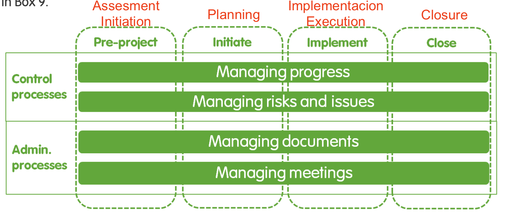

# Ciclo de vida de los proyectos

El ciclo de vida de los proyectos es un arreglo de 4 fases, diseñado con el propósito de guiar de principio a fin a los gerentes de proyecto.

El objetivo de las fases es permitir un mejor control de un proyecto. Al seguir las fases, se garantiza que las actividades de un proyecto no inicien sin la documentación, los recursos y el personal adecuado. El uso de las fases también asegura que haya un camino claro para llevar a cabo y cerrar el proyecto una vez que ha comenzado.

## ¿Cuáles son las 4 fases del ciclo de vida del proyecto?

Un proyecto se divide en 4 fases: Evaluación, Planificación, Ejecución y Cierre. Cada fase contiene un conjunto de hitos específicos que deben completarse antes de que pueda comenzar la siguiente fase. 

* **Fase de Evaluación:** se comprenden los objetivos, las prioridades, los plazos y los riesgos del proyecto.
* **Fase de Planificación**: se describen las tareas y el cronograma necesarios para ejecutar el proyecto. 
* **Fase de Ejecución**: el plan se convierte en acción y se monitorea el desempeño del proyecto.
* **Fase de Cierre:** se analizan los resultados, se resumen los aprendizajes clave y se planifican los próximos pasos.

En las siguientes secciones se describe los hitos a emprender en cada fase y se proporciona orientación sobre cómo se puede lograr cada uno de esos hitos, incluida la referencia cruzada a los procesos de control y administrativos a los que están vinculados los hitos de cada fase \(Figura 11\). 

