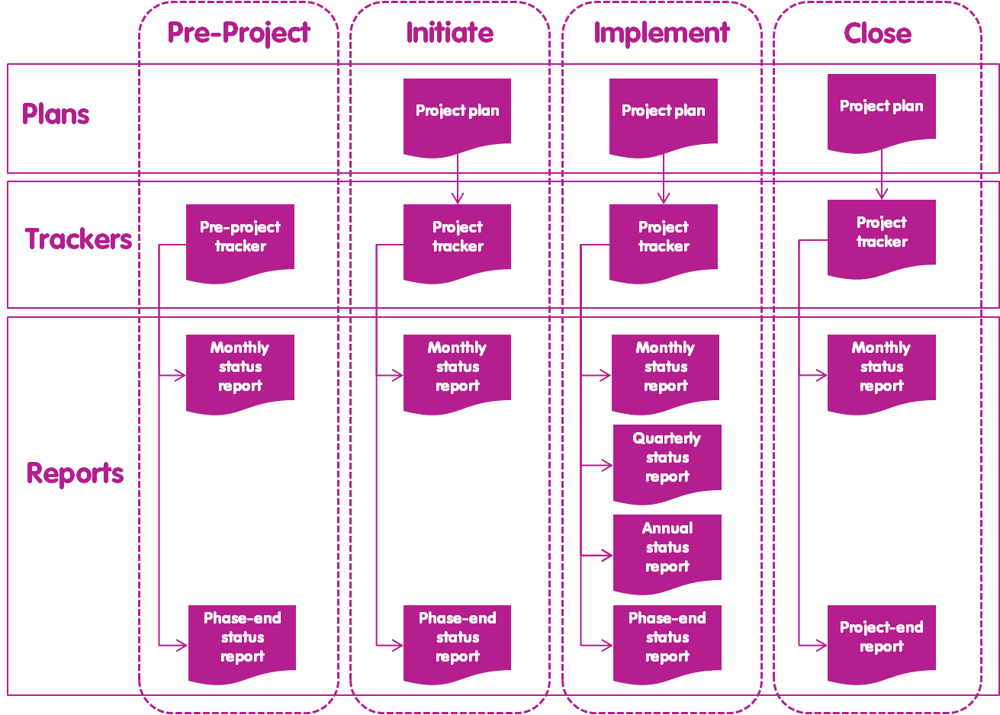

# Documentos

### 1.- Visión general

El propósito del componente Documentos es proporcionar un medio estandarizado para documentar la planificación, implementación, evaluación e informes de un proyecto. There Hay 3 tipos de documentos de proyecto: planes \(para documentar lo que el proyecto pretende lograr y cómo\), rastreadores \(para monitorear el progreso en el plan\) e informes \(para proporcionar instantáneas de progreso en el plan\) \[2\]. La relación entre el plan principal, los rastreadores y los informes por fase se describe en la Figura 25.

Figura 25. Utilización y relación entre los principales documentos del proyecto para cada fase. Nota: La distribución anterior de los informes es ilustrativa, ya que los informes de estado trimestrales y anuales pueden ser necesarios para todas las fases, dependiendo de la longitud de la fase. También se puede generar un informe de excepción en cualquier etapa durante la fase de implementación. Del mismo modo, los informes de auditoría de Assurance y de auditoría de operaciones se pueden generar según sea necesario durante la fase de implementación.

En esta sección se describe el propósito y el contenido de cada documento. Las instrucciones sobre cómo se puede crear el contenido de cada documento se proporcionan dentro de las plantillas de documento de proyecto respectivas. En el recuadro 19 se describen las orientaciones sobre cómo se pueden adaptar los documentos.

### 2.- Planes

#### 2.1.- Plan de proyecto

El propósito del plan de proyecto es proporcionar la línea de base con respecto a la cual el proyecto puede ser evaluado y controlado \[1\]. El plan del proyecto se compone de las siguientes secciones:

* **Introducción:** Una visión general de los antecedentes del proyecto, por ejemplo, Programa es una parte de y el plazo De el Proyecto
* **Estrategia de conservación:** Compuesto por el análisis de la situación, la teoría del cambio y el enfoque de monitoreo \[9\]
* **Roles:** Detallar la asignación y la disposición de gestión de líneas de todos los roles de proyecto
* **Informes de las partes** interesadas: Una tabla que muestra el tipo y la frecuencia de los informes a las principales partes interesadas del proyecto
* **Plan de trabajo:** Esquema del calendario de los principales hitos del proyecto para el año en curso \(revisado al inicio de cada año del proyecto\)
* **Riesgos y cuestiones:** Una lista preliminar y análisis de los principales riesgos y cuestiones del proyecto
* **Dependencias:** una lista de todas las principales dependencias del proyecto \(recuadro 20\)
* **Presupuesto:** Un presupuesto global para el período completo del proyecto y un presupuesto detallado para el año en curso \(revisado al inicio de cada año del proyecto\)
* **Referencias**: Fuentes de evidencia para la información presentada en el plan del proyecto.

<table>
  <thead>
    <tr>
      <th style="text-align:left"><b>Recuadro 20. Dependencias</b>
      </th>
    </tr>
  </thead>
  <tbody>
    <tr>
      <td style="text-align:left">
        
Las dependencias puede ser dependencias entrantes o salientes: Saliente

        
Dependencias entrantes: cosa o cualquier persona fuera del proyecto es
          la que se basa el proyecto para tener &#xE9;xito. Por ejemplo, el paquete
          de trabajo educativo de un proyecto puede depender del desarrollo oportuno
          de los libros escolares por parte de una empresa editorial.

        
Dependencias salientes: instancias en las que otro proyecto o persona
          tiene una dependencia del proyecto en cuesti&#xF3;n. Por ejemplo. el proyecto
          est&#xE1; desarrollando una aplicaci&#xF3;n de telefon&#xED;a m&#xF3;vil
          para registrar los delitos contra la vida silvestre que es necesario para
          otro proyecto que est&#xE1; estableciendo una red de inteligencia de delitos
          contra la vida silvestre.

      </td>
    </tr>
  </tbody>
</table>

Además de las instrucciones proporcionadas en la plantilla del documento del plan de proyecto, se proporcionan orientaciones sobre cómo desarrollar la sección de estrategia de conservación del plan del proyecto en el enfoque de Desarrollo de estrategias para la conservación de la vida silvestre \[7\].

### 3.- Rastreos

#### 3.1.- Rastreo del pre-proyecto

El propósito del rastreo del Pre-proyecto es proporcionar al planificador de pre-proyecto una herramienta para planificar y realizar un seguimiento del progreso de la fase previa al proyecto \[1\]. El rastreador Pre-proyecto se compone de las siguientes secciones:

* Plan de trabajo
* Riesgos y problemas
* Dependencias
* Acciones y decisiones.

#### 3.2.- Rastreador de proyectos

El propósito del rastreador de proyectos es supervisar el progreso del proyecto durante las fases Iniciar, Implementar y Cerrar \[1\]. El rastreador de proyectos se compone de las siguientes secciones:

* Tablero
* Plan de trabajo
* Acciones y decisiones
* Riesgos y problemas
* Dependencias
* Lecciones aprendidas
* Funciones de gestión de proyectos
* Funciones de gestión de documentos
* Impacto
* Horario

Cabe destacar que el rastreador de proyectos no incluye una sección de presupuesto, porque el presupuesto se supervisa mejor a través de una hoja de cálculo o software independiente que se adapta a los requisitos contables particulares del proyecto u organización en cuestión.

#### 3.3.- Rastreador de revisiones de los documentos

El propósito del rastreador de revisión de documentos es documentar y supervisar los comentarios de revisión y las actualizaciones relacionadas con respecto a un documento que se está redactando \(consulte Proceso de gestión de documentos\). El rastreador de revisión de documentos se rellena con comentarios de revisión y actualizaciones generales con respecto al documento que se está redactando.

#### 3.4.- Rastreador de los documentos

El propósito del rastreador de documentos es permitir que el equipo del proyecto realice un seguimiento de qué versión firmada actual de cada documento debe ser referida y utilizada por el equipo del proyecto.

### 4.- Reportes

#### 4.1.- Reporte de Junta

El propósito este reporte es documentar formalmente la fecha, los objetivos, la asistencia, las acciones, las decisiones y las notas de las reuniones importantes del proyecto. La información de este reporte se captura en un documento de Word con las siguientes secciones:

* Título
* Fecha
* Asistentes
* Objetivos
* Agenda
* Decisiones
* Acciones
* Notas.

#### 4.2.- Reporte situacional mensual

El objetivo de este reporte es informar sobre el progreso del mes anterior y presentar un plan propuesto para el progreso en el próximo mes. El contenido de este informe se genera a partir del contenido del rastreador de proyectos. El informe de estado mensual se compone de las siguientes secciones:

* Resumen
* Progreso el mes pasado
* Progreso planificado el próximo mes
* Riesgos
* Cuestiones
* Lecciones aprendidas.

#### 4.3.- Reporte situacional trimestral

El objetivo de este reporte es informar sobre los progresos del trimestre anterior y presentar un plan propuesto para avanzar en el próximo trimestre. El contenido del informe de estado trimestral se genera a partir del contenido del rastreador de proyectos. El informe de estado trimestral se compone de las siguientes secciones:

* Resumen
* Impacto
* Progreso en el último trimestre
* Progreso planificado el próximo trimestre
* Riesgos
* Cuestiones
* Lecciones aprendidas
* Decisiones
* Presupuesto.

Cabe destacar que el reporte situacional trimestral \(o cualquier otro reporte situacional\) no incluye una sección de presupuesto, porque el presupuesto se informa por separado utilizando cualquier hoja de cálculo o software que utilice la organización que lidera el proyecto.

#### 4.4.- Reporte Situacional anual

El objetivo de este reporte es informar sobre los progresos del año anterior y presentar un plan propuesto para los progresos en el próximo año. Tiene las mismas secciones que el reporte situacional trimestral, con contenido ajustado para reflejar el período de tiempo del año.

#### 4.5.- Informe de final de fase

El objetivo del informe de fin de fase es documentar los progresos de la fase anterior y presentar un plan propuesto para avanzar en la siguiente fase. El informe de final de fase tiene las mismas secciones que el informe de estado trimestral, con contenido ajustado para reflejar las fases en lugar de los trimestres.

#### 4.6.- Informe de fin de proyecto

El propósito del informe de fin de proyecto es documentar los logros del proyecto con respecto al plan de proyecto firmado. El informe de fin de proyecto se compone de las siguientes secciones:

* Introducción
* Impacto
* Horario
* Presupuesto
* Cambios en el plan del proyecto
* Lecciones aprendidas
* Referencias.

#### 4.7.- Informe de excepción

El propósito del informe de excepción es describir y documentar qué tolerancia se ha superado o está en peligro de ser excedida. El informe De excepción tiene las mismas secciones que el informe de estado Trimestral.

#### 4.8.- Informe de auditoría de aseguramiento del proyecto

El propósito del informe de auditoría de garantía del proyecto es documentar la adhesión del proyecto al plan del proyecto \[1\]. El informe de auditoría de garantía de proyecto se compone de las mismas secciones que el plan de proyecto.

#### 4.9.- Informe de auditoría de aseguramiento de operaciones

El propósito del informe de auditoría de garantía de operaciones es documentar la adhesión del proyecto a las directivas de operaciones \[1\]. El contenido del informe de auditoría de control de operaciones se desarrolla evaluando si el proyecto se está llevando a cabo de acuerdo con las directivas de operaciones. Las secciones del informe de auditoría de control de operaciones se definirán mediante las directivas de operaciones en las que esté operando el proyecto.

<table>
  <thead>
    <tr>
      <th style="text-align:left"><b>Recuadro 19. Adaptaci&#xF3;n de documentos</b>
      </th>
    </tr>
  </thead>
  <tbody>
    <tr>
      <td style="text-align:left">
        
Como m&#xED;nimo, todos los los proyectos necesitan Onu rastreador previo
          al proyecto, Onu rastreador de proyectos, Onu Plan de proyectos y Onu informe
          de finalizaci&#xF3;n del proyecto. Los documentos restantes hijos y otros,
          dependiendo de las necesidades de un proyecto en Particular.

        
El nivel de detalle, la ten&#xE9; y el n&#xFA;mero/tipo de secciones de
          cada cada documento utilizado muy se puede adaptar para adaptarse Un las
          necesidades del proyecto u organizaci&#xF3;n. Por ejemplo, el Plan de proyecto
          m&#xE1;s b&#xE1;sico contendr&#xED;a una introducci&#xF3;n, una estrategia
          de conservaci&#xF3;n y un presupuesto, pero podr&#xED;a podr&#xED;a excluir
          las otros secciones. Del mismo modo, la versi&#xF3;n m&#xE1;s simplificada
          de Onu rastreador de proyectos podr&#xED;a podr&#xED;a estar compuesta
          por un plan de trabajo, Onu presupuesto y Onu impacto. El rastreador de
          proyectos muy se puede personalizar ocultando columnas y cambiando los
          nombres de columna y secci&#xF3;n. Todas las plantillas de Todo el documento
          documentos se puede actualizar de acuerdo con las directrices de marca
          de la organizaci&#xF3;n.

        
Los documentos de proyecto descritos en este documento se proporcionan
          como plantillas gratuitas sugeridas, listas para usar, que pueden ser &#xFA;tiles
          para proyectos que tienen pocos o ninguno de estos documentos en su lugar.
          Sin embargo, hay muchas plantillas de documentos de gesti&#xF3;n de proyectos
          y paquetes de software disponibles que un proyecto puede utilizar en lugar
          de los que se proporcionan en este manual.

      </td>
    </tr>
  </tbody>
</table>

