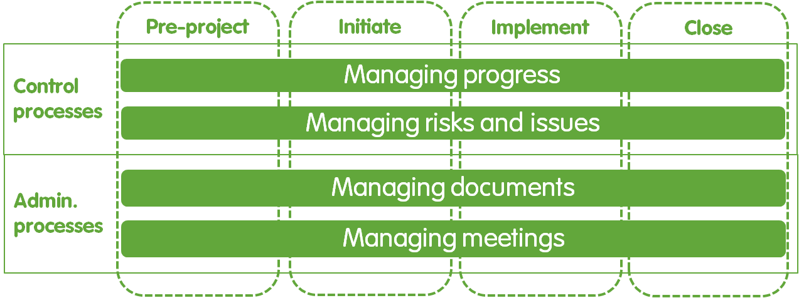
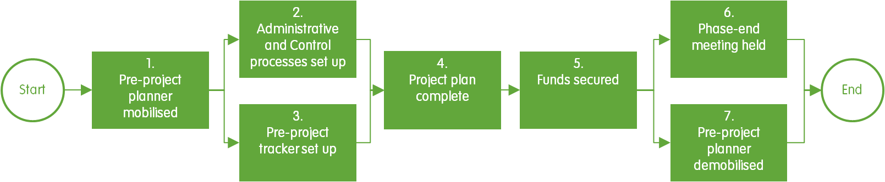
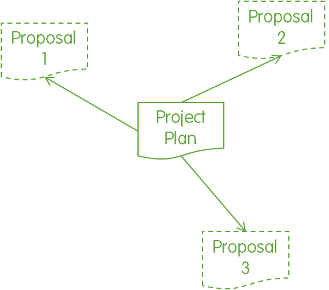
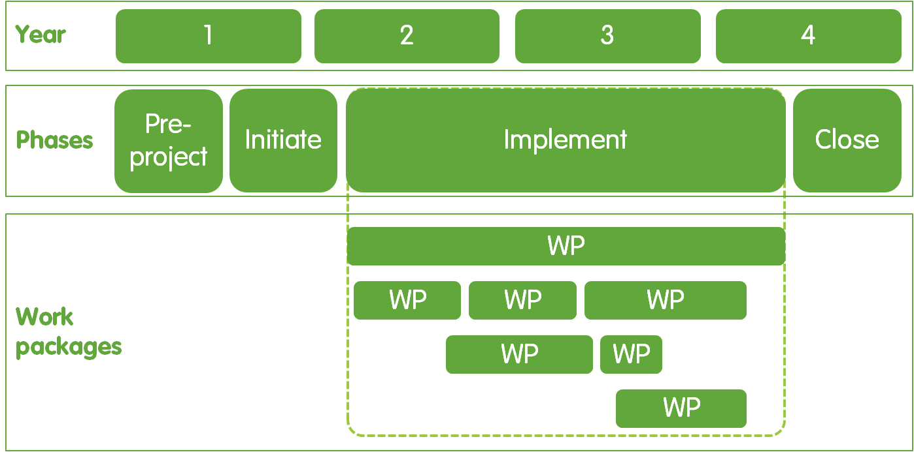
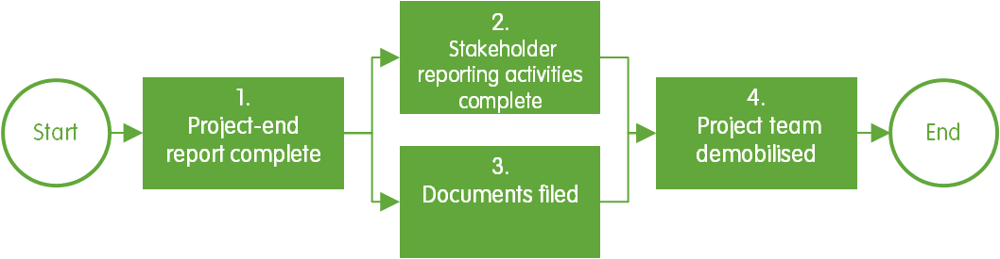

# Fases

### 1.- Visión general

El propósito de las fases es permitir un mejor control de un proyecto. Siguiendo las fases, por ejemplo, garantiza que las actividades de conservación de un proyecto no puedan comenzar sin la documentación adecuada, los fondos y el personal en su lugar. El uso de las fases también se asegura de que haya un camino claro para llevar a cabo y cerrar el proyecto una vez que ha comenzado.

Un proyecto se divide en 4 fases: Pre-proyecto, Iniciar, Implementar y Cerrar \(Figura 11\) \[1, 3\]. Cada fase contiene un conjunto de hitos específicos que deben completarse antes de que se pueda iniciar la siguiente fase \[2\]. En esta sección se describen los hitos notomados en cada fase y se proporciona orientación sobre cómo se puede lograr cada uno de esos hitos, incluida la referencia cruzada a los procesos de Control y Administrativo a los que están vinculados los hitos de fase \(Figura 11\). En el recuadro 9 se describen orientaciones sobre cómo se pueden adaptar las fases.

Figura 11. Relación entre fases, procesos de control y procesos administrativos.

### 2.- Pre-proyecto

#### 2.1.- Propósito

El propósito de la fase previa al proyecto es asegurarse de que está claro lo que el proyecto pretende lograr y cómo se logrará. Es importante destacar que la realización de esta fase también garantiza que el proyecto haya conseguido fondos suficientes antes de iniciar cualquier actividad de conservación \(Figura 12\) \[1\].

#### 2.2.- Proceso

Los hitos de la fase previa al proyecto se muestran en la Figura 12 y se describen a continuación.

Figura 12. Hitos de fase previas al proyecto

**2.2.1.- Planificador pre-proyecto movilizado**

El planificador previo al proyecto se moviliza y gestiona la línea del Ejecutivo. El planificador previo al proyecto es entonces responsable y lleva a cabo la gestión diaria de la fase previa al proyecto.

**2.2.2.- Procesos administrativos y de control establecidos**

El planificador previo al proyecto hace que los procesos administrativos funcionen para la fase previa al proyecto \(véase Procesos administrativos\). Del mismo modo, el planificador previo al proyecto hace que los procesos de Control funcionen, y los utiliza para mantener al Ejecutivo informado de los progresos y cualquier riesgo y problema que requiera atención \(véase Gestión de riesgos y problemas y Gestión de procesos de progreso\). La frecuencia de las reuniones e informes de situación depende de la duración de esta fase y de los requisitos del Ejecutivo.

**2.2.3.- Configuración del rastreador previo al proyecto**

El planificador prea proyecto configura el rastreador Pre-proyecto. El propósito del rastreador Pre-proyecto es proporcionar al planificador de pre-proyecto una herramienta para planificar y realizar un seguimiento del progreso de la fase previa al proyecto. En la Tabla 2 se detallan los roles para desarrollar el rastreador previo al proyecto. tracker.

Cuadro 2. Funciones para el desarrollo de documentos en la fase previa al proyecto.

| **Documento** | **Ejecutivo** | **Planificador pre-proyecto** |
| :--- | :--- | :--- |
| Rastreador previo al proyecto |  | P |
| Plan de proyecto | R, S | P |

Nota: S - Autoridad de cierre de sesión, R - Revisor, P - Productor.

**2.2.4.- Plan de proyecto completo**

El planificador de prea proyectos genera el plan de proyecto de acuerdo con el proceso Gestión de documentos. El plan del proyecto es el proyecto, desde la fase de inicio hasta, e incluyendo, la fase de cierre. El plan de proyecto firmado proporciona la línea de base con respecto a la cual se evalúa el progreso del proyecto. Una vez firmado, el plan del proyecto no se puede cambiar sin pasar por un proceso formal \(consulte Gestión de riesgos y problemas\). En la Tabla 2 se detallan las funciones para desarrollar el plan del proyecto.

**2.2.5.- Fondos Asegurado**

Si se requieren fondos, el planificador previo al proyecto utiliza el plan del proyecto como base para preparar y presentar propuestas de financiamiento, proposals, junto con el apoyo y la revisión del personal de Operaciones para asegurarse de que la propuesta se adhiere a las políticas de operaciones \(Figura 13\). adheres

Figura 13. Enlace entre el plan del proyecto y las propuestas de financiación.

A medida que los acuerdos de subvención se realizan a nivel organizativo, por lo general se firmarán el Líder. Operaciones supervisa la cuenta bancaria del proyecto e informa al planificador de pre-proyecto del monto y la fecha de llegada de los fondos. Es importante tener en cuenta que no es necesario asegurar todos los fondos del proyecto en esta etapa \(recuadro 10\).

| **Recuadro 10. ¿Cuánta financiación se necesita para iniciar un proyecto?** |
| :--- |
| Depende del Ejecutivo decidir qué nivel de fondos es suficiente para que el proyecto pase a la fase de inicio. Si un proyecto procede sin todos los fondos del proyecto garantizados, a continuación, \(a\) el proceso de gestión de riesgos y problemas se puede utilizar para hacer frente al riesgo de no asegurar los fondos restantes necesarios, y \(b\) se pueden hacer ajustes en el plan del proyecto, de modo que los paquetes de trabajo financiados actualmente se programen primero, y los paquetes de trabajo restantes se programen teniendo en cuenta el tiempo estimado necesario para asegurar los fondos a project proceeds without all pendientes. Después de la fase previa al proyecto, phase, el jefe de proyecto asumirá la responsabilidad de recaudar los fondos adicionales necesarios. |

**2.2.6.- Reunión de final de fase celebrada**

Al final de la fase previa al proyecto, el planificador previo al proyecto organiza una reunión de final de fase con el Ejecutivo. El propósito de esta reunión es que el planificador previo al proyecto obtenga la autorización del Ejecutivo para cerrar esta fase. El planificador previo al proyecto presenta la siguiente evidencia de que la fase se ha completado:

* Informe de final de fase
* Firmado plan de proyecto
* Contrato de donante firmado \(si se involucran fondos del donante\)
* Evidencia de que los fondos del proyecto se han transferido a la organización..

La reunión se organiza y documenta de acuerdo con el proceso de gestión de reuniones.

**2.2.7.- Planificador preproteécto desmovilizado**

El planificador de pre-proyecto entrega todos los documentos y cualquier contrato al Ejecutivo, listo para que el Ejecutivo entregue al Jefe de Proyecto en la fase de Inicio. El planificador de preprotesectos es desmovilizado por el Ejecutivo. Este documento se entrega y desmovilización puede realizarse como parte de la reunión de fase final.

### 3.- Iniciacion

#### 3.1.- Propósito

El propósito de la fase de inicio es preparar el proyecto para una implementación exitosa \[1, 2, 3\]. Esto es para garantizar que las actividades de conservación no se implementan antes de que se hayan implementado todos los roles, procesos y documentos, y se haya llevado a cabo una planificación detallada del trabajo \(Figura 14\).

#### 3.2.- Proceso

Los hitos de la fase de inicio se muestran en la Figura 14 y se describen a continuación.

Figura 14. Iniciar hitos de fase.

**3.2.1.- Garantía de proyectos y operaciones movilizada**

El Ejecutivo moviliza las funciones de Aseguramiento de Proyectos y De las Operaciones. Sin embargo, estos roles son opcionales y solo son adecuados para proyectos complejos a gran escala \(consulte Roles\).

**3.2.2.- El director del proyecto se movilizó**

El Ejecutivo moviliza al Director del Proyecto. The A continuación, el Ejecutivo entrega el plan del proyecto, el seguimiento previo al proyecto y cualquier contrato de donante al director del proyecto.

**3.2.3.- Configuración del rastreador de proyectos**

El Administrador de proyectos configura el rastreador de proyectos \(consulte Documentos\), que se usará como herramienta para realizar un seguimiento del progreso del proyecto con respecto al plan de proyecto. En la Tabla 3 se detallan los roles para desarrollar el rastreador de proyectos. El jefe de proyecto tiene la responsabilidad de mantener actualizado el rastreador de proyectos, pero puede autorizar el soporte de Proyectos, los líderes de Workstream y los miembros de Workstream para actualizar el contenido del rastreador de proyectos según sea necesario.

Cuadro 3. Funciones para desarrollar documentos en la fase de inicio

| **Documento** | **Gerente de proyecto** | **Líder de Workstream** |
| :--- | :--- | :--- |
| Rastreador de proyectos | P | R, yo |

Nota: P - Productor, R - Revisor, I - Informado después de la firma.

**3.2.4.- Apoyo al proyecto movilizado**

El jefe de proyecto moviliza el rol de soporte del proyecto si es necesario \(consulte Roles\). The A continuación, el soporte del proyecto lleva a cabo todas las tareas que les asigna el jefe de proyecto \(por ejemplo, mantener actualizado el rastreador del proyecto y crear informes de estado\) para el resto del proyecto.

**3.2.5.- Procesos administrativos y de control establecidos**

El Jefe de Proyecto organiza la creación de los procesos Administrativos y de Control de acuerdo con el Plan del Proyecto \(ver Documentos\).

**3.2.6.- Líderes de la corriente de trabajo Movilizado**

El jefe de proyecto moviliza y asigna paquetes de trabajo a los líderes de Workstream.

**3.2.7.- Planificación detallada del trabajo completa**

Los líderes de Workstream desglosan sus principales hitos en el seguimiento del proyecto en hitos, actividades y tareas menores \(Recuadro 11\). A veces, completar esta planificación de trabajo detallada puede resaltar un riesgo o problema adicional para el proyecto, en cuyo caso se debe seguir el proceso de gestión de riesgos y problemas.

<table>
  <thead>
    <tr>
      <th style="text-align:left"><b>Recuadro 11. Hitos, actividades y tareas</b>
      </th>
    </tr>
  </thead>
  <tbody>
    <tr>
      <td style="text-align:left">
        
Los hitos Hijo puntos de referencia distintos que marcan la realizaci&#xF3;n
          de un evento importante en el proyecto, y se utilizan para supervisar el
          progreso del proyecto [2].

        
Hito importante: Se firm&#xF3; un logro importante que es clave para la
          implementaci&#xF3;n del paquete de trabajo, por ejemplo, el plan del proyecto.
          off.

        
Hito menor: Onu logro menor que es clave para alcanzar un hito, importante,
          por ejemplo, el Plan de proyectos redactado.

        
Actividad: Un grupo de tareas relacionadas, por ejemplo, el desarrollo
          del plan de proyecto.

        
Tarea: Acci&#xF3;n individual llevada a cabo para lograr un hito, por
          ejemplo, revisar el plan del proyecto. plan.

      </td>
    </tr>
  </tbody>
</table>

**3.2.8.- Reunión de final de fase celebrada**

El jefe de proyecto organiza una reunión de final de fase en la que presentan al Ejecutivo with las siguientes pruebas de que la fase se ha completado:

* Informe de final de fase
* Plan de proyecto completo
* Seguimiento del proyecto configurado con un plan de trabajo detallado
* Garantía del proyecto, Operaciones
  * aseguramiento, el director de proyectos, el apoyo al proyecto y los líderes de Workstream movilizaron
  * Configuración de procesos administrativos y de control.

El Ejecutivo considera estos insumos y decide si debe o no proporcionar autorización para cerrar la fase de inicio e iniciar la fase de implementación. Alternativamente, el Ejecutivo puede dirigir al Jefe de Proyecto a llevar a cabo más tareas hasta que el Ejecutivo esté satisfecho de que todos los the hitos se han alcanzado con el estándar necesario. La reunión de final de fase se documenta en la sección de acciones y decisiones del rastreador de proyectos.

### 4.- Implementación

#### 4.1.- Propósito

El propósito de la fase de implementación es lograr el impacto del proyecto \[1, 3\]. Además de los hitos relacionados con la gestión de proyectos en esta fase, habrá muchos hitos adicionales relacionados con las actividades de conservación del proyecto \(incluidos en el plan del proyecto\), por lo que es probable que esta fase ocupe la mayor parte del presupuesto y la programación del proyecto \(Figura 15\).

#### 4.2.- Proceso

Los hitos de la fase de implementación se muestran en la Figura 15 y se describen a continuación.

Figura 15. Implementar hitos del proceso de fase.

**4.2.1.- Miembros de Workstream se movilizaron**

El jefe de proyecto moviliza a los miembros de Workstream de acuerdo con la sección Roles del plan del proyecto \(consulte Documentos\). A continuación, las líneas de comandos de Workstream administran los miembros de Workstream durante la duración del proyecto.

**4.2.2.- Trabajo asignado**

A continuación, cada hito, actividad y tarea se asigna a uno de los miembros del equipo del proyecto. Esto se debe a que, aunque más de un miembro del equipo puede ayudar a completar un hito, actividad o tarea, es importante que esté claro qué individuo es responsable de entregar ese elemento.

**4.2.3.- Paquetes de trabajo entregados**

El jefe de proyecto supervisa la entrega de todos los paquetes de trabajo descritos en el plan de proyecto \(consulte Documentos\) \(Figura 16\). El jefe de proyecto es responsable de la entrega exitosa de los hitos, mientras que los líderes de Workstream son responsables de entregar lostonos de millasasignados a ellos, y los miembros de Workstream son responsables de entregar sus respectivas actividades y tareas. El progreso del proyecto con respecto al plan de proyecto se controla mediante los procesos de control.

**Figura 16.** **Relación** **entre** **paquetes de** **trabajo,** **fases** **y** **años.** Nota: WP - Paquete de trabajo. package. El número de años, la distribución de las fases entre años y el número, la duración y la disposición de los paquetes de trabajo son ilustrativos.

**4.2.4.- Reunión de final de fase celebrada**

El jefe de proyecto celebra una reunión de fin de proyecto para solicitar permiso al ejecutivo para iniciar la fase de cierre. En esta reunión se incluirán el Ejecutivo, el Gerente de Proyectos, la Garantía de Proyectos y la Garantía de Operaciones. La evidencia de la compensación exitosaletion del proyecto es la siguiente:

* Informe de final de fase
* Informe de auditoría de aseguramiento del proyecto

Informe de auditoría de garantía de operaciones.

Los roles para compilar esos informes se detallan en la Tabla 4. Sobre la base de estas pruebas, el Ejecutivo decide si el jefe de proyecto puede o no poner fin a la fase de implementación e iniciar la fase de cierre o, alternativamente, instruirá al jefe de proyecto para que lleve a cabo medidas correctivas adicionales.

Cuadro 4. Roles para compilar los documentos de fase Implementar.

<table>
  <thead>
    <tr>
      <th style="text-align:left"><b>Documento</b>
      </th>
      <th style="text-align:left"><b>Ejecutivo</b>
      </th>
      <th style="text-align:left"><b>Garant&#xED;a de</b> operaciones</th>
      <th style="text-align:left"><b>Garant&#xED;a del proyecto</b>
      </th>
      <th style="text-align:left"><b>Gerente de proyecto</b>
      </th>
      <th style="text-align:left"><b>L&#xED;der de Workstream</b>
      </th>
      <th style="text-align:left"><b>Miembro</b> de Workstream</th>
    </tr>
  </thead>
  <tbody>
    <tr>
      <td style="text-align:left">Informe de final de fase</td>
      <td style="text-align:left">S</td>
      <td style="text-align:left"></td>
      <td style="text-align:left"></td>
      <td style="text-align:left">P</td>
      <td style="text-align:left">Yo</td>
      <td style="text-align:left">Yo</td>
    </tr>
    <tr>
      <td style="text-align:left">
        
Garant&#xED;a del proyecto

        
informe de auditor&#xED;a

      </td>
      <td style="text-align:left">S</td>
      <td style="text-align:left"></td>
      <td style="text-align:left">P</td>
      <td style="text-align:left">R, yo</td>
      <td style="text-align:left">R, yo</td>
      <td style="text-align:left"></td>
    </tr>
    <tr>
      <td style="text-align:left">
        
Auditor&#xED;a de aseguramiento de operaciones

        
Informe

      </td>
      <td style="text-align:left">S</td>
      <td style="text-align:left">P</td>
      <td style="text-align:left"></td>
      <td style="text-align:left">R, yo</td>
      <td style="text-align:left">R, yo</td>
      <td style="text-align:left"></td>
    </tr>
  </tbody>
</table>

  
Nota: S - Autoridad de cierre de sesión, P - Productor, R - Revisor, I - Informado después de la firma.

### 5.- Cierre

#### 5.1.- Propósito

El propósito de la fase de cierre es evaluar el proyecto, informar a las partes interesadas de los logros del proyecto, entregar los documentos del proyecto y detener cualquier gasto adicional de fondos y tiempo de personal en las actividades del proyecto \(Figura 17\) \[1, 2, 3\].

#### 5.2.- Proceso

Los hitos de la fase de cierre se muestran en la Figura 17 y se describen a continuación.

Figura 17. Hitos del proceso de fase de cierre.

**5.2.1.- Informe de fin de proyecto completo**

El jefe de proyecto elabora el informe de fin de proyecto \(consulte Documentos\) para catalogar lo que el proyecto logró con respecto al plan del proyecto \[2\]. Los roles para desarrollar el informe de fin de proyecto se detallan en la Tabla 5 \(consulte Proceso de administración de documentos\).

Cuadro 5. Roles para desarrollar documentos en la fase De cierre.

| Documento | Ejecutivo | Garantía de operaciones | Garantía del proyecto | Gerente de proyecto | Líder de Workstream | Miembro de Workstream |
| :--- | :--- | :--- | :--- | :--- | :--- | :--- |
| Informe de fin de proyecto | S | R | R | P | R, yo | Yo |

Nota: S - Autoridad de cierre de sesión, R - Revisor, P - Productor, I - Informado después de la firma.

**5.2.2.- Actividades de informes de las partes interesadas completas**

Habrá actividades específicas para informar sobre los logros del proyecto y el cierre a una serie de partes interesadas. Una parte interesada es cualquier persona que puede afectar o verse afectada por el proyecto \[7\]. Las partes interesadas pueden incluir empleados, donantes, agencias gubernamentales, grupos comunitarios y otros organisations de conservación \[7, 8\]. El jefe de proyecto supervisará la entrega de las actividades de informes de las partes interesadas de la fase de cierre con la asistencia de la asistencia del proyecto u operaciones según sea necesario.

**5.2.3.- Documentos archivados**

El jefe de proyecto, con la ayuda del soporte del proyecto, registrará y archivará todos los documentos del proyecto en el repositorio de documentos de la organización \(consulte El proceso de gestión de documentos\) e informará al Ejecutivo una vez que se haya hecho esto. Al registrar y the presentar los documentos del proyecto, el jefe de proyecto ha entregado efectivamente los documentos del proyecto a la organización.

**5.2.4.- Equipo del proyecto desmovilizado**

El jefe de proyecto coordinará la desmovilización de los roles de soporte de proyectos, líder de Workstream y miembro de Workstream siguiendo las políticas de operaciones. A continuación, el Ejecutivo desmovilizará al Director de Proyectos, a la Garantía de Proyectos y a la Garantía de Operaciones. es.

<table>
  <thead>
    <tr>
      <th style="text-align:left"><b>Recuadro 9. Fases de adaptaci&#xF3;n</b>
      </th>
    </tr>
  </thead>
  <tbody>
    <tr>
      <td style="text-align:left">
        
Todas las fases Hijo obligatorias, pero cada cada hito se puede adaptar
          para adaptarse Un las necesidades del proyecto. Por ejemplo, el hito para
          desmovilizar al equipo del Proyecto es la fase de cierre puede programarse
          para el principio de la fase de algunos Papeles con la excepci&#xF3;n del
          director del proyecto, cuya desmovilizaci&#xF3;n debe ser el &#xFA;ltimo
          hito.

        
Las funciones y responsabilidades para crear el plan de proyecto deben
          considerarse como m&#xED;nimos. Si el proyecto es particularmente grande,
          o complejo, o contiene altos niveles de riesgo organizacional (por ejemplo,
          reputacional), el Ejecutivo puede tomar una revisi&#xF3;n adicional y firmar
          el plan del proyecto del L&#xED;der, quien a su vez puede optar por solicitar
          la revisi&#xF3;n y la firma del consejo de administraci&#xF3;n.

      </td>
    </tr>
  </tbody>
</table>

