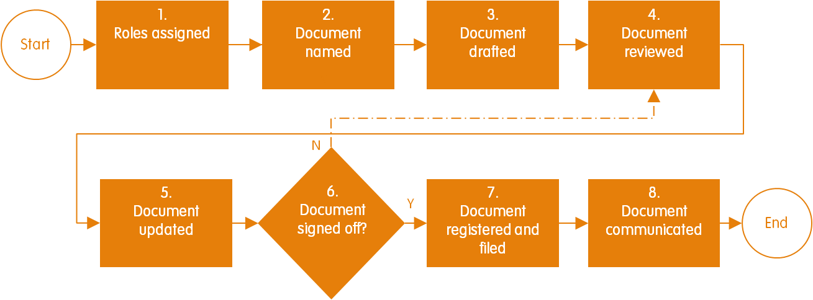
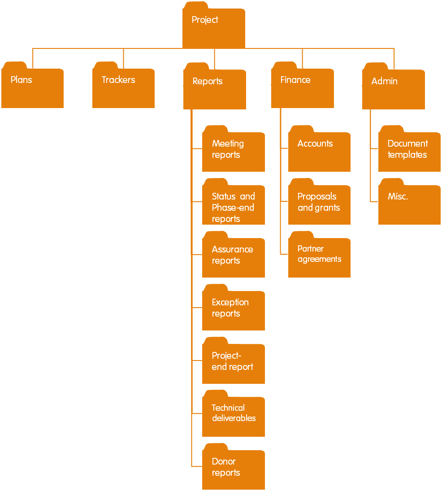
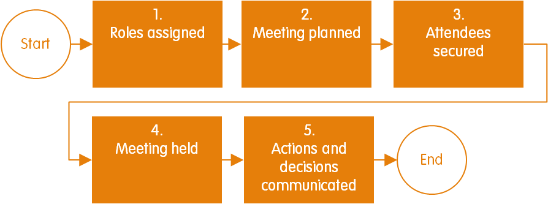

# Procesos Administrativos

### 1.- Visión general

El Propósito De Administrativo Procesos es:

* Mejorar la calidad, la comunicación y el uso de los documentos, los informes de los donantes y los resultados técnicos \(recuadro 15\) producidos por el proyecto \(**Gestión de** **documentos**\)
* Hacer el mejor uso del tiempo del personal en las reuniones **\(Gestión de** **reuniones\).**\).

Los procesos administrativos se utilizan a lo largo de las fases del proyecto \(Figura 11\). En el recuadro 16 se describen orientaciones sobre cómo se pueden adaptar los procesos administrativos.

| Recuadro 15. Entregables técnicos |
| :--- |
| Se trata de elementos producidos como resultado de hitos o tareas del proyecto, por ejemplo, un informe de estudio o una nueva aplicación de teléfono móvil. |

### 2.- Gestión de los documentos

#### 2.1.- Propósito

El objetivo del proceso de gestión de documentos \(Figura 22\) es garantizar el desarrollo, registro y presentación eficientes de cualquier documento relacionado con el proyecto, por ejemplo, documentos del proyecto \(véanse documentos\), informes de donantes y entregas técnicas \(recuadro 15\) \[1\].

Si este proceso no se lleva a cabo, existe el riesgo de que:

* No estará claro cuando se completen los documentos \(firmados\)
* El tiempo se desperdiciará usando versiones antiguas de documentos
* Las personas clave no participarán en la elaboración de un documento
* Los documentos se cambiarán sin la autoridad para hacerlo
* Los documentos no serán accesibles para el personal del proyecto
* Los documentos no se crearán según el proyecto deseado ni para las normas organizativas.

#### 2.2.- Proceso

Los hitos de Gestión de documentos se muestran en la Figura 23 y se describen a continuación.

Figura 22. Proceso de gestión de documentos.

**2.2.1.- Papeles Asignado**

El director del proyecto asigna el productor, el colaborador, el revisor, la autoridad de cierre de sesión e informado después de las funciones de cierre de sesión y se documenta en el rastreador del proyecto \(consulte Documentos\) \(recuadro 17\). Estos roles se pueden asignar a cualquier persona interna o externa al equipo del proyecto.

<table>
  <thead>
    <tr>
      <th style="text-align:left"><b>Recuadro 17. Gesti&#xF3;n de roles de documento</b>
      </th>
    </tr>
  </thead>
  <tbody>
    <tr>
      <td style="text-align:left">
        
Productor: Asignado a la persona Responsable Responsable de compilar el
          documento. Solo puede asignarse un rol de productor.

        
Colaborador: asignado Un personas distintas del productor, que se contenido
          para el documento, por ejemplo, alguien que est&#xE1; creando un mapa del
          &#xE1;rea del proyecto. Puede haber varios Papeles de colaborador asignados.

        
Autoridad de cierre de sesi&#xF3;n: se asigna a la persona que tiene la
          autoridad para decidir cu&#xE1;ndo se ha completado Onu documento. Cuando
          Onu documento est&#xE1; &quot;cerrado&quot;, listo para ser utilizado y
          comunicado. S&#xF3;lo debe haber una autoridad de firma a cada a cada a
          para garantizar Onu proceso de toma de decisi&#xF3;nes claro y directo.
          Proceso.

        
Revisor: Asignado a cualquier persona que est&#xE9; proporcionando comentarios
          de revisi&#xF3;n sobre borradores de documentos. Puede haberroles de revisor
          multiple asignados.

        
Informando despu&#xE9;s de la firma: Asignado a cualquier persona que
          deba recibir una copia de

        
el documento firmado.

      </td>
    </tr>
  </tbody>
</table>

**2.2.2.- Documento con nombre**

Los documentos se nombran de acuerdo con el siguiente formato mientras se están redactando:

Nombre de la organización Año de creación Nombre del documento Número de borrador

**Por ejemplo: Proyecto Hormiga Soldado** ant de Ant Foundation 2018: Revisión anual d1.2

Una vez que se firma un documento, el número de borrador \(por ejemplo, d1.2\) se sustituye por un número de versión \(por ejemplo, v2\).

**2.2.3.- Borrador de documento completo**

El Productor redacta los documentos del proyecto de conformidad con las directrices de desarrollo detalladas en los documentos, los informes de los donantes de conformidad con los requisitos de presentación de informes de los donantes y los resultados técnicos de conformidad con los criterios técnicos de entrega predefinidos. Cada vez que se cambia el documento, el número de borrador se incrementa progresivamentepara realizar un seguimiento de las modificaciones, porejemplo, de d0.1 a d0.2.

**2.2.4.- Documento revisado**

Los revisores revisan el documento y detallan sus comentarios en el rastreador de revisión de documentos \(consulte Documentos\).

**2.2.5.- Documento actualizado**

El Productor actualiza el documento en respuesta a cada comentario de revisión en el rastreador de revisión de documentos. Cuando el Productor decida no hacer una actualización en línea con un comentario de revisión, pondrá la justificación de esta decisión en el rastreador de revisión de documentos junto con el comentario de revisión en cuestión, de modo que quede claro para la autoridad de firma por qué no se ha utilizado un comentario.

**2.2.6.- ¿Documento firmado?**

La autoridad de firma revisa el documento y revisa los comentarios en el rastreador de revisión de documentos para evaluar si el documento es de calidad suficiente para ser firmado. Si el documento no está listo para cerrar la sesión, la autoridad de cierre de sesión resaltará las actualizaciones necesarias en el rastreador de revisión de documentos o solicitará revisiones adicionales. Las revisiones de documentos se llevan a cabo tantas veces como sea necesario hasta que la autoridad de firma juzgue que el documento es de calidad suficiente para ser firmado. Una vez que se firma un documento, cambia su nombre para que tenga un número de versión \(por ejemplo, v1\) en lugar del número de borrador \(por ejemplo, d0.78\).

**2.2.7.- Documento registrado y archivado**

El administrador de proyectos registra el documento en el rastreador de documentos \(consulte Documentos\), que enumera todos los documentos firmados actualmente del proyecto, un resumen de las principales actualizaciones realizadas made de versiones anteriores y sus números de versión firmados. The A continuación, el Administrador de proyectos archiva el documento firmado en la carpeta adecuada dentro de la estructura de archivo del proyecto \(Figura 23\). Las versiones anteriores del mismo documento se archivan y ya no se utilizan.

**2.2.8.- Documento comunicado**

Los documentos registrados firmados se comunican a las personas con roles informados después de la firma.

Figura 23. Ejemplo de estructura de archivo de proyectos.

### 3.- Gestión de las Juntas

#### 3.1.- Propósito

El propósito del proceso de Gestión de Juntas es minimizar el número de juntas mal planificadas, ejecutadas y documentadas que pierden tiempo y dinero, y pueden llevar a la frustración para los miembros del equipo del proyecto \[1\]. Para evitar esto, las juntas deben ser cuidadosamente planeadas de antemano, bien ejecutadas, y eficientemente documentadas, asegurando así el mejor uso del tiempo de los asistentes, y la mejor oportunidad de lograr los objetivos deseados de la reunión.

#### 3.2.- Proceso

Los hitos de La gestión de juntas se muestran en la Figura 24 y se describen a continuación.

Figura 24. Gestión de los hitos de las reuniones.

**3.2.1.- Se Asignan los roles**

Los roles de gestión de la junta son asignados por quien esté organizando la reunión \(recuadro 18\). Se necesitan roles de organizador, presidente y secretario de acuerdos, como mínimo para cada junta. Todos los roles de gestión de la juntas se pueden asignar a la misma persona o a diferentes personas.

<table>
  <thead>
    <tr>
      <th style="text-align:left">Recuadro 18. Gesti&#xF3;n de roles de reuni&#xF3;n</th>
    </tr>
  </thead>
  <tbody>
    <tr>
      <td style="text-align:left">
        
Organizador: Asignado a la persona que planificar&#xE1; la reuni&#xF3;n
          y que establece los asistentes.

        
Presidente: Asignado a la persona que gestionar&#xE1; la reuni&#xF3;n
          para que sus cumpla objetivos.

        
Secretario de Acuerdos: Asignado a la persona que tomar&#xE1; notas, acciones
          y decisiones de la reuni&#xF3;n.

        
Cronometrador: Asignado a la persona que realiza un seguimiento de la
          hora y mantiene la reuni&#xF3;n a tiempo.

      </td>
    </tr>
  </tbody>
</table>

**3.2.2.- Se Programa la Junta**

El Organizador establece un objetivo para la junta para garantizar que tenga una dirección clara y esté justificada. Los objetivos comunes de las juntas son tomar una decisión, proporcionar información, obtener comentarios de revisión sobre un documento, evaluar el estado del proyecto o desarrollar ideas. El Organizador también puede establecer una agenda de juntas para ayudar a alcanzar el objetivo de la manera más eficientemente posible.

El Organizador puede necesitar preparar los materiales con antelación para ayudar a facilitar la reunión o para que los asistentes lo hagan referencia. El Organizador también debe establecer la ubicación de la reunión \(ya sea una ubicación física o en línea\), fecha, hora y horario. La duración de la reunión debe mantenerse en el tiempo mínimo necesario para alcanzar los objetivos de la reunión.

**3.2.3.- Se aseguran las asistencias**

El Organizador selecciona los asistentes necesarios para alcanzar los objetivos de la junta. El número de asistentes debe reducirse al mínimo para garantizar que no se malgaste el tiempo de nadie, al asistir a juntas para las que no son necesarios. El Organizador con antelación informa a los asistentes sobre los objetivos de la junta, la agenda, los materiales de referencia, el horario y el lugar, para permitirles llevar a cabo cualquier preparación que necesiten hacer para la junta. Si una junta necesita ser reprogramada o cancelada, los asistentes deben ser informados dentro de un plazo que tenga en cuenta el posible nivel de interrupción para los asistentes.

**3.2.4.- Se celebra la junta**

El presidente lleva a cabo la junta de acuerdo con el orden del día y el horario. El secretario de acuerdos toma la minuta y documenta todas las notas, acciones y decisiones en el rastreador del proyecto. Si es necesario, las notas, acciones y decisiones generadas en reuniones más formales se pueden capturar en un informe de la reunión \(consulte Documentos\). Es importante que el presidente se asegure de que todas las acciones y decisiones se hayan entendido y acordado en el seno de la reunión para evitar tiempo adicional dedicado a aclarar puntos después de la reunión cuando los participantes hayan retirado.

**3.2.5.- Las acciones y decisiones son comunicadas**

Las acciones y decisiones de la junta se pueden comunicar internamente enviando un enlace a la sección de acciones y decisiones actualizadas del rastreador del proyecto, o externamente mediante el envío de un informe de la junta.

<table>
  <thead>
    <tr>
      <th style="text-align:left"><b>Recuadro 16. Adaptaci&#xF3;n de los procesos administrativos</b>
      </th>
    </tr>
  </thead>
  <tbody>
    <tr>
      <td style="text-align:left">
        
Para garantizar una administraci&#xF3;n eficiente del proyecto, se utilizan
          los que procesos Gesti&#xF3;n de documentos y Gesti&#xF3;n de reuniones,
          independientemente del tama&#xF1;o del proyecto. Embargo sin, algunos aspectos
          de estos procesos se puede adaptar para adaptarse al proyecto es Cuesti&#xF3;n.

        
Para el proceso Administrar documentos, un proyecto puede adaptar los
          hitos del proceso, el formato de nombre de archivo y la estructura de archivo
          seg&#xFA;n sea necesario. Tambi&#xE9;n se pueden asignar roles adicionales
          de Reviewer a personas ajenas al proyecto para mejorar la calidad del documento.
          Por ejemplo, se pueden asignar expertos relevantes como revisores para
          entregas t&#xE9;cnicas, como informes de estudio.

      </td>
    </tr>
  </tbody>
</table>

