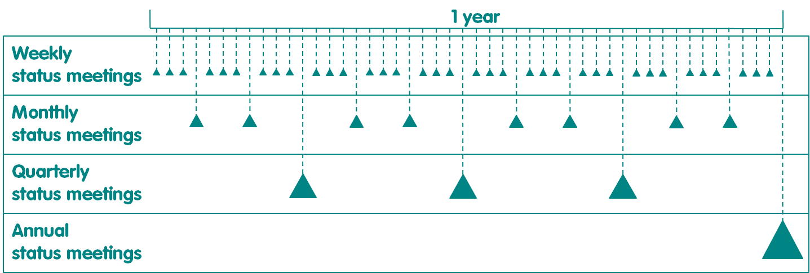

# Procesos de Control

### 1.- Visión general

Durante las fases del proyecto pueden surgir muchas situaciones que amenazan la entrega exitosa of del proyecto. El propósito de los procesos de Control es asegurar que el proyecto es:

* En camino de lograr el impacto, dentro del presupuesto y el cronograma descritos en el plan del proyecto
* Gestión eficaz de riesgos y problemas
* Gestión de cualquier cambio en el plan del proyecto
* Adherirse a las políticas de operaciones
* Identificar, capturar y adaptarse a las lecciones aprendidas.

Hay 2 procesos de control:

* Gestión del progreso
* Gestión de riesgos y problemas.

Los procesos de control se utilizan en todas las fases del proyecto \(Figura 11\). En el recuadro 12 se describen orientaciones sobre cómo se pueden adaptar los procesos de control.

### 2.- Gestión del progreso

#### 2.1.- Propósito

El propósito del proceso de gestión del progreso es permitir el seguimiento regular del progreso del proyecto con respecto al plan del proyecto y planificar las acciones correctivas cuando sea necesario \[2\]. Si no se utiliza el proceso de gestión del progreso, la falta de supervisión periódica del progreso del proyecto aumentará la probabilidad de que no se identifiquen problemas a tiempo para administrarlos eficazmente, lo que puede provocar que el proyecto no alcance su impacto o que supere sus compromisos de presupuesto o de programación.

El proceso de gestión del progreso se facilita mediante informes de estado, informes de auditoría de garantía y reuniones de estado. Las reuniones de situación semanales, mensuales, trimestrales y anuales se pueden llevar a cabo en cualquier fase, dependiendo de la duración de esa fase \(Figura 18\). Todos los informes se llevan a cabo de acuerdo con el proceso de reuniones de gestión. La serie de informes que se generan como resultado del proceso de gestión del progreso se puede adaptar para cumplir con los requisitos de presentación de informes de donantes según sea necesario.

Figura 18. Distribución de reuniones de situación semanales, mensuales, trimestrales y anuales en relación con un año de proyecto. Nota: Al final de un mes, se celebra una reunión de estado mensual en lugar de la reunión de estado semanal. Al final de un trimestre, se celebra una reunión trimestral de estatus en lugar de la reunión mensual de situación. Al final de un año, se celebra una reunión anual de situación en lugar de la reunión trimestral de situación.

#### 2.2.- Proceso

La gestión del progreso de los hitos se muestra en la Figura 19 y se describen a continuación.

Figura 19. Gestión de los hitos del proceso de progreso.

**2.2.1.- Junta situacional es celebrada**

Las juntas situacionales se llevan a cabo cada semana, mes, trimestre o año, dependiendo de la necesidad \(recuadro 12\). El propósito de cada junta situacional es identificar las acciones correctivas necesarias para el próximo período de tiempo para mantener el proyecto en marcha. Las funciones de Organizador y Presidente, los asistentes, las aportaciones y el orden del día de cada reunión se detallan en el Cuadro 6. En la Tabla 7 se detallan los roles para desarrollar cada informe utilizado como entrada para las reuniones de situación.

Cuadro 6. Descripción general de las reuniones de estado.

<table>
  <thead>
    <tr>
      <th style="text-align:left">Reuni&#xF3;n</th>
      <th style="text-align:left">Organizador y Presidente</th>
      <th style="text-align:left">Asistentes</th>
      <th style="text-align:left">Entradas</th>
      <th style="text-align:left">Agenda</th>
    </tr>
  </thead>
  <tbody>
    <tr>
      <td style="text-align:left">Reuni&#xF3;n semanal de estado</td>
      <td style="text-align:left">L&#xED;der de Workstream</td>
      <td style="text-align:left">L&#xED;der de Workstream, Workstream Miembros</td>
      <td style="text-align:left">Actualizaciones de Workstream (verbales o iniciadas session rastreador
        de proyectos)</td>
      <td style="text-align:left">
        
Revisar el calendario del &#xFA;ltimo per&#xED;odo de tiempo

        
Planificar el cronograma para el pr&#xF3;ximo per&#xED;odo de tiempo Revisar
          los riesgos, problemas y dependencias actuales Recopilar lecciones aprendidas

      </td>
    </tr>
    <tr>
      <td style="text-align:left">Reuni&#xF3;n mensual de situaci&#xF3;n</td>
      <td style="text-align:left">Gerente de proyecto</td>
      <td style="text-align:left">Gerente de proyecto, l&#xED;deres de Workstream, Proyecto Apoyo</td>
      <td
      style="text-align:left">Informe de estado mensual</td>
        <td style="text-align:left">Revisar el calendario del &#xFA;ltimo per&#xED;odo de tiempo Planificar
          el cronograma para el pr&#xF3;ximo per&#xED;odo de tiempo Revisar los riesgos,
          problemas y dependencias actuales Recopilar lecciones aprendidas</td>
    </tr>
    <tr>
      <td style="text-align:left">Reuni&#xF3;n trimestral de situaci&#xF3;n</td>
      <td style="text-align:left">Gerente de proyecto</td>
      <td style="text-align:left">Ejecutivo, Gerente de Proyectos, Proyecto Apoyo</td>
      <td style="text-align:left">Informe trimestral de estado</td>
      <td style="text-align:left">Revisar el impacto, la programaci&#xF3;n y el presupuesto del &#xFA;ltimo
        per&#xED;odo de tiempo Planifique el impacto, el cronograma y el presupuesto
        para el pr&#xF3;ximo per&#xED;odo de tiempo Revisar los riesgos, problemas
        y dependencias actuales Recopilar lecciones aprendidas</td>
    </tr>
    <tr>
      <td style="text-align:left">Reuni&#xF3;n anual de situaci&#xF3;n</td>
      <td style="text-align:left">Gerente de proyecto</td>
      <td style="text-align:left">Ejecutivo, Aseguramiento de Proyectos, Aseguramiento de Operaciones, Gerente
        de Proyecto, Proyecto Apoyo</td>
      <td style="text-align:left">Informe anual de situaci&#xF3;n Informe de auditor&#xED;a de aseguramiento
        del proyecto Informe de auditor&#xED;a de control de operaciones Informe
        de auditor&#xED;a de aseguramiento de operaciones</td>
      <td style="text-align:left">Revisar el impacto, la programaci&#xF3;n y el presupuesto del &#xFA;ltimo
        per&#xED;odo de tiempo Planifique el impacto, el cronograma y el presupuesto
        para el pr&#xF3;ximo per&#xED;odo de tiempo Revisar los riesgos, problemas
        y dependencias actuales Recopilar lecciones aprendidas</td>
    </tr>
  </tbody>
</table>

Cuadro 7. Roles para desarrollar documentos en el proceso de administración del progreso.

| Documento | Ejecutivo | Garantía de operaciones | Garantía del proyecto | Gerente de proyecto | Líder de Workstream | Miembros de Workstream |
| :--- | :--- | :--- | :--- | :--- | :--- | :--- |
| Informe de estado mensual |  |  |  | P | Yo | Yo |
| Informe trimestral de estado |  |  |  | P | Yo | Yo |
| Informe anual de situación | R, S | Yo | Yo | P | Yo | Yo |
| Informe de final de fase | R, S | Yo | Yo | P | Yo | Yo |
| Auditoría de aseguramiento del Proyecto Informe | S |  | P | R |  |  |
| Garantía de operaciones informe de auditoría | S | P |  | R |  |  |

Nota: R - Revisor, S - Autoridad de cierre de sesión, P - Productor, I - Informado después de la firma.

**2.2.2.- Nuevos riesgos o problemas ¿Elevado?**

Las reuniones de estado ofrecen a los asistentes with la oportunidad de plantear cualquier nuevo riesgo o problema \(Recuadro 13\) que haya surgido en el último período de tiempo \(semana, mes, trimestre o issues año\). Cualquier miembro del equipo del proyecto puede identificar un riesgo o problema. Si no se plantean nuevos riesgos o problemas, las acciones y decisiones de la reunión se documentarán de forma normal de acuerdo con el proceso de Gestión de reuniones, y el proyecto continuará en el siguiente periodo.

<table>
  <thead>
    <tr>
      <th style="text-align:left"><b>Recuadro 13. Riesgos y problemas</b>
      </th>
    </tr>
  </thead>
  <tbody>
    <tr>
      <td style="text-align:left">
        
Un riesgo se identificaci&#xF3;n que negativa a negativa no ha haya, pero,
          si, si ocurrea, afectar&#xED;amente el impacto, el presupuesto o la programaci&#xF3;n
          del proyecto a qu&#xE9; determinaci&#xF3;n en el plan del proyecto.

        
Un problema se identifica como algo que ya est&#xE1; sucediendo, o ha
          ocurrido, y que est&#xE1; afectando negativamente o ha afectado negativamente
          el impacto, el presupuesto o la programaci&#xF3;n del proyecto. Un problema
          es a menudo el resultado de un riesgo que no se ha identificado y no se
          ha administrado eficazmente.

      </td>
    </tr>
  </tbody>
</table>

**2.2.3.- Riesgos y problemas gestionados**

Si se plantean nuevos riesgos o problemas, se activará el proceso Gestión de riesgos y problemas \(consulte Gestión de riesgos y problemas proceso\). It Es importante que los riesgos o cuestiones que surjan que afecten al programa u organización,del cual forma parteel proyecto, sean planteados inmediatamente por el Director del Proyecto al Ejecutivo, quien luego consultará con el Líder en cuanto a qué curso de acción tomar.

**2.2.4.- ¿Nueva lección aprendida levantada?**

Las reuniones de estado ofrecen a los asistentes la oportunidad de plantear las nuevas lecciones aprendidas que hayan surgido en el último período de tiempo. . Las lecciones aprendidas se utilizan para mejorar la forma en que los proyectos actuales y futuros se planifican, implementan, supervisan e informan \[1\]. Adaptar el proyecto en respuesta a las lecciones aprendidas ayudará al equipo del proyecto a aprovechar los éxitos, reutilizar soluciones y evitar errores anteriores \[2, 3\].

Las lecciones aprendidas pueden estar relacionadas con cualquier cosa en el proyecto, desde cómo realizar el impacto del proyecto de manera más rápida y barata, hasta consejos sobre el uso del software. It Es responsabilidad de todo el personal identificar las lecciones aprendidas a lo largo de la vida del proyecto. Si no se plantean nuevas lecciones aprendidas, las acciones y decisiones de la reunión se documentarán de forma normal de acuerdo con el proceso de Gestión de reuniones, y el proyecto continuará en el próximo período.

**2.2.5.- Lección aprendida evaluada**

El efecto de cada lección aprendida se clasifica como "salió bien" o "podría haber ido mejor". Las recomendaciones en respuesta a cada lección aprendida se documentan \(consulte la sección De seguimiento del proyecto de Documentos\).

**2.2.6.- Seguimiento del proyecto actualizado**

El Jefe de proyecto agrega información sobre las lecciones aprendidas al rastreador de proyectos. The A continuación, el jefe de proyecto incorpora tareas en el rastreador de proyectos de acuerdo con las recomendaciones.

### 3.- Gestión de los riesgos

#### 3.1.- Propósito

El propósito del proceso de Gestión de riesgos y problemas es evaluar y gestionar los riesgos y problemas de acuerdo con su efecto potencial en \(a\) el impacto, el presupuesto y el cronograma documentados en el plan del proyecto, y/o \(b\) las relaciones importantes con las partes interesadas \[2\]. Este proceso se utiliza en todas las fases del proyecto y puede ser iniciado por cualquier miembro del equipo del proyecto, desde un miembro de Workstream hasta el líder. Los riesgos y problemas se pueden identificar a través de las reuniones de estado, pero los miembros del equipo del proyecto no deben esperar hasta la próxima reunión para aumentar un riesgo o problema si requiere atención urgente. En general, las cuestiones son más costosas de gestionar que los riesgos, y por lo tanto el objetivo principal de este proceso es identificar y hacer frente a los riesgos antes de que se conviertan en problemas.

#### 3.2.- Proceso

Los hitos De gestión de riesgos y problemas se muestran en la Figura 20 y se describen a continuación.

Figura 20. Gestión del proceso de riesgos y problemas.

**3.2.1.- Riesgos y problemas evaluados**

Cada riesgo o problema se describe \(Recuadro 13\) junto con una visión general de su causa en el rastreador del proyecto. tracker. A continuación, cada riesgo o problema se punturá como alto, medio o bajo con respecto a su efecto relativo en el impacto, la programación y el presupuesto del proyecto. Los criterios para asignar puntuaciones altas, medias y bajas se proporcionan en la sección de riesgos y problemas del rastreador de proyectos. Estas puntuaciones se combinan para calcular el efecto global en el proyecto. A continuación, el efecto global sobre el proyecto se combina con la probabilidad de que se produzca ese riesgo o problema \(puntuado como improbable, probable o cierto\) para proporcionar una calificación general para el riesgo o problema en cuestión \(Figura 21\). It Es importante tener en cuenta que a todas las cuestiones se les asigna automáticamente una puntuación de probabilidad de "cierto" ya que el problema ya se habrá producido.

Figura 21. Cálculo de la calificación de riesgo y emisión. Nota: el equipo del proyecto asigna puntuaciones para los criterios marcados con \*. El rastreador de proyectos calcula automáticamente otros criterios.

**3.2.2.- ¿Proyecto en excepción?**

El proyecto es de excepción si hay un problema actual que significa que el proyecto no está logrando su impacto dentro del presupuesto y la programación esbozadas en el plan del proyecto \[2\]. Del mismo modo, el proyecto puede considerarse como una excepción si se puede predecir con confianza que, en un futuro próximo, un riesgo o problema actual evitará que el proyecto alcance su impacto dentro del presupuesto y la programación descritos en el plan del proyecto. Una calificación alta para un riesgo o problema indica que el proyecto es en excepción.

**3.2.3.- Seguimiento del proyecto actualizado**

Las opciones de respuesta para hacer frente a los riesgos y problemas son aceptar, reducir, evitar o transferir \(recuadro 14\) \[2\]. El jefe de proyecto supervisa la actualización del rastreador de proyectos con tareas en respuesta a los riesgos y problemas identificados \(consulte la sección Seguimiento del proyecto de Documentos\).

<table>
  <thead>
    <tr>
      <th style="text-align:left">Recuadro 14. Respuesta de riesgo y problema</th>
    </tr>
  </thead>
  <tbody>
    <tr>
      <td style="text-align:left">
        
Aceptar: El riesgo o problema se acepta si su impacto ser&#xE1; absorbido
          por el proyecto Pecado Onu alto efecto es el impacto, presupuesto o cronograma.
          Algunos riesgos y problemas muy puede tener que ser aceptadores si la posible
          mitigaci&#xF3;n est&#xE1; fuera del control del del proyecto. No se no
          requiere acci&#xF3;n Obligatorio. atinte.

        
Reducir: El proyecto tiene como objetivo reducir el impacto del riesgo
          o problema mediante la implementaci&#xF3;n de una serie de acciones de
          mitigaci&#xF3;n.

        
Evitar: El proyecto tiene como como objetivo evitar el riesgo que se producen
          un archivo de una serie de acciones los m&#xE1;s. Esta respuesta No es
          posible para un problema, ya que ya est&#xE1; / fuepazo hap Hapen forma
          de pened.

        
Transferencia: El proyecto puede transferir la responsabilidad del riesgo
          o la gesti&#xF3;n de la emisi&#xF3;n a otra organizaci&#xF3;n o proyecto.

      </td>
    </tr>
  </tbody>
</table>

**3.2.4.- Informe de excepción Compilado**

Si el proyecto es de excepción, el Administrador de proyectos compilará un informe de excepción \[3\] \(consulte Documentos\). El informe De excepción detallará las tolerancias de impacto, programación o presupuesto que se han superado y las acciones correctivas propuestas. Los roles para compilar el informe de excepción se describen en la Tabla 8.

**3.2.5.- ¿Revisar el plan del proyecto?**

Si el Ejecutivo cierra la firma del informe Excepción, esto da a la autoridad del jefe de proyecto para usar las acciones correctivas detalladas en el informe de excepción para revisar el plan del proyecto. Si el Ejecutivo no firma el informe de excepción, esto significa que el Ejecutivo requiere revisiones adicionales \(consulte Proceso de gestión de documentos\) \), o decidirá cerrar el proyecto.

La decisión del Ejecutivo se basa en su evaluación de si el plan revisado del Proyecto se adheriría o no a los contratos actuales de los donantes, y a todos los principios de pmWC. El Ejecutivo puede consultar al Líder, Aseguramiento del Proyecto, Aseguramiento de Operaciones, y el jefe de proyecto para ayudarles a tomar una decisión.

**3.2.6.- Plan de proyecto revisado compilado**

El jefe de proyecto compilará un plan de proyecto revisado \(consulte el proceso de documentos y gestión de documentos\) en consulta con los líderes de Workstream pertinentes. Las funciones para desarrollar el plan de proyecto revisado se describen en el Cuadro 8.

**3.2.7.-Seguimiento del proyecto actualizado**

El jefe de proyectoorganizará organise la actualización del rastreador del proyecto de acuerdo con el plan revisado del proyecto.

**3.2.8.- Proyecto cerrado**

El Ejecutivo dará instrucciones al Jefe de proyecto para que cierre el proyecto de acuerdo con el proceso de fase de cierre.

Cuadro 8. Funciones para desarrollar documentos en el proceso de gestión de riesgos y problemas.

<table>
  <thead>
    <tr>
      <th style="text-align:left"><b>Documento</b>
      </th>
      <th style="text-align:left"><b>Ejecutivo</b>
      </th>
      <th style="text-align:left"><b>Garant&#xED;a del proyecto</b>
      </th>
      <th style="text-align:left"><b>Garant&#xED;a de operaciones</b>
      </th>
      <th style="text-align:left"><b>Gerente de proyecto</b>
      </th>
      <th style="text-align:left"><b>L&#xED;deres de la corriente de trabajo</b>
      </th>
      <th style="text-align:left"><b>Miembros de Workstream</b>
      </th>
    </tr>
  </thead>
  <tbody>
    <tr>
      <td style="text-align:left">Informe de excepci&#xF3;n</td>
      <td style="text-align:left">S</td>
      <td style="text-align:left">R</td>
      <td style="text-align:left">R</td>
      <td style="text-align:left">P</td>
      <td style="text-align:left">Yo</td>
      <td style="text-align:left"></td>
    </tr>
    <tr>
      <td style="text-align:left">
        
Proyecto revisado

        
Plan

      </td>
      <td style="text-align:left">S</td>
      <td style="text-align:left">R</td>
      <td style="text-align:left">R</td>
      <td style="text-align:left">P</td>
      <td style="text-align:left">Yo</td>
      <td style="text-align:left">Yo</td>
    </tr>
  </tbody>
</table>

Nota: S - Autoridad de cierre de sesión, R - Revisor, P - Productor, I - Informado después de la firma.

<table>
  <thead>
    <tr>
      <th style="text-align:left">Recuadro 12. Procesos de control de adaptaci&#xF3;n</th>
    </tr>
  </thead>
  <tbody>
    <tr>
      <td style="text-align:left">
        
El proceso de gesti&#xF3;n del progreso se puede adaptar reduciendo o
          alesten el n&#xFA;mero y la la habitaci&#xF3;n de las reuniones e informes
          de estado. Por ejemplo, para proyectos simples y donde los que miembros
          de Workstream necesitan poca orientaci&#xF3;n, las reuniones de estado
          semanales puede Una de las a las que lo son.

        
Por el contrario, para proyectos m&#xE1;s complejos, la reuni&#xF3;n mensual
          de estado y/o las reuniones trimestrales de estado pueden aumentar en n&#xFA;mero
          para tener 1 por flujo de trabajo, en la que el director del proyecto se
          sienta con cada l&#xED;der de Workstream individualmente para revisar el
          progreso de sus paquetes de trabajo. En este caso, es probable que el jefe
          de proyecto necesite una reuni&#xF3;n de estado mensual adicional y/o una
          reuni&#xF3;n trimestral de estado a la que asistan todos los l&#xED;deres
          de Workstream, que cubra la identificaci&#xF3;n y gesti&#xF3;n de los riesgos
          del paquete inter-trabajo, la emisi&#xF3;ny las dependencias.

      </td>
    </tr>
  </tbody>
</table>

