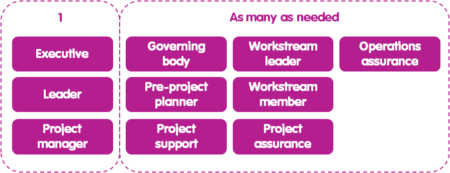
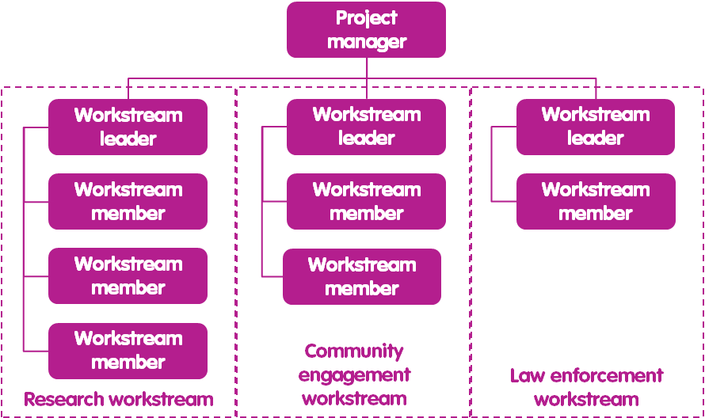
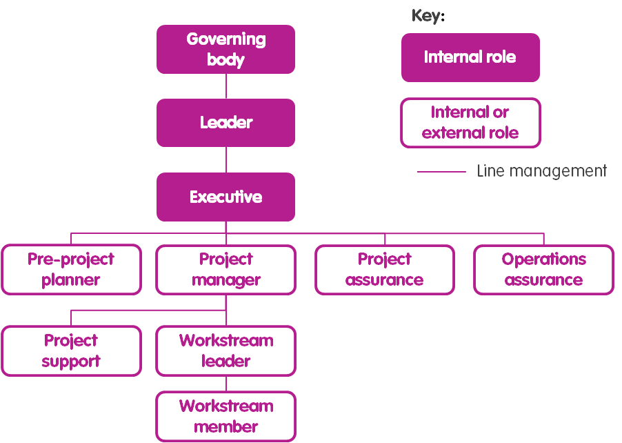
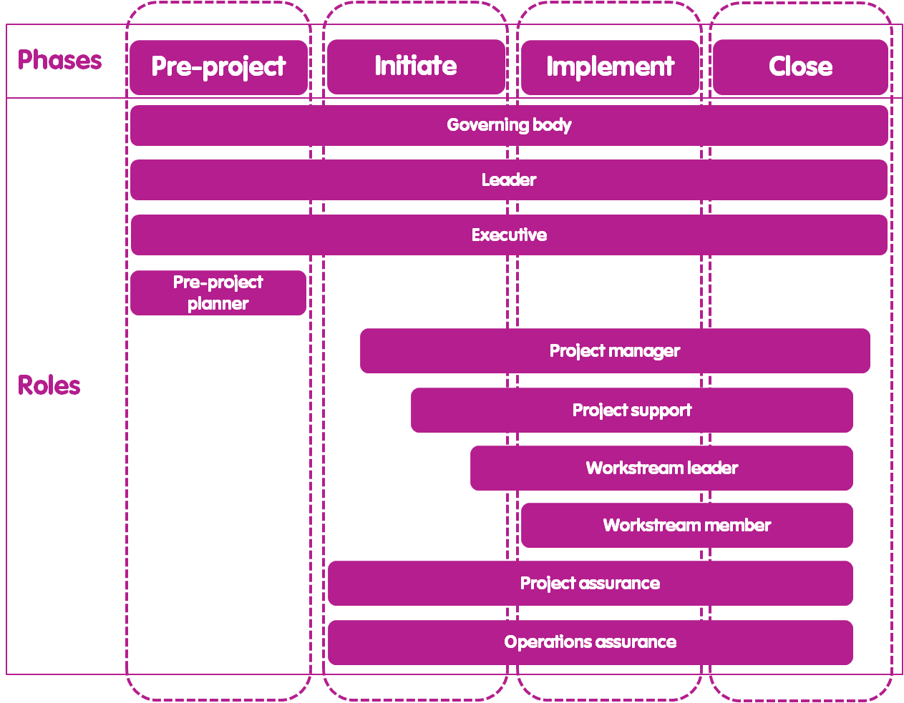

# Roles

### 1.- Visión general

El propósito de asignar roles es ayudar a garantizar una toma de decisiones clara, un control eficiente del proyecto, cohesión del equipo y satisfacción laboral individual. Un rol es diferente a una publicación o posición en que se pueden asignar varios roles al mismo miembro del equipo \[6\]. Por ejemplo, alguien puede tener el puesto de coordinador del Programa, pero puede tener el rol de Ejecutivo para un proyecto y Gerente de Proyecto para un proyecto diferente.

A todos los miembros del equipo del proyecto se les asigna 1 de cada 10 roles de equipo de proyecto. En esos componentes se describen otras funciones relacionadas con las fases, los procesos administrativos y los procesos de control. En el recuadro 5 se describen las orientaciones sobre cómo se pueden adaptar los roles.

### 2.- Número de Roles

Para garantizar una toma de decisiones clara y rápida, solo puede haber 1 rol de líder, 1 ejecutivo y 1 jefe de proyecto. Para todos los demás roles, puede haber tantos de esos tipos de roles asignados como sea necesario por el proyecto. Por ejemplo, puede haber 3 roles de soporte de proyecto, 5 líderes de Workstream y 20 roles de miembro de Workstream asignados para un proyecto determinado \(Figura 04\).

Figura 4. Número de cada rol que se puede asignar.

### 3.- Distribución de los roles

Debido a la naturaleza de la obra, el cargo del órgano de gobierno nunca puede asignarse a alguien con ningún otro papel. El rol Líder se puede asignar a lae misma persona a la que se le ha asignado el rol Ejecutivo, pero ni el rol Líder ni el Ejecutivo se pueden asignar a alguien a quien se le haya asignado ningún otro rol. Esto es para asegurar que la persona que está supervisando el proyecto no está llevando a cabo también un papel que está ayudando a entregar o evaluar el proyecto.

Del mismo modo, aunque las funciones de garantía de proyecto y garantía de operaciones se pueden asignar a la misma persona, estos roles nunca deben asignarse a una persona con ningún otro rol. Esto se debe a que todos los demás roles están involucrados de alguna manera con la entrega del proyecto, por lo que esa persona no sería capaz de evaluar objetivamente si el proyecto se adhiere al plan de proyecto y las políticas de operaciones.

Todos los demás tipos de rol se pueden asignar a las mismas personas o a diferentes, independientemente de los demás roles que se asignen. Por ejemplo, para un proyecto pequeño, los roles De gerente de proyecto, Soporte de proyecto, Líder de Workstream y Miembro de Workstream se pueden asignar a la misma persona.

### 4.- Líneas de gestión

#### 4.1.- Líneas de gestión por fases

La administración de líneas describe por quién se gestiona directamente cada rol, en términos de tomar instrucciones de e informar a \[2\]. La administración de líneas y los roles son diferentes entre la fase Pre-proyecto y todas las demás fases \(Figura 5 y Figura 06\).

Figura 05. Funciones de fase previas al proyecto y gestión de líneas.

Figura 6. Iniciar, implementar y cerrar roles de fase y administración de líneas.

#### 4.2.- Conexiones de las líneas de gestión

Idealmente Cada Equipo Miembro Sin embargo Muchos Papeles Ellos have Debe solamente have Uno gerente de línea. Tener Múltiples Línea Gerentes Para a soltero Papel enlatar Ser Confuso Para el miembro del equipo que lleva a cabo ese papel con Respeto

a cómo gestionan su propio trabajo y a quién van cuando hay que be tomar una decisión. Del mismo modo, puede ser difícil para el administrador de líneas si está administrando a alguien que también está siendo administrado por otra persona, porque el gerente de línea no tendrá el control total sobre lo que ese miembro del equipo está haciendo. Sin embargo, es posible que no sea posible evitar varios gestores de líneas en todos los ces de circunstances \(recuadro 6\).

| **Recuadro 6. Gerentes de línea Múltiples** |
| :--- |
| Aunque se aconseja que cualquier miembro del personal individual tiene un solo gerente de línea, esto puede No ser posible posible es todas las circunstancias, por ejemplo, si una persona tiene el papel de gerente de proyecto para 2 proyectos diferentes con 2 ejecutivos diferentes. En Cuentos casos, la persona conmultiple line managers necesita trabajo con gerentes de línea para desarrollar un conjunto compartido y abogado de límites con respecto Un cómo dividirán su tiempo entre los que 2 proyectos. Puede ser ventajoso asignar franjas franjas Hora específicamente para cada cada proyecto, por ejemplo, lunes y miércoles para el proyecto 1 y los martes, jueves y viernes para el proyecto 2. |

Además, como regla general,cualquier miembro del equipo no debe administrar más de 6 miembros del equipo. Esto se debe a que, para ser eficaz, cada miembro del equipo requiere dirección, control de calidad y soporte para resolver solving problemas de su jefe de línea. Cuantos más miembros del equipo esté supervisando un gerente de línea, menos tiempo pueden dar a cada miembro del equipo individualmente.

#### 4.3.- Gestión de líneas de las corrientes de trabajo

Cada líder de Workstream, y los miembros de Workstream que les informan, se pueden organizar en diferentes flujos de trabajo \(Figura 7\). Los flujos de trabajo son grupos de personal que trabajan en el mismo conjunto de paquetes de trabajo. Los flujos de trabajo se desarrollan mejor en función de las habilidades. Por ejemplo, una corriente de trabajo de aplicación de la ley podría tener habilidades en la recopilación de inteligencia y el patrullaje, mientras que una corriente de trabajo de acción comunitaria podría tener habilidades en la participación de la comunidad, el desarrollo de organizaciones basadas en la comunidad y la campaña de marketing social eng.

Figura 7. Ejemplo de gestión de líneas de varios flujos de trabajo.

### 5.- Responsabilidad y Facilitación

Algunos roles tienen niveles particulares de responsabilidad y facilitación relacionados con la organización, programa, proyecto o paquete de trabajo \(recuadro 7\) \(Figura 8\).

Ser el _**Responsable**_ de la entrega del proyecto significa que el **Gerente Ejecutivo** tiene el poder de decisión final sobre el desarrollo y cambio del plan del proyecto, así como cualquier decisión de cerrar prematuramente el proyecto si es necesario \[2\].

Ser el _**Facilitador**_ de la entrega del proyecto significa que el **Gerente de Proyecto** es la autoridad de toma de decisiones del proyecto durante el tiempo que se adhiere al plan de proyecto y las directivas de operaciones \[2\].

<table>
  <thead>
    <tr>
      <th style="text-align:left">Recuadro 7. Responsable y Facilitador</th>
    </tr>
  </thead>
  <tbody>
    <tr>
      <td style="text-align:left">
        
Responsable: Es la persona que toma la decisi&#xF3;n final es una situaci&#xF3;n
          determinada, o que tiene autoridad de firma en un documento [8].

        
Facilitador: Es la persona designada para hacer el trabajo diario para
          gestionar o llevar a cabo actividades particulares [8].

      </td>
    </tr>
  </tbody>
</table>

Figura 8. Responsabilidades y responsabilidades por nivel.

### 6.- Roles internos y externos

Los roles pueden ser internos o externos a la organización principal responsable de la entrega del proyecto. Las funciones del Consejo de Administración, Líder y Ejecutivo deben ser siempre internas para garantizar que la organización principal tenga un nivel suficiente de control sobre el progreso del proyecto del que en última instancia es responsable de la entrega. Todas las demás funciones se pueden asignar externamente a una organización diferente que haya acordado llevar a cabo trabajos para la organización principal \(Figura 9\). Una organización que realiza trabajos en nombre de una organización líder puede considerarse como una organización de proveedores.

Figura 9. Roles internos y externos.

### 7.- Movilización y desmovilización

La gestión de líneas de roles en cada fase del proyecto, junto con la fase de proyecto, junto con la Hitos Para Cada Fase \(ver Fases\), Dicta cuando cada Papel Es Movilizado Y Desmovilizados \(Caja8\) \(Figura 10\).

<table>
  <thead>
    <tr>
      <th style="text-align:left">Recuadro 8. Movilizaci&#xF3;n y desmovilizaci&#xF3;n</th>
    </tr>
  </thead>
  <tbody>
    <tr>
      <td style="text-align:left">
        
La movilizaci&#xF3;n implica la asignaci&#xF3;n de un rol a una persona
          espec&#xED;fica y la inducci&#xF3;n de esa persona para que est&#xE9; participantes
          con el plan del proyecto y las pol&#xED;ticas de operaciones.

        
La desmovilizaci&#xF3;n implica que los miembros del personal sean liberados
          del proyecto.

      </td>
    </tr>
  </tbody>
</table>

Las funciones del Consejo de Administración, Líder y Ejecutivo existen a lo largo del proyecto, ya que también tienen responsabilidades y responsabilidades con respecto a la gestión de la organización y el programa del que forma parte el proyecto.

El primer papel que se moviliza es el planificador previo al proyecto, que se desmoviliza en cuanto as termina la fase previa al proyecto. Todas las demás funciones, aparte de los miembros de Workstream, se movilizan mobilised en la fase de inicio. Los miembros de Workstream se movilizan mobilised en la fase de implementos. Todos estos roles se desmovilizan en la fase de cierre \(véase Fases\) \(Figura 10\).

Figura 10. Movilización y desmovilización de cada función en relación con las fases.

### 8.- Otros roles

Todos los roles siguientes tienen funciones clave con respecto al proyecto, pero no forman parte del equipo del proyecto. Como tal, no son línea administrada por y no administran ninguna función en el equipo del proyecto, pero sí interactúan con el equipo del proyecto a través de puntos de contacto.

#### 8.1.- Operaciones

Las funciones de operaciones son aquellas que realizan funciones clave \(por ejemplo, la gestión de recursos humanos\) dentro de una organización. Las funciones de operaciones no ayudan a garantizar que todos los miembros de la organización \(incluidos los miembros del equipo del proyecto\) se adhieran a las políticas de operaciones, por ejemplo, la gestión financiera, la igualdad en el lugar de trabajo y las políticas de protección de datos. Puede haber muchos roles de operaciones diferentes enumerados para una organización y algunos o todos los miembros del equipo del proyecto pueden ser puntos de contacto para un rol de operaciones, dependiendo de su función. Por ejemplo, un rol de operaciones que es responsable de implementar una directiva de contratación puede tener tanto el ejecutivo como el director de proyecto como puntos de contacto, ya que ambos roles movilizan otros roles dentro del equipo del proyecto.

#### 8.2.- Donante

Los donantes pueden proporcionar fondos para apoyar todo o parte del trabajo del proyecto. Las funciones de los donantes se pueden asignar a los miembros de una organización de donantes que hacen que la liberación de fondos dependa del progreso del proyecto. Los donantes no pueden decidir directamente si un proyecto continúa o se cierra, pero pueden decidir no proporcionar fondos si no están satisfechos con el progreso del proyecto. El punto de contacto del donante en un equipo de proyecto debe tener un nivel de autoridad de toma de decisiones que coincida con el nivel de apoyo y autoridad de toma de decisiones que el Donante posee. Por ejemplo, el punto de contacto podría asignarse al Líder o Ejecutivo si el Donante está proporcionando fondos para todas las actividades del proyecto. De lo contrario, e puede ser apropiado asignar el punto de contacto como jefe de proyecto si el donante está proporcionando los fondos necesarios para apoyar una pequeña proporción de los paquetes de trabajo del proyecto.

#### 8.3.- Asesor

Las funciones de asesor se asignan a cualquier persona que esté proporcionando asesoramiento regular al equipo del proyecto. El punto de contacto para el Asesor puede ser cualquier persona en el equipo del proyecto y sólo depende del tipo de consejo que se proporciona. Por ejemplo, se podría asignar a un Asesor para proporcionar sugerencias al Ejecutivo sobre los cambios en el plan del proyecto, o a un líder de Workstream sobre cómo crear relaciones sólidas con los líderes de la comunidad local.

#### 8.4.- Socio

Las funciones de socios se asignan a los miembros de otras organizaciones que están llevando a cabo trabajos paralelos que de alguna manera están vinculados al trabajo que está llevando a cabo un proyecto. Por ejemplo, un proyecto podría estar llevando a cabo el componente de investigación de un plan nacional de recuperación de especies, con el resto del trabajo que se lleva a cabo a través de proyectos dirigidos por otras organizaciones. Una organización que realiza trabajos vinculados al trabajo de proyecto de la organización principal puede considerarse como una organización asociada. . El punto de contacto para el socio podría ser el Líder, Ejecutivo o Gerente de Proyecto, dependiendo de la relación del trabajo de la organización asociada con el trabajo del proyecto.

| Recuadro 5. Adaptación de roles |
| :--- |
| Todos los proyectos deben al menos los roles de plan preaquirero,director de proyecto, líder de Workstream y miembro de La corriente de trabajo. Todos los los demás Papeles hijos y otros, dependiendo del entorno del proyecto. Los roles de soporte técnico del proyecto solo deben asignarse si procede para el tamaño y la complejidad del proyecto es Cuestión. No es necesario asignar funciones de órgano de gobierno y líder si el proyecto No está siendo llevado Un cabo por una organización.. hace No es necesario asignar la función Ejecutiva si el proyecto No forma parte de Onu programa.. Si no se asigna el rol Ejecutivo, el jefe de proyecto asumirá la responsabilidad de entregar el proyecto. Las funciones de aseguramiento del proyecto y de aseguramiento de Proyecto operaciones Papeles No tienen que que asignarse si el proyecto es relativamente pequeño y Simple o si allí Heno muy poco riesgo de que el proyecto No mos5 o informe con precisión sobre el plan del proyecto y las políticas de operaciones. |

