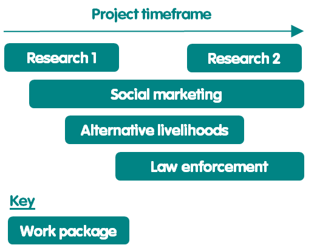
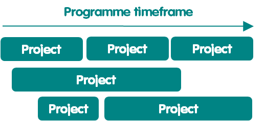

# Untitled

**ADMINISTRACION DE PROYECTOS PARA LA CONSERVACION DE LA VIDA SILVESTRE**

**Serie de prácticas recomendadas para la conservación de la vida silvestre de WildTeam**

El enfoque de Gestión de Proyectos para la Conservación de la Vida Silvestre \(PMWC\) es parte de la serie de prácticas recomendadas para la conservación de la vida silvestre de WildTeam. Esta serie proporciona a los conservacionistas pautas prácticas para ayudarles a lograr un mayor impacto en la conservación. La serie ha sido desarrollada por conservacionistas para conservacionistas, informados por la experiencia on-the-ground, y utilizando el conocimiento más actualizado de los sectores de conservación, negocios y desarrollo. Cada práctica recomendada comprende un manual y un conjunto de documentos de apoyo que son gratuitos para que cualquier persona pueda usar, distribuir y adaptar a sus necesidades. Todas las prácticas recomendadas están disponibles a través de [www.wildteam.org.uk](http://www.wildteam.org.uk/).

**Agradecimientos**

El desarrollo de esta versión del enfoque PMWC no habría sido posible sin el generoso apoyo financiero de un donante anónimo. La primera versión del enfoque PMWC se basó, en parte, en un manual de gestión de proyectos que WildTeam creó en nombre de la actividad Bagh de la Agencia de los Estados Unidos para el Desarrollo Internacional \(USAID\). El enfoque del PMWC también se beneficia de la base de conocimientos sustanciales que ha sido desarrollada a lo largo de décadas por los sectores de negocios, desarrollo y conservación \[1, 2, 3, 4\]. También estamos muy agradecidos a los revisores que ayudaron a mejorar las versiones anteriores de este manual \[5\]. Celia Spiers proporcionó soporte para edición de copias.

**Autores**

Adam Barlow, WildTeam UK, Ali Skeats, WildTeam UK, Beth Robinson, WildTeam España, Christina Barlow, WildTeam Uk, Lucy Boddam-Whetham, WildTeam UK

**Créditos fotográficos**

Las fotos utilizadas en este manual son versiones modificadas de fotos por las siguientes personas:

Portada: Carlos Cram, Introducción: David Mark, Principios: Adam Barlow, Roles: Ashish Kumar Phases: G X Linda, Procesos de control: Desconocido, Procesos administrativos: Adam Barlow, Documentos: Fideicomiso Internacional para la Conservación de la Naturaleza, Apéndice: Vera Kratochvil

**Cita sugerida**

WildTeam. 2018. Gestión de Proyectos para la Conservación de Vida Silvestre v3. Serie de Prácticas Recomendadas de Conservación de Vida Silvestre. WildTeam, Cornualles, Reino Unido.

**Licencia Creative commons**

Este manual de PMWC se emite bajo la licencia Attribution-ShareAlike Creative Commons versión 4.0, que permite a otros:

* Compartir: Copiar y redistribuir el material en cualquier medio o formato.
* Adaptar: Remezclas, transformar y construir sobre el material tanto para fines comerciales y sin fines de lucro.
* Se aplican los siguientes términos:
  * Atribución: Proporcione el crédito adecuado, proporcione un enlace a la licencia e indique si se ha realizado algún cambio. Esto se puede hacer de cualquier manera razonable, pero de ninguna manera que sugiera que el licenciante \(WildTeam\) lo respalda o su uso.
  * ShareAlike: Poner a disposición cualquier adición o cambio en el material bajo la misma licencia que el original.
  * Sin restricciones adicionales: no se pueden aplicar términos legales o [medidas tecnológicas](https://creativecommons.org/licenses/by-sa/3.0/) que restrinjan legalmente a otros a hacer nada que la licencia permita.
  * Los derechos de autor anteriores no cubren el uso de los siguientes elementos \(que están cubiertos por derechos de autor separados\): Logotipo de WildTeam, Todas las fotos utilizadas en el manual de PMWC, Cualquier contenido manual de PMWC al que se haga referencia a otra fuente.

## INTRODUCCION

### 1.- Propósito

El propósito del enfoque de Gestión de Proyectos para la Conservación de la Vida Silvestre \(PMWC\) es ayudar a los conservacionistas a gestionar sus proyectos de una manera que se logre un mayor impacto en la conservación \(Recuadro 1\) \[5\]. El enfoque PMWC se puede utilizar para ayudar a gestionar proyectos de cualquier tamaño o con cualquier enfoque. Por ejemplo, el enfoque PMWC podría utilizarse para un proyecto que trabaje para mejorar los niveles de protección en un parque nacional en beneficio de los elefantes, o para un proyecto que trabaje para ayudar a salvar la biodiversidad mundial mediante el fortalecimiento de la política internacional sobre emisiones de gases de efecto invernadero.

<table>
  <thead>
    <tr>
      <th style="text-align:left"><b>Recuadro 1. Impacto en la conservaci&#xF3;n</b>
      </th>
    </tr>
  </thead>
  <tbody>
    <tr>
      <td style="text-align:left">
        
El impacto en la conservaci&#xF3;n es medido con los cambios positivos
          en:

        <ul>
          <li>Resultados de los objetivos de biodiversidad, por ejemplo, mejor estado
            de la poblaci&#xF3;n de jaguares</li>
          <li>Resultados de amenazas, por ejemplo, la reducci&#xF3;n de la caza furtiva</li>
          <li>Resultados de comportamientos, por ejemplo, la reducci&#xF3;n de la contaminaci&#xF3;n
            de r&#xED;os por parte de las f&#xE1;bricas de cemento</li>
          <li>Resultados de factores contribuyentes, por ejemplo, mejora de las habilidades
            de patrullaje de los guardabosques. [1]</li>
        </ul>
      </td>
    </tr>
  </tbody>
</table>

La aplicación del enfoque PMWC puede ayudar a conservacionistas para controlar y monitorear el progreso de su trabajo, adaptar su trabajo a las condiciones cambiantes, mejorar la comunicación interna y la coordinación, y compartir su aprendizaje tanto interna como externamente.

### 2.- Visión general de Proyectos

#### 2.1.- Parámetros del proyecto

Un proyecto de conservación de la vida silvestre se puede definir como "un esfuerzo temporal para lograr un impacto de conservación medible con un cronograma y presupuesto definidos" \[6\], por ejemplo, un proyecto de presupuesto de 3 años y $50,000 para reducir la intoxicación de perros salvajes en un 30% alrededor del Parque Nacional Kruger. Un proyecto de conservación no es lo mismo que una subvención de conservación \(Recuadro 2\).

| **Recuadro 2. Subvenciones de conservación** |
| :--- |
| Una subvención de conservación es una suma de dinero proporcionada por un donante para cubrir los costos de parte o la totalidad del trabajo de un proyecto. Por lo tanto, un proyecto puede financiarse a través de una o más subvenciones de conservación. Incluso cuando una subvención cubre todos los fondos necesarios para llevar a cabo un proyecto, la subvención es diferente al propio proyecto, que es el esfuerzo real para llevar a cabo el trabajo en línea con parámetros específicos de impacto, cronograma y presupuesto. |

Tener un impacto bien definido, cronograma, y el presupuesto proporciona al equipo del proyecto parámetros claros que pueden utilizar para gestionar el progreso de su trabajo y evaluar si su trabajo está teniendo el efecto deseado. Esencialmente, si el proyecto logra el impacto deseado dentro del presupuesto establecido y el cronograma, se puede considerar un éxito. Por el contrario, si el proyecto no logra el impacto deseado dentro del presupuesto y el cronograma establecidos, puede considerarse un fracaso, en el sentido de que no logró lo que se propuso hacer. Por ejemplo, el proyecto de perros salvajes habría fracasado si sólo lograra una reducción del 15% \(en comparación con el objetivo del 30%\) en la intoxicación por perros salvajes. Del mismo modo, el proyecto también habría fracasado si lograra la reducción del 30% en el envenenamiento de perros salvajes, pero gastado más de los 3 años previstos o el presupuesto de $50,000.

Sin embargo, es posible que el equipo del proyecto ajuste los parámetros del proyecto durante el proyecto en respuesta a la nueva información y las condiciones cambiantes \(consulte Gestión de riesgos y problemas\). Lo que el proyecto se propuso lograr al principio puede, por lo tanto, terminar luciendo muy diferente de lo que se había establecido al final del proyecto. Sin embargo, cualquier cambio en los parámetros del proyecto debe ser aprobado por alguien con el nivel adecuado de rendición de cuentas \(consulte Roles\). Por ejemplo, si los trastornos políticos retrasaron las actividades del proyecto de perros salvajes hasta tal punto que ya no era posible lograr el impacto deseado dentro del plazo de 3 años, entonces el proyecto podría cerrarse, o el plan del proyecto se ajustó a algo que es más realista pero todavía aceptable para la organización que lleva a cabo el proyecto \(ver Principios y Gestión de riesgos y problemas\).

Además, aunque todos los proyectos tienen un punto final, ningún trabajo de conservación debe detenerse al final de un proyecto. En su lugar, el final de un proyecto proporciona un punto de control para que el equipo del proyecto reflexione sobre el progreso que han realizado y para utilizar las lecciones aprendidas para planificar el próximo proyecto. Por ejemplo, al final del proyecto de perros salvajes, el equipo del proyecto podría reflexionar sobre lo que logró y utilizar esa información para decidir si seguir tratando de reducir el envenenamiento de perros salvajes o centrarse en una amenaza diferente como la pérdida de hábitat, si la pérdida de hábitat ahora parecía ser una amenaza más importante para abordar.

#### 2.2.- Trabajo del proyecto

Todo el trabajo del proyecto se organiza en paquetes de trabajo. Un paquete de trabajo es una colección de actividades de conservación relacionadas, por ejemplo, actividades de política. Los proyectos se pueden componer de uno o varios paquetes de trabajo que se ejecutan secuencialmente, en paralelo o ambos \(figura 01\).

Figura 01. Ejemplo de arreglo de paquetes de trabajo de proyecto.

#### 2.3.- Proyectos y programas

Los proyectos de conservación podrán llevarse a cabo de forma aislada o como parte de un programa de trabajo más amplio \[2\]. Un programa puede considerarse como una colección de proyectos. Por ejemplo, podría haber un proyecto independiente para reducir el consumo de energía de combustibles fósiles por parte de las personas que viven en Alemania, o ese proyecto podría formar parte de un programa más amplio para reducir las emisiones de gases de efecto invernadero en Alemania.

Un programa proporciona la supervisión estratégica de lo que los proyectos combinados pretenden lograr, y los proyectos proporcionan un marco para la realización de las partes manejables del trabajo dentro de ese programa. La ventaja de dividir el trabajo de conservación de un programa en proyectos es que proporciona un conjunto de puntos de control importantes que pueden ser utilizados por un equipo de conservación para asegurarse de que están en el camino correcto para lograr el impacto deseado del programa. Sin que el trabajo se divida en proyectos, el programa puede continuar hasta el final de su cronograma antes de que el equipo se dé cuenta de que no ha logrado lo que se propuso hacer.

Los proyectos y programas pueden llevarse a cabo durante cualquier período de tiempo. Del mismo modo, dentro de un programa, los proyectos pueden llevarse a cabo secuencialmente, en paralelo, o ambos \(Figura 02\).

Figura 02. Ejemplos de arreglos de proyectos dentro de un programa.

Sin embargo, para que las cosas sean lo más fáciles de gestionar posible, se recomienda una disposición secuencial de 3 proyectos dentro de un único programa \(Figura 03\). También se recomiendan los siguientes plazos para un programa y sus proyectos:

9-12 años para un programa, para proporcionar una cantidad razonable de tiempo para alcanzar algún grado de cambio medible en los resultados de amenaza o biodiversidad

3-4 años para un proyecto, para proporcionar una cantidad razonable de tiempo para llevar a cabo las actividades del proyecto y lograr cambios medibles en los resultados de factores y comportamientos contribuyentes.

Figura 03. Arreglo recomendado y plazos de los proyectos en un programa.

### 3.- Descripción general del manual

El enfoque PMWC se puede utilizar por sí solo, pero también es compatible tanto con los estándares abiertos para la Práctica de Conservación \[4\] como con el enfoque de Desarrollo de Estrategia para la Conservación de la Vida Silvestre \[7\] \(Apéndice 2\).

El enfoque PMWC se compone de 6 componentes:

* **Principios,** para mantener altos estándares de eficacia y ética
* **Roles,** para aclarar la estructura del equipo y la toma de decisiones
* **Fases,** para gestionar un proyecto de principio a fin
* **Procesos de control,** para mantener un proyecto en marcha y adaptarse a los nuevos conocimientos y las condiciones cambiantes
* **Procesos administrativos,** para ayudar a llevar a cabo reuniones internas eficaces y desarrollar documentos de proyectos de alta calidad y resultados técnicos
* **Documentos,** para crear documentos de proyecto, estandarizados y vinculados.

Cada componente PMWC incluye directrices sobre cómo se puede adaptar ese componente para adaptarse a un entorno de proyecto determinado. Además de los 6 componentes, los Apéndices proporcionan un plan de proyecto de ejemplo. Los apéndices también describen cómo el enfoque PMWC es compatible con los Estándares Abiertos para la Práctica de Conservación y el enfoque de Desarrollo de Estrategia para la Conservación de la Vida Silvestre.

### 4.- Recursos de Apoyo

Se proporciona un conjunto de documentos justificativos para ayudar a un equipo del proyecto a aplicar el enfoque PMWC \(Recuadro 3\). Estos documentos cubren todos los documentos PMWC mencionados en este manual. En la Tabla 1 se enumeran los enlaces a todos los documentos, así como a otros enlaces para ayudar a los conservacionistas a aplicar el enfoque PMWC y otras prácticas recomendadas relacionadas.

<table>
  <thead>
    <tr>
      <th style="text-align:left">Recuadro 3. Documentos de apoyo</th>
    </tr>
  </thead>
  <tbody>
    <tr>
      <td style="text-align:left">
        
Planes:

        
Plan de proyecto

        
Ratreadores:

        
Rastreador previo al proyecto

        
Rastreador de proyectos

        
Rastreador de revisi&#xF3;n de documentos

        
Rastreador de documentos

        
Informes:

        
Informe de la reuni&#xF3;n

        
Informe mensual/trimestral/anual/fase final del reporte

        
Informe de excepci&#xF3;n

        
Informe de auditor&#xED;a de aseguramiento del proyecto

        
Informe de auditor&#xED;a de aseguramiento de operaciones

        
Informe del final del proyecto.

      </td>
    </tr>
  </tbody>
</table>

Tabla 1 _Recursos de apoyo._

| **Recurso** | **Enlace de acceso** |
| :--- | :--- |
| Documentos PMWC | [**Enlace 1**](https://drive.google.com/open?id=1lTw0TUwwU58wT52VXQ3gQXQQVxDTvX9g) |
| Capacitación sobre PMWC y otras mejores prácticas | [**Enlace**](http://www.wildteam.org.uk/classroom) **2** |
| Enfoque de desarrollo de estrategias para la conservación de la vida silvestre | [**Enlace 3**](https://drive.google.com/open?id=1oYaS1uOyRjGA_w55YOd3N5YbGci-diR4) |

## 

