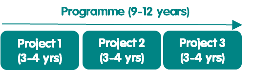
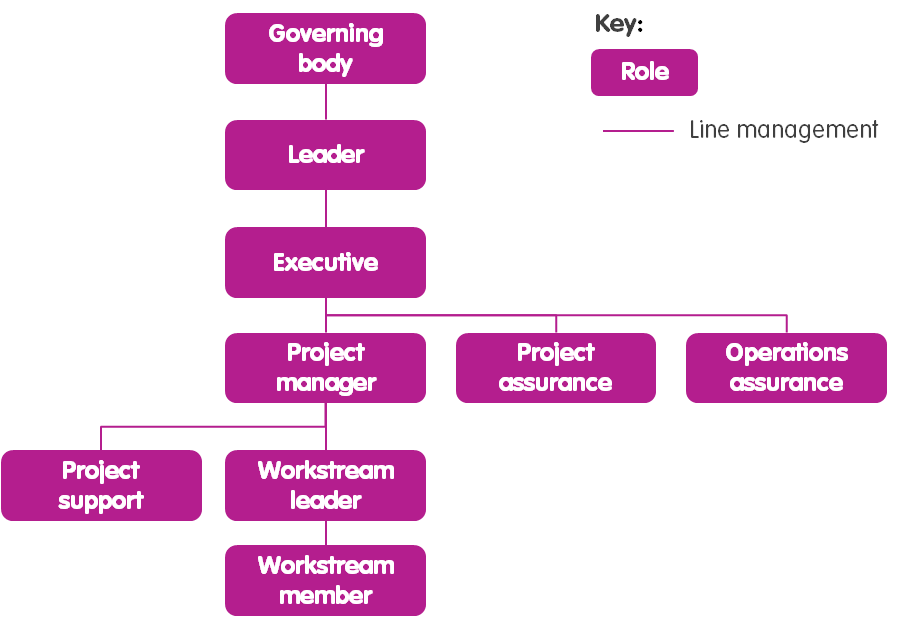
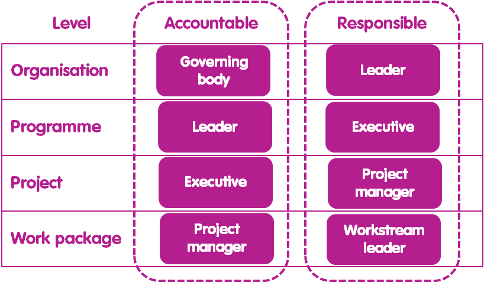
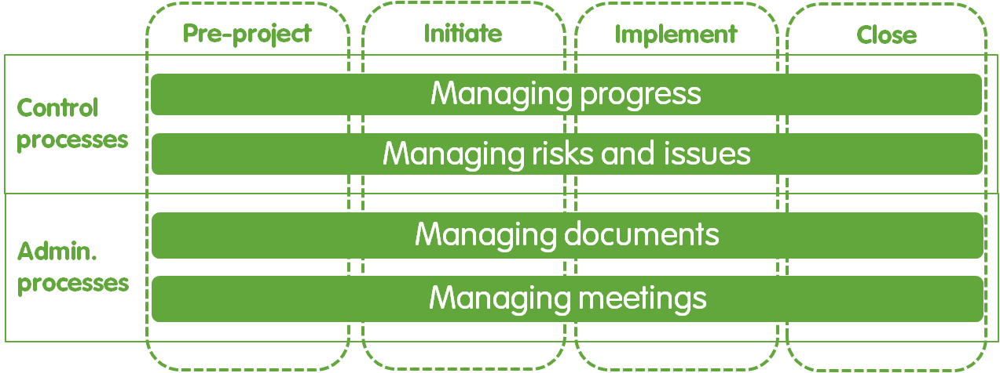
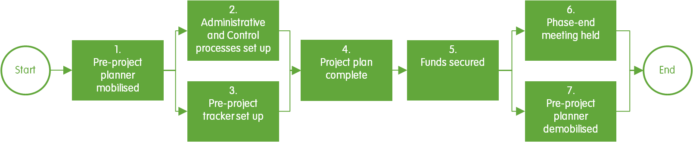
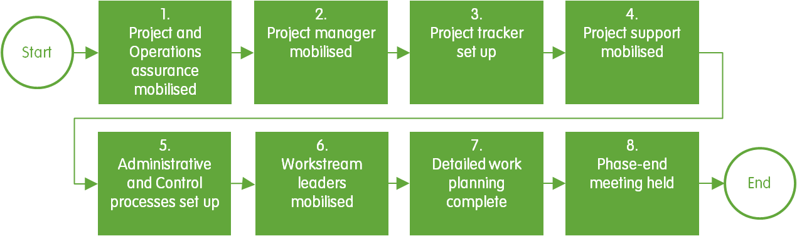
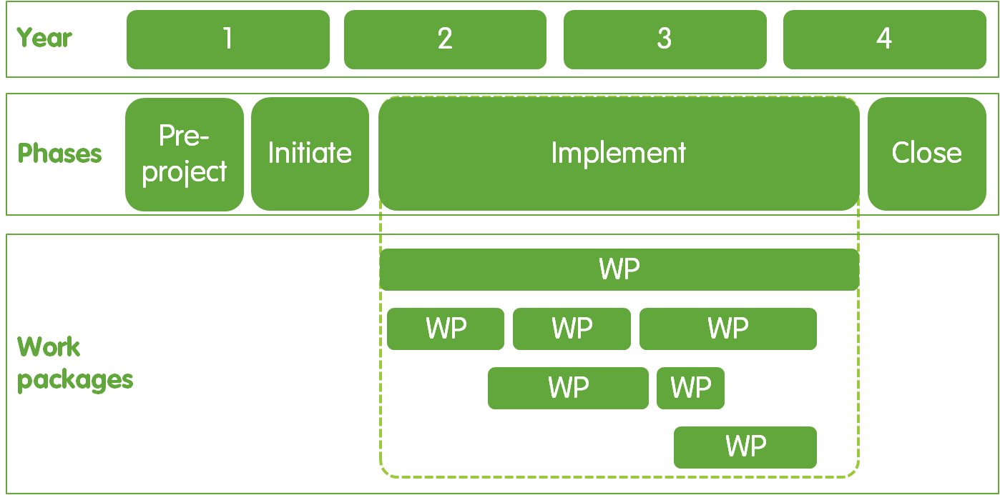
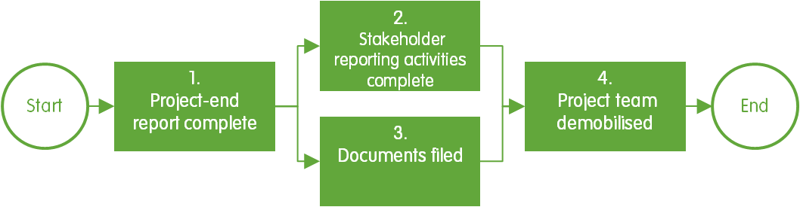
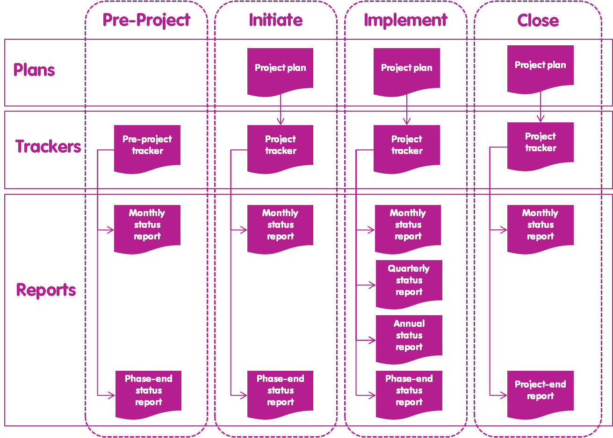
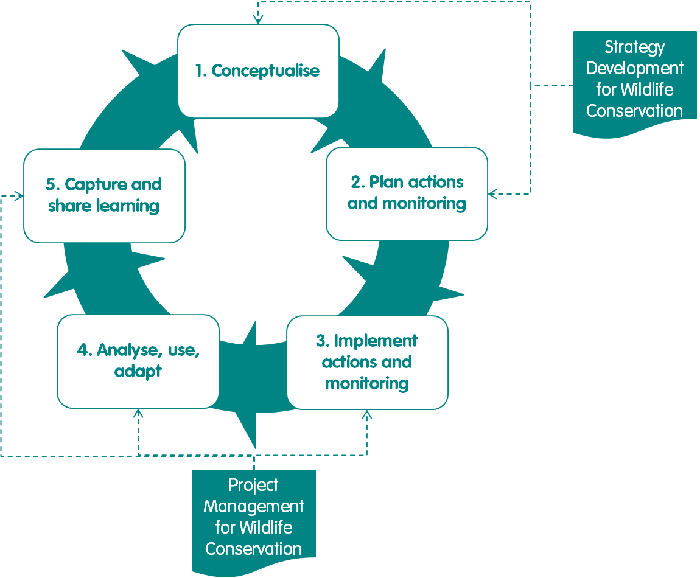

# Untitled

**ADMINISTRACION DE PROYECTOS PARA LA CONSERVACION DE LA VIDA SILVESTRE**

**Serie de prácticas recomendadas para la conservación de la vida silvestre de WildTeam**

El enfoque de Gestión de Proyectos para la Conservación de la Vida Silvestre \(PMWC\) es parte de la serie de prácticas recomendadas para la conservación de la vida silvestre de WildTeam. Esta serie proporciona a los conservacionistas pautas prácticas para ayudarles a lograr un mayor impacto en la conservación. La serie ha sido desarrollada por conservacionistas para conservacionistas, informados por la experiencia on-the-ground, y utilizando el conocimiento más actualizado de los sectores de conservación, negocios y desarrollo. Cada práctica recomendada comprende un manual y un conjunto de documentos de apoyo que son gratuitos para que cualquier persona pueda usar, distribuir y adaptar a sus necesidades. Todas las prácticas recomendadas están disponibles a través de [www.wildteam.org.uk](http://www.wildteam.org.uk/).

**Agradecimientos**

El desarrollo de esta versión del enfoque PMWC no habría sido posible sin el generoso apoyo financiero de un donante anónimo. La primera versión del enfoque PMWC se basó, en parte, en un manual de gestión de proyectos que WildTeam creó en nombre de la actividad Bagh de la Agencia de los Estados Unidos para el Desarrollo Internacional \(USAID\). El enfoque del PMWC también se beneficia de la base de conocimientos sustanciales que ha sido desarrollada a lo largo de décadas por los sectores de negocios, desarrollo y conservación \[1, 2, 3, 4\]. También estamos muy agradecidos a los revisores que ayudaron a mejorar las versiones anteriores de este manual \[5\]. Celia Spiers proporcionó soporte para edición de copias.

**Autores**

Adam Barlow, WildTeam UK, Ali Skeats, WildTeam UK, Beth Robinson, WildTeam España, Christina Barlow, WildTeam Uk, Lucy Boddam-Whetham, WildTeam UK

**Créditos fotográficos**

Las fotos utilizadas en este manual son versiones modificadas de fotos por las siguientes personas:

Portada: Carlos Cram, Introducción: David Mark, Principios: Adam Barlow, Roles: Ashish Kumar Phases: G X Linda, Procesos de control: Desconocido, Procesos administrativos: Adam Barlow, Documentos: Fideicomiso Internacional para la Conservación de la Naturaleza, Apéndice: Vera Kratochvil

**Cita sugerida**

WildTeam. 2018. Gestión de Proyectos para la Conservación de Vida Silvestre v3. Serie de Prácticas Recomendadas de Conservación de Vida Silvestre. WildTeam, Cornualles, Reino Unido.

**Licencia Creative commons**

Este manual de PMWC se emite bajo la licencia Attribution-ShareAlike Creative Commons versión 4.0, que permite a otros:

* Compartir: Copiar y redistribuir el material en cualquier medio o formato.
* Adaptar: Remezclas, transformar y construir sobre el material tanto para fines comerciales y sin fines de lucro.
* Se aplican los siguientes términos:
  * Atribución: Proporcione el crédito adecuado, proporcione un enlace a la licencia e indique si se ha realizado algún cambio. Esto se puede hacer de cualquier manera razonable, pero de ninguna manera que sugiera que el licenciante \(WildTeam\) lo respalda o su uso.
  * ShareAlike: Poner a disposición cualquier adición o cambio en el material bajo la misma licencia que el original.
  * Sin restricciones adicionales: no se pueden aplicar términos legales o [medidas tecnológicas](https://creativecommons.org/licenses/by-sa/3.0/) que restrinjan legalmente a otros a hacer nada que la licencia permita.
  * Los derechos de autor anteriores no cubren el uso de los siguientes elementos \(que están cubiertos por derechos de autor separados\): Logotipo de WildTeam, Todas las fotos utilizadas en el manual de PMWC, Cualquier contenido manual de PMWC al que se haga referencia a otra fuente.

## INTRODUCCION

### 1.- Propósito

El propósito del enfoque de Gestión de Proyectos para la Conservación de la Vida Silvestre \(PMWC\) es ayudar a los conservacionistas a gestionar sus proyectos de una manera que se logre un mayor impacto en la conservación \(Recuadro 1\) \[5\]. El enfoque PMWC se puede utilizar para ayudar a gestionar proyectos de cualquier tamaño o con cualquier enfoque. Por ejemplo, el enfoque PMWC podría utilizarse para un proyecto que trabaje para mejorar los niveles de protección en un parque nacional en beneficio de los elefantes, o para un proyecto que trabaje para ayudar a salvar la biodiversidad mundial mediante el fortalecimiento de la política internacional sobre emisiones de gases de efecto invernadero.

<table>
  <thead>
    <tr>
      <th style="text-align:left"><b>Recuadro 1. Impacto en la conservaci&#xF3;n</b>
      </th>
    </tr>
  </thead>
  <tbody>
    <tr>
      <td style="text-align:left">
        
El impacto en la conservaci&#xF3;n es medido con los cambios positivos
          en:

        <ul>
          <li>Resultados de los objetivos de biodiversidad, por ejemplo, mejor estado
            de la poblaci&#xF3;n de jaguares</li>
          <li>Resultados de amenazas, por ejemplo, la reducci&#xF3;n de la caza furtiva</li>
          <li>Resultados de comportamientos, por ejemplo, la reducci&#xF3;n de la contaminaci&#xF3;n
            de r&#xED;os por parte de las f&#xE1;bricas de cemento</li>
          <li>Resultados de factores contribuyentes, por ejemplo, mejora de las habilidades
            de patrullaje de los guardabosques. [1]</li>
        </ul>
      </td>
    </tr>
  </tbody>
</table>

La aplicación del enfoque PMWC puede ayudar a conservacionistas para controlar y monitorear el progreso de su trabajo, adaptar su trabajo a las condiciones cambiantes, mejorar la comunicación interna y la coordinación, y compartir su aprendizaje tanto interna como externamente.

### 2.- Visión general de Proyectos

#### 2.1.- Parámetros del proyecto

Un proyecto de conservación de la vida silvestre se puede definir como "un esfuerzo temporal para lograr un impacto de conservación medible con un cronograma y presupuesto definidos" \[6\], por ejemplo, un proyecto de presupuesto de 3 años y $50,000 para reducir la intoxicación de perros salvajes en un 30% alrededor del Parque Nacional Kruger. Un proyecto de conservación no es lo mismo que una subvención de conservación \(Recuadro 2\).

| **Recuadro 2. Subvenciones de conservación** |
| :--- |
| Una subvención de conservación es una suma de dinero proporcionada por un donante para cubrir los costos de parte o la totalidad del trabajo de un proyecto. Por lo tanto, un proyecto puede financiarse a través de una o más subvenciones de conservación. Incluso cuando una subvención cubre todos los fondos necesarios para llevar a cabo un proyecto, la subvención es diferente al propio proyecto, que es el esfuerzo real para llevar a cabo el trabajo en línea con parámetros específicos de impacto, cronograma y presupuesto. |

Tener un impacto bien definido, cronograma, y el presupuesto proporciona al equipo del proyecto parámetros claros que pueden utilizar para gestionar el progreso de su trabajo y evaluar si su trabajo está teniendo el efecto deseado. Esencialmente, si el proyecto logra el impacto deseado dentro del presupuesto establecido y el cronograma, se puede considerar un éxito. Por el contrario, si el proyecto no logra el impacto deseado dentro del presupuesto y el cronograma establecidos, puede considerarse un fracaso, en el sentido de que no logró lo que se propuso hacer. Por ejemplo, el proyecto de perros salvajes habría fracasado si sólo lograra una reducción del 15% \(en comparación con el objetivo del 30%\) en la intoxicación por perros salvajes. Del mismo modo, el proyecto también habría fracasado si lograra la reducción del 30% en el envenenamiento de perros salvajes, pero gastado más de los 3 años previstos o el presupuesto de $50,000.

Sin embargo, es posible que el equipo del proyecto ajuste los parámetros del proyecto durante el proyecto en respuesta a la nueva información y las condiciones cambiantes \(consulte Gestión de riesgos y problemas\). Lo que el proyecto se propuso lograr al principio puede, por lo tanto, terminar luciendo muy diferente de lo que se había establecido al final del proyecto. Sin embargo, cualquier cambio en los parámetros del proyecto debe ser aprobado por alguien con el nivel adecuado de rendición de cuentas \(consulte Roles\). Por ejemplo, si los trastornos políticos retrasaron las actividades del proyecto de perros salvajes hasta tal punto que ya no era posible lograr el impacto deseado dentro del plazo de 3 años, entonces el proyecto podría cerrarse, o el plan del proyecto se ajustó a algo que es más realista pero todavía aceptable para la organización que lleva a cabo el proyecto \(ver Principios y Gestión de riesgos y problemas\).

Además, aunque todos los proyectos tienen un punto final, ningún trabajo de conservación debe detenerse al final de un proyecto. En su lugar, el final de un proyecto proporciona un punto de control para que el equipo del proyecto reflexione sobre el progreso que han realizado y para utilizar las lecciones aprendidas para planificar el próximo proyecto. Por ejemplo, al final del proyecto de perros salvajes, el equipo del proyecto podría reflexionar sobre lo que logró y utilizar esa información para decidir si seguir tratando de reducir el envenenamiento de perros salvajes o centrarse en una amenaza diferente como la pérdida de hábitat, si la pérdida de hábitat ahora parecía ser una amenaza más importante para abordar.

#### 2.2.- Trabajo del proyecto

Todo el trabajo del proyecto se organiza en paquetes de trabajo. Un paquete de trabajo es una colección de actividades de conservación relacionadas, por ejemplo, actividades de política. Los proyectos se pueden componer de uno o varios paquetes de trabajo que se ejecutan secuencialmente, en paralelo o ambos \(figura 01\).

Figura 01. Ejemplo de arreglo de paquetes de trabajo de proyecto.

#### 2.3.- Proyectos y programas

Los proyectos de conservación podrán llevarse a cabo de forma aislada o como parte de un programa de trabajo más amplio \[2\]. Un programa puede considerarse como una colección de proyectos. Por ejemplo, podría haber un proyecto independiente para reducir el consumo de energía de combustibles fósiles por parte de las personas que viven en Alemania, o ese proyecto podría formar parte de un programa más amplio para reducir las emisiones de gases de efecto invernadero en Alemania.

Un programa proporciona la supervisión estratégica de lo que los proyectos combinados pretenden lograr, y los proyectos proporcionan un marco para la realización de las partes manejables del trabajo dentro de ese programa. La ventaja de dividir el trabajo de conservación de un programa en proyectos es que proporciona un conjunto de puntos de control importantes que pueden ser utilizados por un equipo de conservación para asegurarse de que están en el camino correcto para lograr el impacto deseado del programa. Sin que el trabajo se divida en proyectos, el programa puede continuar hasta el final de su cronograma antes de que el equipo se dé cuenta de que no ha logrado lo que se propuso hacer.

Los proyectos y programas pueden llevarse a cabo durante cualquier período de tiempo. Del mismo modo, dentro de un programa, los proyectos pueden llevarse a cabo secuencialmente, en paralelo, o ambos \(Figura 02\).

Figura 02. Ejemplos de arreglos de proyectos dentro de un programa.

Sin embargo, para que las cosas sean lo más fáciles de gestionar posible, se recomienda una disposición secuencial de 3 proyectos dentro de un único programa \(Figura 03\). También se recomiendan los siguientes plazos para un programa y sus proyectos:

9-12 años para un programa, para proporcionar una cantidad razonable de tiempo para alcanzar algún grado de cambio medible en los resultados de amenaza o biodiversidad

3-4 años para un proyecto, para proporcionar una cantidad razonable de tiempo para llevar a cabo las actividades del proyecto y lograr cambios medibles en los resultados de factores y comportamientos contribuyentes.

Figura 03. Arreglo recomendado y plazos de los proyectos en un programa.

### 3.- Descripción general del manual

El enfoque PMWC se puede utilizar por sí solo, pero también es compatible tanto con los estándares abiertos para la Práctica de Conservación \[4\] como con el enfoque de Desarrollo de Estrategia para la Conservación de la Vida Silvestre \[7\] \(Apéndice 2\).

El enfoque PMWC se compone de 6 componentes:

* **Principios,** para mantener altos estándares de eficacia y ética
* **Roles,** para aclarar la estructura del equipo y la toma de decisiones
* **Fases,** para gestionar un proyecto de principio a fin
* **Procesos de control,** para mantener un proyecto en marcha y adaptarse a los nuevos conocimientos y las condiciones cambiantes
* **Procesos administrativos,** para ayudar a llevar a cabo reuniones internas eficaces y desarrollar documentos de proyectos de alta calidad y resultados técnicos
* **Documentos,** para crear documentos de proyecto, estandarizados y vinculados.

Cada componente PMWC incluye directrices sobre cómo se puede adaptar ese componente para adaptarse a un entorno de proyecto determinado. Además de los 6 componentes, los Apéndices proporcionan un plan de proyecto de ejemplo. Los apéndices también describen cómo el enfoque PMWC es compatible con los Estándares Abiertos para la Práctica de Conservación y el enfoque de Desarrollo de Estrategia para la Conservación de la Vida Silvestre.

### 4.- Recursos de Apoyo

Se proporciona un conjunto de documentos justificativos para ayudar a un equipo del proyecto a aplicar el enfoque PMWC \(Recuadro 3\). Estos documentos cubren todos los documentos PMWC mencionados en este manual. En la Tabla 1 se enumeran los enlaces a todos los documentos, así como a otros enlaces para ayudar a los conservacionistas a aplicar el enfoque PMWC y otras prácticas recomendadas relacionadas.

<table>
  <thead>
    <tr>
      <th style="text-align:left">Recuadro 3. Documentos de apoyo</th>
    </tr>
  </thead>
  <tbody>
    <tr>
      <td style="text-align:left">
        
Planes:

        
Plan de proyecto

        
Ratreadores:

        
Rastreador previo al proyecto

        
Rastreador de proyectos

        
Rastreador de revisi&#xF3;n de documentos

        
Rastreador de documentos

        
Informes:

        
Informe de la reuni&#xF3;n

        
Informe mensual/trimestral/anual/fase final del reporte

        
Informe de excepci&#xF3;n

        
Informe de auditor&#xED;a de aseguramiento del proyecto

        
Informe de auditor&#xED;a de aseguramiento de operaciones

        
Informe del final del proyecto.

      </td>
    </tr>
  </tbody>
</table>

Tabla 1 _Recursos de apoyo._

| **Recurso** | **Enlace de acceso** |
| :--- | :--- |
| Documentos PMWC | [**Enlace 1**](https://drive.google.com/open?id=1lTw0TUwwU58wT52VXQ3gQXQQVxDTvX9g) |
| Capacitación sobre PMWC y otras mejores prácticas | [**Enlace**](http://www.wildteam.org.uk/classroom) **2** |
| Enfoque de desarrollo de estrategias para la conservación de la vida silvestre | [**Enlace 3**](https://drive.google.com/open?id=1oYaS1uOyRjGA_w55YOd3N5YbGci-diR4) |

## PRINCIPIOS

### 1.- Visión general

El propósito de los Principios es asegurar que un proyecto mantenga altos estándares de eficacia y ética. Hay 5 principios PMWC \[5\]. Siguiendo estos principios se asegura que un proyecto:

* Se implementa a pesar de cierto nivel de incertidumbre \(**Hacer** **algo**\)
* Se centra más en lo que pretende lograr en lugar de cómo lo logrará \(**Enfoque en el** **impacto**\)
* Documenta claramente lo que todo el equipo del proyecto está destinado a hacer \(Saber quién **hace** **qué**\)
* Se adapta a los conocimientos y condiciones cambiantes \(**Adaptación informada**\)
* Se gestiona utilizando un enfoque que mejor se adapte a las necesidades del proyecto **\(Adecuacion para el propósito\).**\).

En el Recuadro 4 se describen orientaciones sobre cómo se pueden adaptar los principios.

### 2.- Haz algo

#### 2.1.- Propósito

Si un equipo del proyecto decide llevar a cabo nuevas investigaciones para recopilar toda la información que necesitan para desarrollar un plan de proyecto perfecto, también están optando por aceptar que la biodiversidad que están tratando de salvar seguirá siendo degradada mientras se lleva a cabo la investigación. El propósito del principio Hacer algo es, por lo tanto, alentar a los equipos del proyecto a implementar su plan de proyecto a pesar de la falta de información.

#### 2.2.- Aplicación

El principio Hacer algo se aplica implementando el plan del Proyecto, al tiempo que reconoce la incertidumbre que generan las lagunas en la información en la que se basa el plan del Proyecto. Las lagunas de información se pueden cotejar en un programa de investigación, y la incertidumbre se puede evaluar a través de los niveles de confianza asociados con los vínculos entre los diferentes puntos de los modelos conceptuales que componen la parte de la estrategia de conservación del plan del proyecto \[7\]. La incertidumbre también puede ser manejada por la identificación y el tratamiento activo del equipo del proyecto \(consulte Gestión de riesgos y problemas\). Puede haber algunos casos en los que las partes del plan del proyecto son tan inciertas que no se puedan implementar inmediatamente. En tales casos, el equipo del proyecto puede programar la implementación de una manera que comience con las partes del plan del proyecto con las que están más seguros, al tiempo que recopila información y actualiza las partes del plan del proyecto que son más inciertas, que se implementarán más adelante en el proyecto.

Por ejemplo, un equipo del proyecto que trabaja para salvar leones en el Parque Nacional de Nairobi puede no estar seguro de la escala, distribución o causas de envenenamiento de leones por parte de los aldeanos locales, pero saben que si no hacen un plan de proyecto ahora y comienzan a implementarlo, pueden estar seguros de que los leones se continuarán perdiendo. Por lo tanto, ese equipo del proyecto debe desarrollar e implementar un plan de proyecto que incluya actividades para reducir la matanza de leones, y también crear una agenda de investigación para ayudarles a evaluar, comprender y monitorear mejor la matanza de leones en el futuro.

### 3.- Enfoque en el impacto

#### 3.1.- Propósito

Como conservacionistas, el equipo del proyecto tiene la responsabilidad de asegurar que el tiempo y los fondos que gastan están teniendo un impacto positivo en la biodiversidad de interés. El principio enfocarse en el impacto se utiliza para garantizar que los equipos de proyecto den más importancia a lo que están tratando de lograr \(impacto\) que en cómo están tratando de lograrlo \(paquetes de trabajo\). Este principio es ayudar a los equipos del proyecto a evitar el gasto continuo de recursos en paquetes de trabajo que no están logrando el impacto deseado, y en su lugar buscar los medios más rápidos y rentables para lograr el impacto deseado.

#### 3.2.- Aplicación

El principio de enfoque en el impacto se aplica al tener una definición clara del impacto deseado en el plan del proyecto, junto con los objetivos y los indicadores asociados utilizados para evaluar cuándo se ha logrado el impacto \(ver Documentos\). A continuación, se realiza un seguimiento del progreso hacia la consecución del impacto deseado a través del proceso de gestión del progreso. Si el impacto del proyecto está en peligro de no alcanzarse dentro de la programación y el presupuesto descritos en el plan del proyecto, el plan del proyecto se actualiza con parámetros más realistas o el proyecto se cierra \(consulte Gestión de los procesos de riesgos y problemas\). Bajo este principio, un proyecto ha fallado si no ha logrado el impacto deseado descrito en el plan del proyecto, a pesar de que puede haber entregado todos sus paquetes de trabajo dentro de la programación y el presupuesto. Por el contrario, un proyecto ha tenido éxito si el impacto se ha logrado a pesar de los cambios importantes\(autorizados\) en los paq0uetes de trabajo, la cronograma y el presupuesto \(véase Gestión de riesgos\). Por ejemplo, un proyecto que impartió capacitación en línea en aplicación de la ley al personal del departamento forestal del gobierno habría fracasado si ese paquete de trabajo no lograra el impacto deseado de una mejora en los niveles de habilidades de aplicación de la ley para ese personal del departamento forestal.

### 4.- Saber quién hace qué

#### 4.1.- Propósito

El principio saber quién hace que, es el principio para asegurar que todos los involucrados en el proyecto sepanj lo que están destinados a decidir y hacer. Seguir este principio significa que el tiempo, la experiencia y el nivel de autoridad de cada miembro del equipo se utiliza eficazmente, lo que ayudará a acelerar la toma de decisiones y la finalización de los paquetes de trabajo.

#### 4.2.- Aplicación

El principio saber quién hace qué, se logra mediante un equipo bien estructurado y roles claros para cada miembro del equipo. Estos roles deben ser bien comunicados, comprendidos, respetados y actuados en todo el equipo. Este principio se aplica mediante la designación de roles y la gestión de líneas en el plan de proyecto y la adhesión a las responsabilidades de rol descritas en los Roles, Fases, Procesos de Control y Procesos Administrativos. Del mismo modo, al implementar la sección del plan de trabajo del plan de proyecto, cada elemento de ese plan de trabajo debe asignarse a un solo miembro del equipo, para evitar cualquier confusión en cuanto a quién está destinado a entregar ese hito o tarea. Un proyecto que aplique el principio Saber quién hace qué, por ejemplo, no se retrasaría al requerir el tiempo del Ejecutivo para decidir qué orador contratar para un evento de concienciación, o qué diseño utilizar para un póster de campaña, porque la responsabilidad de esos niveles de decisión habría sido delegada al gerente del proyecto o a un líder del flujo de trabajo. Del mismo modo, quedaría claro qué miembro del equipo era responsable si un proyecto lograba completar una serie de eventos de sensibilización antes de lo previsto y bajo presupuesto, porque todas las tareas relacionadas con esa actividad se habrían asignado a un miembro específico del equipo.

### 5.- Adaptación informada

#### 5.1.- Propósito

El principio de adaptación informada se utiliza para permitir y fomentar un proyecto para adaptarse a las condiciones cambiantes a lo largo de su ciclo de vida y, por lo tanto, aumentar sus posibilidades de lograr el impacto deseado.

#### 5.2. -Aplicación

El principio de adaptación informada se logra mediante la identificación, el seguimiento, la documentación y la respuesta activas a nuevas informaciones, situaciones o lecciones a medida que surgen. Este principio se aplica en el enfoque PMWC a través del desarrollo del plan inicial del Proyecto, el seguimiento y adaptación posterior de ese plan de proyecto a través de los procesos de Control. Bajo este principio, por ejemplo, si un proyecto descubre que una campaña de concienciación previa en una aldea en particular fue bloqueada por líderes locales, entonces ese proyecto podría ajustar el plan del proyecto para incluir hitos adicionales para identificar y superar las preocupaciones de los líderes locales.

### 6.- Apto para el propósito

#### 6.1.-Propósito

El principio Fit for purpose se utiliza para asegurarse de que el enfoque PMWC se adapta de manera que se adapte a la escala, complejidad, importancia y nivel de riesgo de un proyecto en particular \(recuadro 4\). No seguir este principio puede conducir a fallas o ineficiencias del proyecto, porque el enfoque de gestión del proyecto es inadecuado para el proyecto en cuestión.

#### 6.2.- Aplicación

El principio Fit for purpose se aplica modificando el enfoque PMWC para adaptarse a las necesidades del proyecto en cuestión, siguiendo las directrices de adaptación para cada componente. Las directrices de adaptación contienen límites establecidos para garantizar el cumplimiento de los principios de PMWC. Un uso demasiado ligero de los procesos de Control, por ejemplo, no establecerá controles suficientes para hacer frente a riesgos y problemas que de otro modo podrían poner en peligro el impacto de un proyecto, o hacer que se acabe con el horario y el presupuesto. Esto hará que el proyecto no cumpla con el principio Focus on impact. Por el contrario, los procesos de control aplicados demasiado a un proyecto en particular perderán tiempo y dinero implementando niveles de control inadecuados que obstaculizan, en lugar de apoyar, el logro del impacto del proyecto. Por ejemplo, un proyecto de bajo riesgo y bajo presupuesto puede adaptar el enfoque pmWC para llevar a cabo menos reuniones de situación para supervisar el progreso.

<table>
  <thead>
    <tr>
      <th style="text-align:left">Recuadro 4. Principios de adaptaci&#xF3;n</th>
    </tr>
  </thead>
  <tbody>
    <tr>
      <td style="text-align:left">
        
Todos los los principios de PMWC deben aplicarse independientemente de
          la escala, complejidad o alcance del el proyecto. Esto se debe Un que estos
          principios Hijo esenciales para garantizar Onu proyecto eficiente que tenga
          las mejores Posibilidades de lograr Onu impacto medible en la conservaci&#xF3;n.

        
Aunque todos los proyectos deben adherirse a todos los principios, cada
          equipo del proyecto debe decidir c&#xF3;mo infundir esos principios en
          la aplicaci&#xF3;n de cada componente del proyecto. Por ejemplo, para adherirse
          al principio Hacer algo, cada equipo del proyecto debe juzgar qu&#xE9;
          nivel de incertidumbre est&#xE1;n dispuestos a aceptar antes de pasar a
          la fase de implementaci&#xF3;n del proyecto. Del mismo modo, cada equipo
          del proyecto debe decidir por s&#xED; mismo c&#xF3;mo definir el impactoquequieren
          lograr, que luego

        
determinar si el proyecto ha a&#xF1;os &#xE9;xito o ha fracasado bajo
          el principio de Enfoque es el impacto.

      </td>
    </tr>
  </tbody>
</table>

## ROLES

### 1.- Visión general

El propósito de asignar roles es ayudar a garantizar una toma de decisiones clara, un control eficiente del proyecto, cohesión del equipo y satisfacción laboral individual. Un rol es diferente a una publicación o posición en que se pueden asignar varios roles al mismo miembro del equipo \[6\]. Por ejemplo, alguien puede tener el puesto de coordinador del Programa, pero puede tener el rol de Ejecutivo para un proyecto y Gerente de Proyecto para un proyecto diferente.

A todos los miembros del equipo del proyecto se les asigna 1 de cada 10 roles de equipo de proyecto. En esos componentes se describen otras funciones relacionadas con las fases, los procesos administrativos y los procesos de control. En el recuadro 5 se describen las orientaciones sobre cómo se pueden adaptar los roles.

### 2.- Número de Roles

Para garantizar una toma de decisiones clara y rápida, solo puede haber 1 rol de líder, 1 ejecutivo y 1 jefe de proyecto. Para todos los demás roles, puede haber tantos de esos tipos de roles asignados como sea necesario por el proyecto. Por ejemplo, puede haber 3 roles de soporte de proyecto, 5 líderes de Workstream y 20 roles de miembro de Workstream asignados para un proyecto determinado \(Figura 04\).

Figura 4. Número de cada rol que se puede asignar.

### 3.- Distribución de los roles

Debido a la naturaleza de la obra, el cargo del órgano de gobierno nunca puede asignarse a alguien con ningún otro papel. El rol Líder se puede asignar a lae misma persona a la que se le ha asignado el rol Ejecutivo, pero ni el rol Líder ni el Ejecutivo se pueden asignar a alguien a quien se le haya asignado ningún otro rol. Esto es para asegurar que la persona que está supervisando el proyecto no está llevando a cabo también un papel que está ayudando a entregar o evaluar el proyecto.

Del mismo modo, aunque las funciones de garantía de proyecto y garantía de operaciones se pueden asignar a la misma persona, estos roles nunca deben asignarse a una persona con ningún otro rol. Esto se debe a que todos los demás roles están involucrados de alguna manera con la entrega del proyecto, por lo que esa persona no sería capaz de evaluar objetivamente si el proyecto se adhiere al plan de proyecto y las políticas de operaciones.

Todos los demás tipos de rol se pueden asignar a las mismas personas o a diferentes, independientemente de los demás roles que se asignen. Por ejemplo, para un proyecto pequeño, los roles De gerente de proyecto, Soporte de proyecto, Líder de Workstream y Miembro de Workstream se pueden asignar a la misma persona.

### 4.- Líneas de gestión

#### 4.1.- Líneas de gestión por fases

La administración de líneas describe por quién se gestiona directamente cada rol, en términos de tomar instrucciones de e informar a \[2\]. La administración de líneas y los roles son diferentes entre la fase Pre-proyecto y todas las demás fases \(Figura 5 y Figura 06\).

Figura 05. Funciones de fase previas al proyecto y gestión de líneas.

Figura 6. Iniciar, implementar y cerrar roles de fase y administración de líneas.

#### 4.2.- Conexiones de las líneas de gestión

Idealmente Cada Equipo Miembro Sin embargo Muchos Papeles Ellos have Debe solamente have Uno gerente de línea. Tener Múltiples Línea Gerentes Para a soltero Papel enlatar Ser Confuso Para el miembro del equipo que lleva a cabo ese papel con Respeto

a cómo gestionan su propio trabajo y a quién van cuando hay que be tomar una decisión. Del mismo modo, puede ser difícil para el administrador de líneas si está administrando a alguien que también está siendo administrado por otra persona, porque el gerente de línea no tendrá el control total sobre lo que ese miembro del equipo está haciendo. Sin embargo, es posible que no sea posible evitar varios gestores de líneas en todos los ces de circunstances \(recuadro 6\).

| **Recuadro 6. Gerentes de línea Múltiples** |
| :--- |
| Aunque se aconseja que cualquier miembro del personal individual tiene un solo gerente de línea, esto puede No ser posible posible es todas las circunstancias, por ejemplo, si una persona tiene el papel de gerente de proyecto para 2 proyectos diferentes con 2 ejecutivos diferentes. En Cuentos casos, la persona conmultiple line managers necesita trabajo con gerentes de línea para desarrollar un conjunto compartido y abogado de límites con respecto Un cómo dividirán su tiempo entre los que 2 proyectos. Puede ser ventajoso asignar franjas franjas Hora específicamente para cada cada proyecto, por ejemplo, lunes y miércoles para el proyecto 1 y los martes, jueves y viernes para el proyecto 2. |

Además, como regla general,cualquier miembro del equipo no debe administrar más de 6 miembros del equipo. Esto se debe a que, para ser eficaz, cada miembro del equipo requiere dirección, control de calidad y soporte para resolver solving problemas de su jefe de línea. Cuantos más miembros del equipo esté supervisando un gerente de línea, menos tiempo pueden dar a cada miembro del equipo individualmente.

#### 4.3.- Gestión de líneas de las corrientes de trabajo

Cada líder de Workstream, y los miembros de Workstream que les informan, se pueden organizar en diferentes flujos de trabajo \(Figura 7\). Los flujos de trabajo son grupos de personal que trabajan en el mismo conjunto de paquetes de trabajo. Los flujos de trabajo se desarrollan mejor en función de las habilidades. Por ejemplo, una corriente de trabajo de aplicación de la ley podría tener habilidades en la recopilación de inteligencia y el patrullaje, mientras que una corriente de trabajo de acción comunitaria podría tener habilidades en la participación de la comunidad, el desarrollo de organizaciones basadas en la comunidad y la campaña de marketing social eng.

Figura 7. Ejemplo de gestión de líneas de varios flujos de trabajo.

### 5.- Responsabilidad y Facilitación

Algunos roles tienen niveles particulares de responsabilidad y facilitación relacionados con la organización, programa, proyecto o paquete de trabajo \(recuadro 7\) \(Figura 8\).

Ser el _**Responsable**_ de la entrega del proyecto significa que el **Gerente Ejecutivo** tiene el poder de decisión final sobre el desarrollo y cambio del plan del proyecto, así como cualquier decisión de cerrar prematuramente el proyecto si es necesario \[2\].

Ser el _**Facilitador**_ de la entrega del proyecto significa que el **Gerente de Proyecto** es la autoridad de toma de decisiones del proyecto durante el tiempo que se adhiere al plan de proyecto y las directivas de operaciones \[2\].

<table>
  <thead>
    <tr>
      <th style="text-align:left">Recuadro 7. Responsable y Facilitador</th>
    </tr>
  </thead>
  <tbody>
    <tr>
      <td style="text-align:left">
        
Responsable: Es la persona que toma la decisi&#xF3;n final es una situaci&#xF3;n
          determinada, o que tiene autoridad de firma en un documento [8].

        
Facilitador: Es la persona designada para hacer el trabajo diario para
          gestionar o llevar a cabo actividades particulares [8].

      </td>
    </tr>
  </tbody>
</table>

Figura 8. Responsabilidades y responsabilidades por nivel.

### 

### 6.- Roles internos y externos

Los roles pueden ser internos o externos a la organización principal responsable de la entrega del proyecto. Las funciones del Consejo de Administración, Líder y Ejecutivo deben ser siempre internas para garantizar que la organización principal tenga un nivel suficiente de control sobre el progreso del proyecto del que en última instancia es responsable de la entrega. Todas las demás funciones se pueden asignar externamente a una organización diferente que haya acordado llevar a cabo trabajos para la organización principal \(Figura 9\). Una organización que realiza trabajos en nombre de una organización líder puede considerarse como una organización de proveedores.

Figura 9. Roles internos y externos.

### 7.- Movilización y desmovilización

La gestión de líneas de roles en cada fase del proyecto, junto con la fase de proyecto, junto con la Hitos Para Cada Fase \(ver Fases\), Dicta cuando cada Papel Es Movilizado Y Desmovilizados \(Caja8\) \(Figura 10\).

<table>
  <thead>
    <tr>
      <th style="text-align:left">Recuadro 8. Movilizaci&#xF3;n y desmovilizaci&#xF3;n</th>
    </tr>
  </thead>
  <tbody>
    <tr>
      <td style="text-align:left">
        
La movilizaci&#xF3;n implica la asignaci&#xF3;n de un rol a una persona
          espec&#xED;fica y la inducci&#xF3;n de esa persona para que est&#xE9; participantes
          con el plan del proyecto y las pol&#xED;ticas de operaciones.

        
La desmovilizaci&#xF3;n implica que los miembros del personal sean liberados
          del proyecto.

      </td>
    </tr>
  </tbody>
</table>

Las funciones del Consejo de Administración, Líder y Ejecutivo existen a lo largo del proyecto, ya que también tienen responsabilidades y responsabilidades con respecto a la gestión de la organización y el programa del que forma parte el proyecto.

El primer papel que se moviliza es el planificador previo al proyecto, que se desmoviliza en cuanto as termina la fase previa al proyecto. Todas las demás funciones, aparte de los miembros de Workstream, se movilizan mobilised en la fase de inicio. Los miembros de Workstream se movilizan mobilised en la fase de implementos. Todos estos roles se desmovilizan en la fase de cierre \(véase Fases\) \(Figura 10\).

Figura 10. Movilización y desmovilización de cada función en relación con las fases.

### 8.- Otros roles

Todos los roles siguientes tienen funciones clave con respecto al proyecto, pero no forman parte del equipo del proyecto. Como tal, no son línea administrada por y no administran ninguna función en el equipo del proyecto, pero sí interactúan con el equipo del proyecto a través de puntos de contacto.

#### 8.1.- Operaciones

Las funciones de operaciones son aquellas que realizan funciones clave \(por ejemplo, la gestión de recursos humanos\) dentro de una organización. Las funciones de operaciones no ayudan a garantizar que todos los miembros de la organización \(incluidos los miembros del equipo del proyecto\) se adhieran a las políticas de operaciones, por ejemplo, la gestión financiera, la igualdad en el lugar de trabajo y las políticas de protección de datos. Puede haber muchos roles de operaciones diferentes enumerados para una organización y algunos o todos los miembros del equipo del proyecto pueden ser puntos de contacto para un rol de operaciones, dependiendo de su función. Por ejemplo, un rol de operaciones que es responsable de implementar una directiva de contratación puede tener tanto el ejecutivo como el director de proyecto como puntos de contacto, ya que ambos roles movilizan otros roles dentro del equipo del proyecto.

#### 8.2.- Donante

Los donantes pueden proporcionar fondos para apoyar todo o parte del trabajo del proyecto. Las funciones de los donantes se pueden asignar a los miembros de una organización de donantes que hacen que la liberación de fondos dependa del progreso del proyecto. Los donantes no pueden decidir directamente si un proyecto continúa o se cierra, pero pueden decidir no proporcionar fondos si no están satisfechos con el progreso del proyecto. El punto de contacto del donante en un equipo de proyecto debe tener un nivel de autoridad de toma de decisiones que coincida con el nivel de apoyo y autoridad de toma de decisiones que el Donante posee. Por ejemplo, el punto de contacto podría asignarse al Líder o Ejecutivo si el Donante está proporcionando fondos para todas las actividades del proyecto. De lo contrario, e puede ser apropiado asignar el punto de contacto como jefe de proyecto si el donante está proporcionando los fondos necesarios para apoyar una pequeña proporción de los paquetes de trabajo del proyecto.

#### 8.3.- Asesor

Las funciones de asesor se asignan a cualquier persona que esté proporcionando asesoramiento regular al equipo del proyecto. El punto de contacto para el Asesor puede ser cualquier persona en el equipo del proyecto y sólo depende del tipo de consejo que se proporciona. Por ejemplo, se podría asignar a un Asesor para proporcionar sugerencias al Ejecutivo sobre los cambios en el plan del proyecto, o a un líder de Workstream sobre cómo crear relaciones sólidas con los líderes de la comunidad local.

#### 

#### 8.4.- Socio

Las funciones de socios se asignan a los miembros de otras organizaciones que están llevando a cabo trabajos paralelos que de alguna manera están vinculados al trabajo que está llevando a cabo un proyecto. Por ejemplo, un proyecto podría estar llevando a cabo el componente de investigación de un plan nacional de recuperación de especies, con el resto del trabajo que se lleva a cabo a través de proyectos dirigidos por otras organizaciones. Una organización que realiza trabajos vinculados al trabajo de proyecto de la organización principal puede considerarse como una organización asociada. . El punto de contacto para el socio podría ser el Líder, Ejecutivo o Gerente de Proyecto, dependiendo de la relación del trabajo de la organización asociada con el trabajo del proyecto.

| Recuadro 5. Adaptación de roles |
| :--- |
| Todos los proyectos deben al menos los roles de plan preaquirero,director de proyecto, líder de Workstream y miembro de La corriente de trabajo. Todos los los demás Papeles hijos y otros, dependiendo del entorno del proyecto. Los roles de soporte técnico del proyecto solo deben asignarse si procede para el tamaño y la complejidad del proyecto es Cuestión. No es necesario asignar funciones de órgano de gobierno y líder si el proyecto No está siendo llevado Un cabo por una organización.. hace No es necesario asignar la función Ejecutiva si el proyecto No forma parte de Onu programa.. Si no se asigna el rol Ejecutivo, el jefe de proyecto asumirá la responsabilidad de entregar el proyecto. Las funciones de aseguramiento del proyecto y de aseguramiento de Proyecto operaciones Papeles No tienen que que asignarse si el proyecto es relativamente pequeño y Simple o si allí Heno muy poco riesgo de que el proyecto No mos5 o informe con precisión sobre el plan del proyecto y las políticas de operaciones. |

## FASES

### 1.- Visión general

El propósito de las fases es permitir un mejor control de un proyecto. Siguiendo las fases, por ejemplo, garantiza que las actividades de conservación de un proyecto no puedan comenzar sin la documentación adecuada, los fondos y el personal en su lugar. El uso de las fases también se asegura de que haya un camino claro para llevar a cabo y cerrar el proyecto una vez que ha comenzado.

Un proyecto se divide en 4 fases: Pre-proyecto, Iniciar, Implementar y Cerrar \(Figura 11\) \[1, 3\]. Cada fase contiene un conjunto de hitos específicos que deben completarse antes de que se pueda iniciar la siguiente fase \[2\]. En esta sección se describen los hitos notomados en cada fase y se proporciona orientación sobre cómo se puede lograr cada uno de esos hitos, incluida la referencia cruzada a los procesos de Control y Administrativo a los que están vinculados los hitos de fase \(Figura 11\). En el recuadro 9 se describen orientaciones sobre cómo se pueden adaptar las fases.

Figura 11. Relación entre fases, procesos de control y procesos administrativos.

### 2.- Pre-proyecto

#### 2.1.- Propósito

El propósito de la fase previa al proyecto es asegurarse de que está claro lo que el proyecto pretende lograr y cómo se logrará. Es importante destacar que la realización de esta fase también garantiza que el proyecto haya conseguido fondos suficientes antes de iniciar cualquier actividad de conservación \(Figura 12\) \[1\].

#### 2.2.- Proceso

Los hitos de la fase previa al proyecto se muestran en la Figura 12 y se describen a continuación.

Figura 12. Hitos de fase previas al proyecto

**2.2.1.- Planificador pre-proyecto movilizado**

El planificador previo al proyecto se moviliza y gestiona la línea del Ejecutivo. El planificador previo al proyecto es entonces responsable y lleva a cabo la gestión diaria de la fase previa al proyecto.

**2.2.2.- Procesos administrativos y de control establecidos**

El planificador previo al proyecto hace que los procesos administrativos funcionen para la fase previa al proyecto \(véase Procesos administrativos\). Del mismo modo, el planificador previo al proyecto hace que los procesos de Control funcionen, y los utiliza para mantener al Ejecutivo informado de los progresos y cualquier riesgo y problema que requiera atención \(véase Gestión de riesgos y problemas y Gestión de procesos de progreso\). La frecuencia de las reuniones e informes de situación depende de la duración de esta fase y de los requisitos del Ejecutivo.

**2.2.3.- Configuración del rastreador previo al proyecto**

El planificador prea proyecto configura el rastreador Pre-proyecto. El propósito del rastreador Pre-proyecto es proporcionar al planificador de pre-proyecto una herramienta para planificar y realizar un seguimiento del progreso de la fase previa al proyecto. En la Tabla 2 se detallan los roles para desarrollar el rastreador previo al proyecto. tracker.

Cuadro 2. Funciones para el desarrollo de documentos en la fase previa al proyecto.

| **Documento** | **Ejecutivo** | **Planificador pre-proyecto** |
| :--- | :--- | :--- |
| Rastreador previo al proyecto |  | P |
| Plan de proyecto | R, S | P |

Nota: S - Autoridad de cierre de sesión, R - Revisor, P - Productor.

**2.2.4.- Plan de proyecto completo**

El planificador de prea proyectos genera el plan de proyecto de acuerdo con el proceso Gestión de documentos. El plan del proyecto es el proyecto, desde la fase de inicio hasta, e incluyendo, la fase de cierre. El plan de proyecto firmado proporciona la línea de base con respecto a la cual se evalúa el progreso del proyecto. Una vez firmado, el plan del proyecto no se puede cambiar sin pasar por un proceso formal \(consulte Gestión de riesgos y problemas\). En la Tabla 2 se detallan las funciones para desarrollar el plan del proyecto.

**2.2.5.- Fondos Asegurado**

Si se requieren fondos, el planificador previo al proyecto utiliza el plan del proyecto como base para preparar y presentar propuestas de financiamiento, proposals, junto con el apoyo y la revisión del personal de Operaciones para asegurarse de que la propuesta se adhiere a las políticas de operaciones \(Figura 13\). adheres

Figura 13. Enlace entre el plan del proyecto y las propuestas de financiación.

A medida que los acuerdos de subvención se realizan a nivel organizativo, por lo general se firmarán el Líder. Operaciones supervisa la cuenta bancaria del proyecto e informa al planificador de pre-proyecto del monto y la fecha de llegada de los fondos. Es importante tener en cuenta que no es necesario asegurar todos los fondos del proyecto en esta etapa \(recuadro 10\).

| **Recuadro 10. ¿Cuánta financiación se necesita para iniciar un proyecto?** |
| :--- |
| Depende del Ejecutivo decidir qué nivel de fondos es suficiente para que el proyecto pase a la fase de inicio. Si un proyecto procede sin todos los fondos del proyecto garantizados, a continuación, \(a\) el proceso de gestión de riesgos y problemas se puede utilizar para hacer frente al riesgo de no asegurar los fondos restantes necesarios, y \(b\) se pueden hacer ajustes en el plan del proyecto, de modo que los paquetes de trabajo financiados actualmente se programen primero, y los paquetes de trabajo restantes se programen teniendo en cuenta el tiempo estimado necesario para asegurar los fondos a project proceeds without all pendientes. Después de la fase previa al proyecto, phase, el jefe de proyecto asumirá la responsabilidad de recaudar los fondos adicionales necesarios. |

**2.2.6.- Reunión de final de fase celebrada**

Al final de la fase previa al proyecto, el planificador previo al proyecto organiza una reunión de final de fase con el Ejecutivo. El propósito de esta reunión es que el planificador previo al proyecto obtenga la autorización del Ejecutivo para cerrar esta fase. El planificador previo al proyecto presenta la siguiente evidencia de que la fase se ha completado:

* Informe de final de fase
* Firmado plan de proyecto
* Contrato de donante firmado \(si se involucran fondos del donante\)
* Evidencia de que los fondos del proyecto se han transferido a la organización..

La reunión se organiza y documenta de acuerdo con el proceso de gestión de reuniones.

**2.2.7.- Planificador preproteécto desmovilizado**

El planificador de pre-proyecto entrega todos los documentos y cualquier contrato al Ejecutivo, listo para que el Ejecutivo entregue al Jefe de Proyecto en la fase de Inicio. El planificador de preprotesectos es desmovilizado por el Ejecutivo. Este documento se entrega y desmovilización puede realizarse como parte de la reunión de fase final.

### 3.- Iniciacion

#### 3.1.- Propósito

El propósito de la fase de inicio es preparar el proyecto para una implementación exitosa \[1, 2, 3\]. Esto es para garantizar que las actividades de conservación no se implementan antes de que se hayan implementado todos los roles, procesos y documentos, y se haya llevado a cabo una planificación detallada del trabajo \(Figura 14\).

#### 3.2.- Proceso

Los hitos de la fase de inicio se muestran en la Figura 14 y se describen a continuación.

Figura 14. Iniciar hitos de fase.

**3.2.1.- Garantía de proyectos y operaciones movilizada**

El Ejecutivo moviliza las funciones de Aseguramiento de Proyectos y De las Operaciones. Sin embargo, estos roles son opcionales y solo son adecuados para proyectos complejos a gran escala \(consulte Roles\).

**3.2.2.- El director del proyecto se movilizó**

El Ejecutivo moviliza al Director del Proyecto. The A continuación, el Ejecutivo entrega el plan del proyecto, el seguimiento previo al proyecto y cualquier contrato de donante al director del proyecto.

**3.2.3.- Configuración del rastreador de proyectos**

El Administrador de proyectos configura el rastreador de proyectos \(consulte Documentos\), que se usará como herramienta para realizar un seguimiento del progreso del proyecto con respecto al plan de proyecto. En la Tabla 3 se detallan los roles para desarrollar el rastreador de proyectos. El jefe de proyecto tiene la responsabilidad de mantener actualizado el rastreador de proyectos, pero puede autorizar el soporte de Proyectos, los líderes de Workstream y los miembros de Workstream para actualizar el contenido del rastreador de proyectos según sea necesario.

Cuadro 3. Funciones para desarrollar documentos en la fase de inicio

| **Documento** | **Gerente de proyecto** | **Líder de Workstream** |
| :--- | :--- | :--- |
| Rastreador de proyectos | P | R, yo |

Nota: P - Productor, R - Revisor, I - Informado después de la firma.

**3.2.4.- Apoyo al proyecto movilizado**

El jefe de proyecto moviliza el rol de soporte del proyecto si es necesario \(consulte Roles\). The A continuación, el soporte del proyecto lleva a cabo todas las tareas que les asigna el jefe de proyecto \(por ejemplo, mantener actualizado el rastreador del proyecto y crear informes de estado\) para el resto del proyecto.

**3.2.5.- Procesos administrativos y de control establecidos**

El Jefe de Proyecto organiza la creación de los procesos Administrativos y de Control de acuerdo con el Plan del Proyecto \(ver Documentos\).

**3.2.6.- Líderes de la corriente de trabajo Movilizado**

El jefe de proyecto moviliza y asigna paquetes de trabajo a los líderes de Workstream.

**3.2.7.- Planificación detallada del trabajo completa**

Los líderes de Workstream desglosan sus principales hitos en el seguimiento del proyecto en hitos, actividades y tareas menores \(Recuadro 11\). A veces, completar esta planificación de trabajo detallada puede resaltar un riesgo o problema adicional para el proyecto, en cuyo caso se debe seguir el proceso de gestión de riesgos y problemas.

<table>
  <thead>
    <tr>
      <th style="text-align:left"><b>Recuadro 11. Hitos, actividades y tareas</b>
      </th>
    </tr>
  </thead>
  <tbody>
    <tr>
      <td style="text-align:left">
        
Los hitos Hijo puntos de referencia distintos que marcan la realizaci&#xF3;n
          de un evento importante en el proyecto, y se utilizan para supervisar el
          progreso del proyecto [2].

        
Hito importante: Se firm&#xF3; un logro importante que es clave para la
          implementaci&#xF3;n del paquete de trabajo, por ejemplo, el plan del proyecto.
          off.

        
Hito menor: Onu logro menor que es clave para alcanzar un hito, importante,
          por ejemplo, el Plan de proyectos redactado.

        
Actividad: Un grupo de tareas relacionadas, por ejemplo, el desarrollo
          del plan de proyecto.

        
Tarea: Acci&#xF3;n individual llevada a cabo para lograr un hito, por
          ejemplo, revisar el plan del proyecto. plan.

      </td>
    </tr>
  </tbody>
</table>

**3.2.8.- Reunión de final de fase celebrada**

El jefe de proyecto organiza una reunión de final de fase en la que presentan al Ejecutivo with las siguientes pruebas de que la fase se ha completado:

* Informe de final de fase
* Plan de proyecto completo
* Seguimiento del proyecto configurado con un plan de trabajo detallado
* Garantía del proyecto, Operaciones
  * aseguramiento, el director de proyectos, el apoyo al proyecto y los líderes de Workstream movilizaron
  * Configuración de procesos administrativos y de control.

El Ejecutivo considera estos insumos y decide si debe o no proporcionar autorización para cerrar la fase de inicio e iniciar la fase de implementación. Alternativamente, el Ejecutivo puede dirigir al Jefe de Proyecto a llevar a cabo más tareas hasta que el Ejecutivo esté satisfecho de que todos los the hitos se han alcanzado con el estándar necesario. La reunión de final de fase se documenta en la sección de acciones y decisiones del rastreador de proyectos.

### 4.- Implementación

#### 4.1.- Propósito

El propósito de la fase de implementación es lograr el impacto del proyecto \[1, 3\]. Además de los hitos relacionados con la gestión de proyectos en esta fase, habrá muchos hitos adicionales relacionados con las actividades de conservación del proyecto \(incluidos en el plan del proyecto\), por lo que es probable que esta fase ocupe la mayor parte del presupuesto y la programación del proyecto \(Figura 15\).

#### 4.2.- Proceso

Los hitos de la fase de implementación se muestran en la Figura 15 y se describen a continuación.

Figura 15. Implementar hitos del proceso de fase.

**4.2.1.- Miembros de Workstream se movilizaron**

El jefe de proyecto moviliza a los miembros de Workstream de acuerdo con la sección Roles del plan del proyecto \(consulte Documentos\). A continuación, las líneas de comandos de Workstream administran los miembros de Workstream durante la duración del proyecto.

**4.2.2.- Trabajo asignado**

A continuación, cada hito, actividad y tarea se asigna a uno de los miembros del equipo del proyecto. Esto se debe a que, aunque más de un miembro del equipo puede ayudar a completar un hito, actividad o tarea, es importante que esté claro qué individuo es responsable de entregar ese elemento.

**4.2.3.- Paquetes de trabajo entregados**

El jefe de proyecto supervisa la entrega de todos los paquetes de trabajo descritos en el plan de proyecto \(consulte Documentos\) \(Figura 16\). El jefe de proyecto es responsable de la entrega exitosa de los hitos, mientras que los líderes de Workstream son responsables de entregar lostonos de millasasignados a ellos, y los miembros de Workstream son responsables de entregar sus respectivas actividades y tareas. El progreso del proyecto con respecto al plan de proyecto se controla mediante los procesos de control.

**Figura 16.** **Relación** **entre** **paquetes de** **trabajo,** **fases** **y** **años.** Nota: WP - Paquete de trabajo. package. El número de años, la distribución de las fases entre años y el número, la duración y la disposición de los paquetes de trabajo son ilustrativos.

**4.2.4.- Reunión de final de fase celebrada**

El jefe de proyecto celebra una reunión de fin de proyecto para solicitar permiso al ejecutivo para iniciar la fase de cierre. En esta reunión se incluirán el Ejecutivo, el Gerente de Proyectos, la Garantía de Proyectos y la Garantía de Operaciones. La evidencia de la compensación exitosaletion del proyecto es la siguiente:

* Informe de final de fase
* Informe de auditoría de aseguramiento del proyecto

Informe de auditoría de garantía de operaciones.

Los roles para compilar esos informes se detallan en la Tabla 4. Sobre la base de estas pruebas, el Ejecutivo decide si el jefe de proyecto puede o no poner fin a la fase de implementación e iniciar la fase de cierre o, alternativamente, instruirá al jefe de proyecto para que lleve a cabo medidas correctivas adicionales.

Cuadro 4. Roles para compilar los documentos de fase Implementar.

<table>
  <thead>
    <tr>
      <th style="text-align:left"><b>Documento</b>
      </th>
      <th style="text-align:left"><b>Ejecutivo</b>
      </th>
      <th style="text-align:left"><b>Garant&#xED;a de</b> operaciones</th>
      <th style="text-align:left"><b>Garant&#xED;a del proyecto</b>
      </th>
      <th style="text-align:left"><b>Gerente de proyecto</b>
      </th>
      <th style="text-align:left"><b>L&#xED;der de Workstream</b>
      </th>
      <th style="text-align:left"><b>Miembro</b> de Workstream</th>
    </tr>
  </thead>
  <tbody>
    <tr>
      <td style="text-align:left">Informe de final de fase</td>
      <td style="text-align:left">S</td>
      <td style="text-align:left"></td>
      <td style="text-align:left"></td>
      <td style="text-align:left">P</td>
      <td style="text-align:left">Yo</td>
      <td style="text-align:left">Yo</td>
    </tr>
    <tr>
      <td style="text-align:left">
        
Garant&#xED;a del proyecto

        
informe de auditor&#xED;a

      </td>
      <td style="text-align:left">S</td>
      <td style="text-align:left"></td>
      <td style="text-align:left">P</td>
      <td style="text-align:left">R, yo</td>
      <td style="text-align:left">R, yo</td>
      <td style="text-align:left"></td>
    </tr>
    <tr>
      <td style="text-align:left">
        
Auditor&#xED;a de aseguramiento de operaciones

        
Informe

      </td>
      <td style="text-align:left">S</td>
      <td style="text-align:left">P</td>
      <td style="text-align:left"></td>
      <td style="text-align:left">R, yo</td>
      <td style="text-align:left">R, yo</td>
      <td style="text-align:left"></td>
    </tr>
  </tbody>
</table>

  
Nota: S - Autoridad de cierre de sesión, P - Productor, R - Revisor, I - Informado después de la firma.

### 5.- Cierre

#### 5.1.- Propósito

El propósito de la fase de cierre es evaluar el proyecto, informar a las partes interesadas de los logros del proyecto, entregar los documentos del proyecto y detener cualquier gasto adicional de fondos y tiempo de personal en las actividades del proyecto \(Figura 17\) \[1, 2, 3\].

#### 5.2.- Proceso

Los hitos de la fase de cierre se muestran en la Figura 17 y se describen a continuación.

Figura 17. Hitos del proceso de fase de cierre.

**5.2.1.- Informe de fin de proyecto completo**

El jefe de proyecto elabora el informe de fin de proyecto \(consulte Documentos\) para catalogar lo que el proyecto logró con respecto al plan del proyecto \[2\]. Los roles para desarrollar el informe de fin de proyecto se detallan en la Tabla 5 \(consulte Proceso de administración de documentos\).

Cuadro 5. Roles para desarrollar documentos en la fase De cierre.

| Documento | Ejecutivo | Garantía de operaciones | Garantía del proyecto | Gerente de proyecto | Líder de Workstream | Miembro de Workstream |
| :--- | :--- | :--- | :--- | :--- | :--- | :--- |
| Informe de fin de proyecto | S | R | R | P | R, yo | Yo |

Nota: S - Autoridad de cierre de sesión, R - Revisor, P - Productor, I - Informado después de la firma.

**5.2.2.- Actividades de informes de las partes interesadas completas**

Habrá actividades específicas para informar sobre los logros del proyecto y el cierre a una serie de partes interesadas. Una parte interesada es cualquier persona que puede afectar o verse afectada por el proyecto \[7\]. Las partes interesadas pueden incluir empleados, donantes, agencias gubernamentales, grupos comunitarios y otros organisations de conservación \[7, 8\]. El jefe de proyecto supervisará la entrega de las actividades de informes de las partes interesadas de la fase de cierre con la asistencia de la asistencia del proyecto u operaciones según sea necesario.

**5.2.3.- Documentos archivados**

El jefe de proyecto, con la ayuda del soporte del proyecto, registrará y archivará todos los documentos del proyecto en el repositorio de documentos de la organización \(consulte El proceso de gestión de documentos\) e informará al Ejecutivo una vez que se haya hecho esto. Al registrar y the presentar los documentos del proyecto, el jefe de proyecto ha entregado efectivamente los documentos del proyecto a la organización.

**5.2.4.- Equipo del proyecto desmovilizado**

El jefe de proyecto coordinará la desmovilización de los roles de soporte de proyectos, líder de Workstream y miembro de Workstream siguiendo las políticas de operaciones. A continuación, el Ejecutivo desmovilizará al Director de Proyectos, a la Garantía de Proyectos y a la Garantía de Operaciones. es.

<table>
  <thead>
    <tr>
      <th style="text-align:left"><b>Recuadro 9. Fases de adaptaci&#xF3;n</b>
      </th>
    </tr>
  </thead>
  <tbody>
    <tr>
      <td style="text-align:left">
        
Todas las fases Hijo obligatorias, pero cada cada hito se puede adaptar
          para adaptarse Un las necesidades del proyecto. Por ejemplo, el hito para
          desmovilizar al equipo del Proyecto es la fase de cierre puede programarse
          para el principio de la fase de algunos Papeles con la excepci&#xF3;n del
          director del proyecto, cuya desmovilizaci&#xF3;n debe ser el &#xFA;ltimo
          hito.

        
Las funciones y responsabilidades para crear el plan de proyecto deben
          considerarse como m&#xED;nimos. Si el proyecto es particularmente grande,
          o complejo, o contiene altos niveles de riesgo organizacional (por ejemplo,
          reputacional), el Ejecutivo puede tomar una revisi&#xF3;n adicional y firmar
          el plan del proyecto del L&#xED;der, quien a su vez puede optar por solicitar
          la revisi&#xF3;n y la firma del consejo de administraci&#xF3;n.

      </td>
    </tr>
  </tbody>
</table>

## PROCESOS DE CONTROL

### 1.- Visión general

Durante las fases del proyecto pueden surgir muchas situaciones que amenazan la entrega exitosa of del proyecto. El propósito de los procesos de Control es asegurar que el proyecto es:

* En camino de lograr el impacto, dentro del presupuesto y el cronograma descritos en el plan del proyecto
* Gestión eficaz de riesgos y problemas
* Gestión de cualquier cambio en el plan del proyecto
* Adherirse a las políticas de operaciones
* Identificar, capturar y adaptarse a las lecciones aprendidas.

Hay 2 procesos de control:

* Gestión del progreso
* Gestión de riesgos y problemas.

Los procesos de control se utilizan en todas las fases del proyecto \(Figura 11\). En el recuadro 12 se describen orientaciones sobre cómo se pueden adaptar los procesos de control.

### 2.- Gestión del progreso

#### 2.1.- Propósito

El propósito del proceso de gestión del progreso es permitir el seguimiento regular del progreso del proyecto con respecto al plan del proyecto y planificar las acciones correctivas cuando sea necesario \[2\]. Si no se utiliza el proceso de gestión del progreso, la falta de supervisión periódica del progreso del proyecto aumentará la probabilidad de que no se identifiquen problemas a tiempo para administrarlos eficazmente, lo que puede provocar que el proyecto no alcance su impacto o que supere sus compromisos de presupuesto o de programación.

El proceso de gestión del progreso se facilita mediante informes de estado, informes de auditoría de garantía y reuniones de estado. Las reuniones de situación semanales, mensuales, trimestrales y anuales se pueden llevar a cabo en cualquier fase, dependiendo de la duración de esa fase \(Figura 18\). Todos los informes se llevan a cabo de acuerdo con el proceso de reuniones de gestión. La serie de informes que se generan como resultado del proceso de gestión del progreso se puede adaptar para cumplir con los requisitos de presentación de informes de donantes según sea necesario.

Figura 18. Distribución de reuniones de situación semanales, mensuales, trimestrales y anuales en relación con un año de proyecto. Nota: Al final de un mes, se celebra una reunión de estado mensual en lugar de la reunión de estado semanal. Al final de un trimestre, se celebra una reunión trimestral de estatus en lugar de la reunión mensual de situación. Al final de un año, se celebra una reunión anual de situación en lugar de la reunión trimestral de situación.

#### 2.2.- Proceso

La gestión del progreso de los hitos se muestra en la Figura 19 y se describen a continuación.

Figura 19. Gestión de los hitos del proceso de progreso.

**2.2.1.- Junta situacional es celebrada**

Las juntas situacionales se llevan a cabo cada semana, mes, trimestre o año, dependiendo de la necesidad \(recuadro 12\). El propósito de cada junta situacional es identificar las acciones correctivas necesarias para el próximo período de tiempo para mantener el proyecto en marcha. Las funciones de Organizador y Presidente, los asistentes, las aportaciones y el orden del día de cada reunión se detallan en el Cuadro 6. En la Tabla 7 se detallan los roles para desarrollar cada informe utilizado como entrada para las reuniones de situación.

Cuadro 6. Descripción general de las reuniones de estado.

<table>
  <thead>
    <tr>
      <th style="text-align:left">Reuni&#xF3;n</th>
      <th style="text-align:left">Organizador y Presidente</th>
      <th style="text-align:left">Asistentes</th>
      <th style="text-align:left">Entradas</th>
      <th style="text-align:left">Agenda</th>
    </tr>
  </thead>
  <tbody>
    <tr>
      <td style="text-align:left">Reuni&#xF3;n semanal de estado</td>
      <td style="text-align:left">L&#xED;der de Workstream</td>
      <td style="text-align:left">L&#xED;der de Workstream, Workstream Miembros</td>
      <td style="text-align:left">Actualizaciones de Workstream (verbales o iniciadas session rastreador
        de proyectos)</td>
      <td style="text-align:left">
        
Revisar el calendario del &#xFA;ltimo per&#xED;odo de tiempo

        
Planificar el cronograma para el pr&#xF3;ximo per&#xED;odo de tiempo Revisar
          los riesgos, problemas y dependencias actuales Recopilar lecciones aprendidas

      </td>
    </tr>
    <tr>
      <td style="text-align:left">Reuni&#xF3;n mensual de situaci&#xF3;n</td>
      <td style="text-align:left">Gerente de proyecto</td>
      <td style="text-align:left">Gerente de proyecto, l&#xED;deres de Workstream, Proyecto Apoyo</td>
      <td
      style="text-align:left">Informe de estado mensual</td>
        <td style="text-align:left">Revisar el calendario del &#xFA;ltimo per&#xED;odo de tiempo Planificar
          el cronograma para el pr&#xF3;ximo per&#xED;odo de tiempo Revisar los riesgos,
          problemas y dependencias actuales Recopilar lecciones aprendidas</td>
    </tr>
    <tr>
      <td style="text-align:left">Reuni&#xF3;n trimestral de situaci&#xF3;n</td>
      <td style="text-align:left">Gerente de proyecto</td>
      <td style="text-align:left">Ejecutivo, Gerente de Proyectos, Proyecto Apoyo</td>
      <td style="text-align:left">Informe trimestral de estado</td>
      <td style="text-align:left">Revisar el impacto, la programaci&#xF3;n y el presupuesto del &#xFA;ltimo
        per&#xED;odo de tiempo Planifique el impacto, el cronograma y el presupuesto
        para el pr&#xF3;ximo per&#xED;odo de tiempo Revisar los riesgos, problemas
        y dependencias actuales Recopilar lecciones aprendidas</td>
    </tr>
    <tr>
      <td style="text-align:left">Reuni&#xF3;n anual de situaci&#xF3;n</td>
      <td style="text-align:left">Gerente de proyecto</td>
      <td style="text-align:left">Ejecutivo, Aseguramiento de Proyectos, Aseguramiento de Operaciones, Gerente
        de Proyecto, Proyecto Apoyo</td>
      <td style="text-align:left">Informe anual de situaci&#xF3;n Informe de auditor&#xED;a de aseguramiento
        del proyecto Informe de auditor&#xED;a de control de operaciones Informe
        de auditor&#xED;a de aseguramiento de operaciones</td>
      <td style="text-align:left">Revisar el impacto, la programaci&#xF3;n y el presupuesto del &#xFA;ltimo
        per&#xED;odo de tiempo Planifique el impacto, el cronograma y el presupuesto
        para el pr&#xF3;ximo per&#xED;odo de tiempo Revisar los riesgos, problemas
        y dependencias actuales Recopilar lecciones aprendidas</td>
    </tr>
  </tbody>
</table>

Cuadro 7. Roles para desarrollar documentos en el proceso de administración del progreso.

| Documento | Ejecutivo | Garantía de operaciones | Garantía del proyecto | Gerente de proyecto | Líder de Workstream | Miembros de Workstream |
| :--- | :--- | :--- | :--- | :--- | :--- | :--- |
| Informe de estado mensual |  |  |  | P | Yo | Yo |
| Informe trimestral de estado |  |  |  | P | Yo | Yo |
| Informe anual de situación | R, S | Yo | Yo | P | Yo | Yo |
| Informe de final de fase | R, S | Yo | Yo | P | Yo | Yo |
| Auditoría de aseguramiento del Proyecto Informe | S |  | P | R |  |  |
| Garantía de operaciones informe de auditoría | S | P |  | R |  |  |

Nota: R - Revisor, S - Autoridad de cierre de sesión, P - Productor, I - Informado después de la firma.

**2.2.2.- Nuevos riesgos o problemas ¿Elevado?**

Las reuniones de estado ofrecen a los asistentes with la oportunidad de plantear cualquier nuevo riesgo o problema \(Recuadro 13\) que haya surgido en el último período de tiempo \(semana, mes, trimestre o issues año\). Cualquier miembro del equipo del proyecto puede identificar un riesgo o problema. Si no se plantean nuevos riesgos o problemas, las acciones y decisiones de la reunión se documentarán de forma normal de acuerdo con el proceso de Gestión de reuniones, y el proyecto continuará en el siguiente periodo.

<table>
  <thead>
    <tr>
      <th style="text-align:left"><b>Recuadro 13. Riesgos y problemas</b>
      </th>
    </tr>
  </thead>
  <tbody>
    <tr>
      <td style="text-align:left">
        
Un riesgo se identificaci&#xF3;n que negativa a negativa no ha haya, pero,
          si, si ocurrea, afectar&#xED;amente el impacto, el presupuesto o la programaci&#xF3;n
          del proyecto a qu&#xE9; determinaci&#xF3;n en el plan del proyecto.

        
Un problema se identifica como algo que ya est&#xE1; sucediendo, o ha
          ocurrido, y que est&#xE1; afectando negativamente o ha afectado negativamente
          el impacto, el presupuesto o la programaci&#xF3;n del proyecto. Un problema
          es a menudo el resultado de un riesgo que no se ha identificado y no se
          ha administrado eficazmente.

      </td>
    </tr>
  </tbody>
</table>

**2.2.3.- Riesgos y problemas gestionados**

Si se plantean nuevos riesgos o problemas, se activará el proceso Gestión de riesgos y problemas \(consulte Gestión de riesgos y problemas proceso\). It Es importante que los riesgos o cuestiones que surjan que afecten al programa u organización,del cual forma parteel proyecto, sean planteados inmediatamente por el Director del Proyecto al Ejecutivo, quien luego consultará con el Líder en cuanto a qué curso de acción tomar.

**2.2.4.- ¿Nueva lección aprendida levantada?**

Las reuniones de estado ofrecen a los asistentes la oportunidad de plantear las nuevas lecciones aprendidas que hayan surgido en el último período de tiempo. . Las lecciones aprendidas se utilizan para mejorar la forma en que los proyectos actuales y futuros se planifican, implementan, supervisan e informan \[1\]. Adaptar el proyecto en respuesta a las lecciones aprendidas ayudará al equipo del proyecto a aprovechar los éxitos, reutilizar soluciones y evitar errores anteriores \[2, 3\].

Las lecciones aprendidas pueden estar relacionadas con cualquier cosa en el proyecto, desde cómo realizar el impacto del proyecto de manera más rápida y barata, hasta consejos sobre el uso del software. It Es responsabilidad de todo el personal identificar las lecciones aprendidas a lo largo de la vida del proyecto. Si no se plantean nuevas lecciones aprendidas, las acciones y decisiones de la reunión se documentarán de forma normal de acuerdo con el proceso de Gestión de reuniones, y el proyecto continuará en el próximo período.

**2.2.5.- Lección aprendida evaluada**

El efecto de cada lección aprendida se clasifica como "salió bien" o "podría haber ido mejor". Las recomendaciones en respuesta a cada lección aprendida se documentan \(consulte la sección De seguimiento del proyecto de Documentos\).

**2.2.6.- Seguimiento del proyecto actualizado**

El Jefe de proyecto agrega información sobre las lecciones aprendidas al rastreador de proyectos. The A continuación, el jefe de proyecto incorpora tareas en el rastreador de proyectos de acuerdo con las recomendaciones.

### 3.- Gestión de riesgos y problemas

#### 3.1.- Propósito

El propósito del proceso de Gestión de riesgos y problemas es evaluar y gestionar los riesgos y problemas de acuerdo con su efecto potencial en \(a\) el impacto, el presupuesto y el cronograma documentados en el plan del proyecto, y/o \(b\) las relaciones importantes con las partes interesadas \[2\]. Este proceso se utiliza en todas las fases del proyecto y puede ser iniciado por cualquier miembro del equipo del proyecto, desde un miembro de Workstream hasta el líder. Los riesgos y problemas se pueden identificar a través de las reuniones de estado, pero los miembros del equipo del proyecto no deben esperar hasta la próxima reunión para aumentar un riesgo o problema si requiere atención urgente. En general, las cuestiones son más costosas de gestionar que los riesgos, y por lo tanto el objetivo principal de este proceso es identificar y hacer frente a los riesgos antes de que se conviertan en problemas.

#### 3.2.- Proceso

Los hitos De gestión de riesgos y problemas se muestran en la Figura 20 y se describen a continuación.

Figura 20. Gestión del proceso de riesgos y problemas.

**3.2.1.- Riesgos y problemas evaluados**

Cada riesgo o problema se describe \(Recuadro 13\) junto con una visión general de su causa en el rastreador del proyecto. tracker. A continuación, cada riesgo o problema se punturá como alto, medio o bajo con respecto a su efecto relativo en el impacto, la programación y el presupuesto del proyecto. Los criterios para asignar puntuaciones altas, medias y bajas se proporcionan en la sección de riesgos y problemas del rastreador de proyectos. Estas puntuaciones se combinan para calcular el efecto global en el proyecto. A continuación, el efecto global sobre el proyecto se combina con la probabilidad de que se produzca ese riesgo o problema \(puntuado como improbable, probable o cierto\) para proporcionar una calificación general para el riesgo o problema en cuestión \(Figura 21\). It Es importante tener en cuenta que a todas las cuestiones se les asigna automáticamente una puntuación de probabilidad de "cierto" ya que el problema ya se habrá producido.

Figura 21. Cálculo de la calificación de riesgo y emisión. Nota: el equipo del proyecto asigna puntuaciones para los criterios marcados con \*. El rastreador de proyectos calcula automáticamente otros criterios.

**3.2.2.- ¿Proyecto en excepción?**

El proyecto es de excepción si hay un problema actual que significa que el proyecto no está logrando su impacto dentro del presupuesto y la programación esbozadas en el plan del proyecto \[2\]. Del mismo modo, el proyecto puede considerarse como una excepción si se puede predecir con confianza que, en un futuro próximo, un riesgo o problema actual evitará que el proyecto alcance su impacto dentro del presupuesto y la programación descritos en el plan del proyecto. Una calificación alta para un riesgo o problema indica que el proyecto es en excepción.

**3.2.3.- Seguimiento del proyecto actualizado**

Las opciones de respuesta para hacer frente a los riesgos y problemas son aceptar, reducir, evitar o transferir \(recuadro 14\) \[2\]. El jefe de proyecto supervisa la actualización del rastreador de proyectos con tareas en respuesta a los riesgos y problemas identificados \(consulte la sección Seguimiento del proyecto de Documentos\).

<table>
  <thead>
    <tr>
      <th style="text-align:left">Recuadro 14. Respuesta de riesgo y problema</th>
    </tr>
  </thead>
  <tbody>
    <tr>
      <td style="text-align:left">
        
Aceptar: El riesgo o problema se acepta si su impacto ser&#xE1; absorbido
          por el proyecto Pecado Onu alto efecto es el impacto, presupuesto o cronograma.
          Algunos riesgos y problemas muy puede tener que ser aceptadores si la posible
          mitigaci&#xF3;n est&#xE1; fuera del control del del proyecto. No se no
          requiere acci&#xF3;n Obligatorio. atinte.

        
Reducir: El proyecto tiene como objetivo reducir el impacto del riesgo
          o problema mediante la implementaci&#xF3;n de una serie de acciones de
          mitigaci&#xF3;n.

        
Evitar: El proyecto tiene como como objetivo evitar el riesgo que se producen
          un archivo de una serie de acciones los m&#xE1;s. Esta respuesta No es
          posible para un problema, ya que ya est&#xE1; / fuepazo hap Hapen forma
          de pened.

        
Transferencia: El proyecto puede transferir la responsabilidad del riesgo
          o la gesti&#xF3;n de la emisi&#xF3;n a otra organizaci&#xF3;n o proyecto.

      </td>
    </tr>
  </tbody>
</table>

**3.2.4.- Informe de excepción Compilado**

Si el proyecto es de excepción, el Administrador de proyectos compilará un informe de excepción \[3\] \(consulte Documentos\). El informe De excepción detallará las tolerancias de impacto, programación o presupuesto que se han superado y las acciones correctivas propuestas. Los roles para compilar el informe de excepción se describen en la Tabla 8.

**3.2.5.- ¿Revisar el plan del proyecto?**

Si el Ejecutivo cierra la firma del informe Excepción, esto da a la autoridad del jefe de proyecto para usar las acciones correctivas detalladas en el informe de excepción para revisar el plan del proyecto. Si el Ejecutivo no firma el informe de excepción, esto significa que el Ejecutivo requiere revisiones adicionales \(consulte Proceso de gestión de documentos\) \), o decidirá cerrar el proyecto.

La decisión del Ejecutivo se basa en su evaluación de si el plan revisado del Proyecto se adheriría o no a los contratos actuales de los donantes, y a todos los principios de pmWC. El Ejecutivo puede consultar al Líder, Aseguramiento del Proyecto, Aseguramiento de Operaciones, y el jefe de proyecto para ayudarles a tomar una decisión.

**3.2.6.- Plan de proyecto revisado compilado**

El jefe de proyecto compilará un plan de proyecto revisado \(consulte el proceso de documentos y gestión de documentos\) en consulta con los líderes de Workstream pertinentes. Las funciones para desarrollar el plan de proyecto revisado se describen en el Cuadro 8.

**3.2.7.-Seguimiento del proyecto actualizado**

El jefe de proyectoorganizará organise la actualización del rastreador del proyecto de acuerdo con el plan revisado del proyecto.

**3.2.8.- Proyecto cerrado**

El Ejecutivo dará instrucciones al Jefe de proyecto para que cierre el proyecto de acuerdo con el proceso de fase de cierre.

Cuadro 8. Funciones para desarrollar documentos en el proceso de gestión de riesgos y problemas.

<table>
  <thead>
    <tr>
      <th style="text-align:left"><b>Documento</b>
      </th>
      <th style="text-align:left"><b>Ejecutivo</b>
      </th>
      <th style="text-align:left"><b>Garant&#xED;a del proyecto</b>
      </th>
      <th style="text-align:left"><b>Garant&#xED;a de operaciones</b>
      </th>
      <th style="text-align:left"><b>Gerente de proyecto</b>
      </th>
      <th style="text-align:left"><b>L&#xED;deres de la corriente de trabajo</b>
      </th>
      <th style="text-align:left"><b>Miembros de Workstream</b>
      </th>
    </tr>
  </thead>
  <tbody>
    <tr>
      <td style="text-align:left">Informe de excepci&#xF3;n</td>
      <td style="text-align:left">S</td>
      <td style="text-align:left">R</td>
      <td style="text-align:left">R</td>
      <td style="text-align:left">P</td>
      <td style="text-align:left">Yo</td>
      <td style="text-align:left"></td>
    </tr>
    <tr>
      <td style="text-align:left">
        
Proyecto revisado

        
Plan

      </td>
      <td style="text-align:left">S</td>
      <td style="text-align:left">R</td>
      <td style="text-align:left">R</td>
      <td style="text-align:left">P</td>
      <td style="text-align:left">Yo</td>
      <td style="text-align:left">Yo</td>
    </tr>
  </tbody>
</table>

Nota: S - Autoridad de cierre de sesión, R - Revisor, P - Productor, I - Informado después de la firma.

<table>
  <thead>
    <tr>
      <th style="text-align:left">Recuadro 12. Procesos de control de adaptaci&#xF3;n</th>
    </tr>
  </thead>
  <tbody>
    <tr>
      <td style="text-align:left">
        
El proceso de gesti&#xF3;n del progreso se puede adaptar reduciendo o
          alesten el n&#xFA;mero y la la habitaci&#xF3;n de las reuniones e informes
          de estado. Por ejemplo, para proyectos simples y donde los que miembros
          de Workstream necesitan poca orientaci&#xF3;n, las reuniones de estado
          semanales puede Una de las a las que lo son.

        
Por el contrario, para proyectos m&#xE1;s complejos, la reuni&#xF3;n mensual
          de estado y/o las reuniones trimestrales de estado pueden aumentar en n&#xFA;mero
          para tener 1 por flujo de trabajo, en la que el director del proyecto se
          sienta con cada l&#xED;der de Workstream individualmente para revisar el
          progreso de sus paquetes de trabajo. En este caso, es probable que el jefe
          de proyecto necesite una reuni&#xF3;n de estado mensual adicional y/o una
          reuni&#xF3;n trimestral de estado a la que asistan todos los l&#xED;deres
          de Workstream, que cubra la identificaci&#xF3;n y gesti&#xF3;n de los riesgos
          del paquete inter-trabajo, la emisi&#xF3;ny las dependencias.

      </td>
    </tr>
  </tbody>
</table>

## PROCESOS ADMINISTRATIVOS

### 1.- Visión general

El Propósito De Administrativo Procesos es:

* Mejorar la calidad, la comunicación y el uso de los documentos, los informes de los donantes y los resultados técnicos \(recuadro 15\) producidos por el proyecto \(**Gestión de** **documentos**\)
* Hacer el mejor uso del tiempo del personal en las reuniones **\(Gestión de** **reuniones\).**\).

Los procesos administrativos se utilizan a lo largo de las fases del proyecto \(Figura 11\). En el recuadro 16 se describen orientaciones sobre cómo se pueden adaptar los procesos administrativos.

| Recuadro 15. Entregables técnicos |
| :--- |
| Se trata de elementos producidos como resultado de hitos o tareas del proyecto, por ejemplo, un informe de estudio o una nueva aplicación de teléfono móvil. |

### 2.- Gestión de los documentos

#### 2.1.- Propósito

El objetivo del proceso de gestión de documentos \(Figura 22\) es garantizar el desarrollo, registro y presentación eficientes de cualquier documento relacionado con el proyecto, por ejemplo, documentos del proyecto \(véanse documentos\), informes de donantes y entregas técnicas \(recuadro 15\) \[1\].

Si este proceso no se lleva a cabo, existe el riesgo de que:

* No estará claro cuando se completen los documentos \(firmados\)
* El tiempo se desperdiciará usando versiones antiguas de documentos
* Las personas clave no participarán en la elaboración de un documento
* Los documentos se cambiarán sin la autoridad para hacerlo
* Los documentos no serán accesibles para el personal del proyecto
* Los documentos no se crearán según el proyecto deseado ni para las normas organizativas.

#### 2.2.- Proceso

Los hitos de Gestión de documentos se muestran en la Figura 23 y se describen a continuación.

Figura 22. Proceso de gestión de documentos.

**2.2.1.- Papeles Asignado**

El director del proyecto asigna el productor, el colaborador, el revisor, la autoridad de cierre de sesión e informado después de las funciones de cierre de sesión y se documenta en el rastreador del proyecto \(consulte Documentos\) \(recuadro 17\). Estos roles se pueden asignar a cualquier persona interna o externa al equipo del proyecto.

<table>
  <thead>
    <tr>
      <th style="text-align:left"><b>Recuadro 17. Gesti&#xF3;n de roles de documento</b>
      </th>
    </tr>
  </thead>
  <tbody>
    <tr>
      <td style="text-align:left">
        
Productor: Asignado a la persona Responsable Responsable de compilar el
          documento. Solo puede asignarse un rol de productor.

        
Colaborador: asignado Un personas distintas del productor, que se contenido
          para el documento, por ejemplo, alguien que est&#xE1; creando un mapa del
          &#xE1;rea del proyecto. Puede haber varios Papeles de colaborador asignados.

        
Autoridad de cierre de sesi&#xF3;n: se asigna a la persona que tiene la
          autoridad para decidir cu&#xE1;ndo se ha completado Onu documento. Cuando
          Onu documento est&#xE1; &quot;cerrado&quot;, listo para ser utilizado y
          comunicado. S&#xF3;lo debe haber una autoridad de firma a cada a cada a
          para garantizar Onu proceso de toma de decisi&#xF3;nes claro y directo.
          Proceso.

        
Revisor: Asignado a cualquier persona que est&#xE9; proporcionando comentarios
          de revisi&#xF3;n sobre borradores de documentos. Puede haberroles de revisor
          multiple asignados.

        
Informando despu&#xE9;s de la firma: Asignado a cualquier persona que
          deba recibir una copia de

        
el documento firmado.

      </td>
    </tr>
  </tbody>
</table>

**2.2.2.- Documento con nombre**

Los documentos se nombran de acuerdo con el siguiente formato mientras se están redactando:

Nombre de la organización Año de creación Nombre del documento Número de borrador

**Por ejemplo: Proyecto Hormiga Soldado** ant de Ant Foundation 2018: Revisión anual d1.2

Una vez que se firma un documento, el número de borrador \(por ejemplo, d1.2\) se sustituye por un número de versión \(por ejemplo, v2\).

**2.2.3.- Borrador de documento completo**

El Productor redacta los documentos del proyecto de conformidad con las directrices de desarrollo detalladas en los documentos, los informes de los donantes de conformidad con los requisitos de presentación de informes de los donantes y los resultados técnicos de conformidad con los criterios técnicos de entrega predefinidos. Cada vez que se cambia el documento, el número de borrador se incrementa progresivamentepara realizar un seguimiento de las modificaciones, porejemplo, de d0.1 a d0.2.

**2.2.4.- Documento revisado**

Los revisores revisan el documento y detallan sus comentarios en el rastreador de revisión de documentos \(consulte Documentos\).

**2.2.5.- Documento actualizado**

El Productor actualiza el documento en respuesta a cada comentario de revisión en el rastreador de revisión de documentos. Cuando el Productor decida no hacer una actualización en línea con un comentario de revisión, pondrá la justificación de esta decisión en el rastreador de revisión de documentos junto con el comentario de revisión en cuestión, de modo que quede claro para la autoridad de firma por qué no se ha utilizado un comentario.

**2.2.6.- ¿Documento firmado?**

La autoridad de firma revisa el documento y revisa los comentarios en el rastreador de revisión de documentos para evaluar si el documento es de calidad suficiente para ser firmado. Si el documento no está listo para cerrar la sesión, la autoridad de cierre de sesión resaltará las actualizaciones necesarias en el rastreador de revisión de documentos o solicitará revisiones adicionales. Las revisiones de documentos se llevan a cabo tantas veces como sea necesario hasta que la autoridad de firma juzgue que el documento es de calidad suficiente para ser firmado. Una vez que se firma un documento, cambia su nombre para que tenga un número de versión \(por ejemplo, v1\) en lugar del número de borrador \(por ejemplo, d0.78\).

**2.2.7.- Documento registrado y archivado**

El administrador de proyectos registra el documento en el rastreador de documentos \(consulte Documentos\), que enumera todos los documentos firmados actualmente del proyecto, un resumen de las principales actualizaciones realizadas made de versiones anteriores y sus números de versión firmados. The A continuación, el Administrador de proyectos archiva el documento firmado en la carpeta adecuada dentro de la estructura de archivo del proyecto \(Figura 23\). Las versiones anteriores del mismo documento se archivan y ya no se utilizan.

**2.2.8.- Documento comunicado**

Los documentos registrados firmados se comunican a las personas con roles informados después de la firma.

Figura 23. Ejemplo de estructura de archivo de proyectos.

### 3.- Gestión de las Juntas

#### 3.1.- Propósito

El propósito del proceso de Gestión de Juntas es minimizar el número de juntas mal planificadas, ejecutadas y documentadas que pierden tiempo y dinero, y pueden llevar a la frustración para los miembros del equipo del proyecto \[1\]. Para evitar esto, las juntas deben ser cuidadosamente planeadas de antemano, bien ejecutadas, y eficientemente documentadas, asegurando así el mejor uso del tiempo de los asistentes, y la mejor oportunidad de lograr los objetivos deseados de la reunión.

#### 3.2.- Proceso

Los hitos de La gestión de juntas se muestran en la Figura 24 y se describen a continuación.

Figura 24. Gestión de los hitos de las reuniones.

**3.2.1.- Se Asignan los roles**

Los roles de gestión de la junta son asignados por quien esté organizando la reunión \(recuadro 18\). Se necesitan roles de organizador, presidente y secretario de acuerdos, como mínimo para cada junta. Todos los roles de gestión de la juntas se pueden asignar a la misma persona o a diferentes personas.

<table>
  <thead>
    <tr>
      <th style="text-align:left">Recuadro 18. Gesti&#xF3;n de roles de reuni&#xF3;n</th>
    </tr>
  </thead>
  <tbody>
    <tr>
      <td style="text-align:left">
        
Organizador: Asignado a la persona que planificar&#xE1; la reuni&#xF3;n
          y que establece los asistentes.

        
Presidente: Asignado a la persona que gestionar&#xE1; la reuni&#xF3;n
          para que sus cumpla objetivos.

        
Secretario de Acuerdos: Asignado a la persona que tomar&#xE1; notas, acciones
          y decisiones de la reuni&#xF3;n.

        
Cronometrador: Asignado a la persona que realiza un seguimiento de la
          hora y mantiene la reuni&#xF3;n a tiempo.

      </td>
    </tr>
  </tbody>
</table>

**3.2.2.- Se Programa la Junta**

El Organizador establece un objetivo para la junta para garantizar que tenga una dirección clara y esté justificada. Los objetivos comunes de las juntas son tomar una decisión, proporcionar información, obtener comentarios de revisión sobre un documento, evaluar el estado del proyecto o desarrollar ideas. El Organizador también puede establecer una agenda de juntas para ayudar a alcanzar el objetivo de la manera más eficientemente posible.

El Organizador puede necesitar preparar los materiales con antelación para ayudar a facilitar la reunión o para que los asistentes lo hagan referencia. El Organizador también debe establecer la ubicación de la reunión \(ya sea una ubicación física o en línea\), fecha, hora y horario. La duración de la reunión debe mantenerse en el tiempo mínimo necesario para alcanzar los objetivos de la reunión.

**3.2.3.- Se aseguran las asistencias**

El Organizador selecciona los asistentes necesarios para alcanzar los objetivos de la junta. El número de asistentes debe reducirse al mínimo para garantizar que no se malgaste el tiempo de nadie, al asistir a juntas para las que no son necesarios. El Organizador con antelación informa a los asistentes sobre los objetivos de la junta, la agenda, los materiales de referencia, el horario y el lugar, para permitirles llevar a cabo cualquier preparación que necesiten hacer para la junta. Si una junta necesita ser reprogramada o cancelada, los asistentes deben ser informados dentro de un plazo que tenga en cuenta el posible nivel de interrupción para los asistentes.

**3.2.4.- Se celebra la junta**

El presidente lleva a cabo la junta de acuerdo con el orden del día y el horario. El secretario de acuerdos toma la minuta y documenta todas las notas, acciones y decisiones en el rastreador del proyecto. Si es necesario, las notas, acciones y decisiones generadas en reuniones más formales se pueden capturar en un informe de la reunión \(consulte Documentos\). Es importante que el presidente se asegure de que todas las acciones y decisiones se hayan entendido y acordado en el seno de la reunión para evitar tiempo adicional dedicado a aclarar puntos después de la reunión cuando los participantes hayan retirado.

**3.2.5.- Las acciones y decisiones son comunicadas**

Las acciones y decisiones de la junta se pueden comunicar internamente enviando un enlace a la sección de acciones y decisiones actualizadas del rastreador del proyecto, o externamente mediante el envío de un informe de la junta.

<table>
  <thead>
    <tr>
      <th style="text-align:left"><b>Recuadro 16. Adaptaci&#xF3;n de los procesos administrativos</b>
      </th>
    </tr>
  </thead>
  <tbody>
    <tr>
      <td style="text-align:left">
        
Para garantizar una administraci&#xF3;n eficiente del proyecto, se utilizan
          los que procesos Gesti&#xF3;n de documentos y Gesti&#xF3;n de reuniones,
          independientemente del tama&#xF1;o del proyecto. Embargo sin, algunos aspectos
          de estos procesos se puede adaptar para adaptarse al proyecto es Cuesti&#xF3;n.

        
Para el proceso Administrar documentos, un proyecto puede adaptar los
          hitos del proceso, el formato de nombre de archivo y la estructura de archivo
          seg&#xFA;n sea necesario. Tambi&#xE9;n se pueden asignar roles adicionales
          de Reviewer a personas ajenas al proyecto para mejorar la calidad del documento.
          Por ejemplo, se pueden asignar expertos relevantes como revisores para
          entregas t&#xE9;cnicas, como informes de estudio.

      </td>
    </tr>
  </tbody>
</table>

## DOCUMENTOS

### 1.- Visión general

El propósito del componente Documentos es proporcionar un medio estandarizado para documentar la planificación, implementación, evaluación e informes de un proyecto. There Hay 3 tipos de documentos de proyecto: planes \(para documentar lo que el proyecto pretende lograr y cómo\), rastreadores \(para monitorear el progreso en el plan\) e informes \(para proporcionar instantáneas de progreso en el plan\) \[2\]. La relación entre el plan principal, los rastreadores y los informes por fase se describe en la Figura 25.

Figura 25. Utilización y relación entre los principales documentos del proyecto para cada fase. Nota: La distribución anterior de los informes es ilustrativa, ya que los informes de estado trimestrales y anuales pueden ser necesarios para todas las fases, dependiendo de la longitud de la fase. También se puede generar un informe de excepción en cualquier etapa durante la fase de implementación. Del mismo modo, los informes de auditoría de Assurance y de auditoría de operaciones se pueden generar según sea necesario durante la fase de implementación.

En esta sección se describe el propósito y el contenido de cada documento. Las instrucciones sobre cómo se puede crear el contenido de cada documento se proporcionan dentro de las plantillas de documento de proyecto respectivas. En el recuadro 19 se describen las orientaciones sobre cómo se pueden adaptar los documentos.

### 2.- Planes

#### 2.1.- Plan de proyecto

El propósito del plan de proyecto es proporcionar la línea de base con respecto a la cual el proyecto puede ser evaluado y controlado \[1\]. El plan del proyecto se compone de las siguientes secciones:

* **Introducción:** Una visión general de los antecedentes del proyecto, por ejemplo, Programa es una parte de y el plazo De el Proyecto
* **Estrategia de conservación:** Compuesto por el análisis de la situación, la teoría del cambio y el enfoque de monitoreo \[9\]
* **Roles:** Detallar la asignación y la disposición de gestión de líneas de todos los roles de proyecto
* **Informes de las partes** interesadas: Una tabla que muestra el tipo y la frecuencia de los informes a las principales partes interesadas del proyecto
* **Plan de trabajo:** Esquema del calendario de los principales hitos del proyecto para el año en curso \(revisado al inicio de cada año del proyecto\)
* **Riesgos y cuestiones:** Una lista preliminar y análisis de los principales riesgos y cuestiones del proyecto
* **Dependencias:** una lista de todas las principales dependencias del proyecto \(recuadro 20\)
* **Presupuesto:** Un presupuesto global para el período completo del proyecto y un presupuesto detallado para el año en curso \(revisado al inicio de cada año del proyecto\)
* **Referencias**: Fuentes de evidencia para la información presentada en el plan del proyecto.

<table>
  <thead>
    <tr>
      <th style="text-align:left"><b>Recuadro 20. Dependencias</b>
      </th>
    </tr>
  </thead>
  <tbody>
    <tr>
      <td style="text-align:left">
        
Las dependencias puede ser dependencias entrantes o salientes: Saliente

        
Dependencias entrantes: cosa o cualquier persona fuera del proyecto es
          la que se basa el proyecto para tener &#xE9;xito. Por ejemplo, el paquete
          de trabajo educativo de un proyecto puede depender del desarrollo oportuno
          de los libros escolares por parte de una empresa editorial.

        
Dependencias salientes: instancias en las que otro proyecto o persona
          tiene una dependencia del proyecto en cuesti&#xF3;n. Por ejemplo. el proyecto
          est&#xE1; desarrollando una aplicaci&#xF3;n de telefon&#xED;a m&#xF3;vil
          para registrar los delitos contra la vida silvestre que es necesario para
          otro proyecto que est&#xE1; estableciendo una red de inteligencia de delitos
          contra la vida silvestre.

      </td>
    </tr>
  </tbody>
</table>

Además de las instrucciones proporcionadas en la plantilla del documento del plan de proyecto, se proporcionan orientaciones sobre cómo desarrollar la sección de estrategia de conservación del plan del proyecto en el enfoque de Desarrollo de estrategias para la conservación de la vida silvestre \[7\].

### 3.- Rastreos

#### 3.1.- Rastreo del pre-proyecto

El propósito del rastreo del Pre-proyecto es proporcionar al planificador de pre-proyecto una herramienta para planificar y realizar un seguimiento del progreso de la fase previa al proyecto \[1\]. El rastreador Pre-proyecto se compone de las siguientes secciones:

* Plan de trabajo
* Riesgos y problemas
* Dependencias
* Acciones y decisiones.

#### 3.2.- Rastreador de proyectos

El propósito del rastreador de proyectos es supervisar el progreso del proyecto durante las fases Iniciar, Implementar y Cerrar \[1\]. El rastreador de proyectos se compone de las siguientes secciones:

* Tablero
* Plan de trabajo
* Acciones y decisiones
* Riesgos y problemas
* Dependencias
* Lecciones aprendidas
* Funciones de gestión de proyectos
* Funciones de gestión de documentos
* Impacto
* Horario

Cabe destacar que el rastreador de proyectos no incluye una sección de presupuesto, porque el presupuesto se supervisa mejor a través de una hoja de cálculo o software independiente que se adapta a los requisitos contables particulares del proyecto u organización en cuestión.

#### 3.3.- Rastreador de revisiones de los documentos

El propósito del rastreador de revisión de documentos es documentar y supervisar los comentarios de revisión y las actualizaciones relacionadas con respecto a un documento que se está redactando \(consulte Proceso de gestión de documentos\). El rastreador de revisión de documentos se rellena con comentarios de revisión y actualizaciones generales con respecto al documento que se está redactando.

#### 3.4.- Rastreador de los documentos

El propósito del rastreador de documentos es permitir que el equipo del proyecto realice un seguimiento de qué versión firmada actual de cada documento debe ser referida y utilizada por el equipo del proyecto.

### 4.- Reportes

#### 4.1.- Reporte de Junta

El propósito este reporte es documentar formalmente la fecha, los objetivos, la asistencia, las acciones, las decisiones y las notas de las reuniones importantes del proyecto. La información de este reporte se captura en un documento de Word con las siguientes secciones:

* Título
* Fecha
* Asistentes
* Objetivos
* Agenda
* Decisiones
* Acciones
* Notas.

#### 4.2.- Reporte situacional mensual

El objetivo de este reporte es informar sobre el progreso del mes anterior y presentar un plan propuesto para el progreso en el próximo mes. El contenido de este informe se genera a partir del contenido del rastreador de proyectos. El informe de estado mensual se compone de las siguientes secciones:

* Resumen
* Progreso el mes pasado
* Progreso planificado el próximo mes
* Riesgos
* Cuestiones
* Lecciones aprendidas.

#### 4.3.- Reporte situacional trimestral

El objetivo de este reporte es informar sobre los progresos del trimestre anterior y presentar un plan propuesto para avanzar en el próximo trimestre. El contenido del informe de estado trimestral se genera a partir del contenido del rastreador de proyectos. El informe de estado trimestral se compone de las siguientes secciones:

* Resumen
* Impacto
* Progreso en el último trimestre
* Progreso planificado el próximo trimestre
* Riesgos
* Cuestiones
* Lecciones aprendidas
* Decisiones
* Presupuesto.

Cabe destacar que el reporte situacional trimestral \(o cualquier otro reporte situacional\) no incluye una sección de presupuesto, porque el presupuesto se informa por separado utilizando cualquier hoja de cálculo o software que utilice la organización que lidera el proyecto.

#### 4.4.- Reporte Situacional anual

El objetivo de este reporte es informar sobre los progresos del año anterior y presentar un plan propuesto para los progresos en el próximo año. Tiene las mismas secciones que el reporte situacional trimestral, con contenido ajustado para reflejar el período de tiempo del año.

#### 4.5.- Informe de final de fase

El objetivo del informe de fin de fase es documentar los progresos de la fase anterior y presentar un plan propuesto para avanzar en la siguiente fase. El informe de final de fase tiene las mismas secciones que el informe de estado trimestral, con contenido ajustado para reflejar las fases en lugar de los trimestres.

#### 4.6.- Informe de fin de proyecto

El propósito del informe de fin de proyecto es documentar los logros del proyecto con respecto al plan de proyecto firmado. El informe de fin de proyecto se compone de las siguientes secciones:

* Introducción
* Impacto
* Horario
* Presupuesto
* Cambios en el plan del proyecto
* Lecciones aprendidas
* Referencias.

#### 4.7.- Informe de excepción

El propósito del informe de excepción es describir y documentar qué tolerancia se ha superado o está en peligro de ser excedida. El informe De excepción tiene las mismas secciones que el informe de estado Trimestral.

#### 4.8.- Informe de auditoría de aseguramiento del proyecto

El propósito del informe de auditoría de garantía del proyecto es documentar la adhesión del proyecto al plan del proyecto \[1\]. El informe de auditoría de garantía de proyecto se compone de las mismas secciones que el plan de proyecto.

#### 4.9.- Informe de auditoría de aseguramiento de operaciones

El propósito del informe de auditoría de garantía de operaciones es documentar la adhesión del proyecto a las directivas de operaciones \[1\]. El contenido del informe de auditoría de control de operaciones se desarrolla evaluando si el proyecto se está llevando a cabo de acuerdo con las directivas de operaciones. Las secciones del informe de auditoría de control de operaciones se definirán mediante las directivas de operaciones en las que esté operando el proyecto.

<table>
  <thead>
    <tr>
      <th style="text-align:left"><b>Recuadro 19. Adaptaci&#xF3;n de documentos</b>
      </th>
    </tr>
  </thead>
  <tbody>
    <tr>
      <td style="text-align:left">
        
Como m&#xED;nimo, todos los los proyectos necesitan Onu rastreador previo
          al proyecto, Onu rastreador de proyectos, Onu Plan de proyectos y Onu informe
          de finalizaci&#xF3;n del proyecto. Los documentos restantes hijos y otros,
          dependiendo de las necesidades de un proyecto en Particular.

        
El nivel de detalle, la ten&#xE9; y el n&#xFA;mero/tipo de secciones de
          cada cada documento utilizado muy se puede adaptar para adaptarse Un las
          necesidades del proyecto u organizaci&#xF3;n. Por ejemplo, el Plan de proyecto
          m&#xE1;s b&#xE1;sico contendr&#xED;a una introducci&#xF3;n, una estrategia
          de conservaci&#xF3;n y un presupuesto, pero podr&#xED;a podr&#xED;a excluir
          las otros secciones. Del mismo modo, la versi&#xF3;n m&#xE1;s simplificada
          de Onu rastreador de proyectos podr&#xED;a podr&#xED;a estar compuesta
          por un plan de trabajo, Onu presupuesto y Onu impacto. El rastreador de
          proyectos muy se puede personalizar ocultando columnas y cambiando los
          nombres de columna y secci&#xF3;n. Todas las plantillas de Todo el documento
          documentos se puede actualizar de acuerdo con las directrices de marca
          de la organizaci&#xF3;n.

        
Los documentos de proyecto descritos en este documento se proporcionan
          como plantillas gratuitas sugeridas, listas para usar, que pueden ser &#xFA;tiles
          para proyectos que tienen pocos o ninguno de estos documentos en su lugar.
          Sin embargo, hay muchas plantillas de documentos de gesti&#xF3;n de proyectos
          y paquetes de software disponibles que un proyecto puede utilizar en lugar
          de los que se proporcionan en este manual.

      </td>
    </tr>
  </tbody>
</table>

## APENDICES

### 1.-Ejemplo de Plan de proyecto

Este plan de proyecto de ejemplo ilustra el tipo de captura de contenido en cada sección del plan de proyecto. A los efectos de este ejemplo, se han omitido algunas secciones del plan del proyecto \(introducción, presupuesto y referencias\) y no se citan fuentes de información. cited. Solo se utiliza un pequeño número de entradas en cada sección como contenido ilustrativo. Las definiciones de todos los términos utilizados en la sección de estrategia de conservación del plan del proyecto se proporcionan en el enfoque de Desarrollo de estrategia para la conservación de la vida silvestre \[7\].

#### 1.1.- Estrategia de conservación

**1.1.1.- Análisis situacional**

El alcance del proyecto se muestra en la Figura 26, el modelo conceptual de análisis de situación se muestra en la Figura 27 y la evaluación de amenazas se detalla en la Tabla 9.

Figura 26. El bosque reservado de Sundarbans de Bangladesh.

Figura 27. Situación Análisis Conceptual Modelo. Cuadro 9. Amenazas Evaluación.

Tabla 9 Evalucaion de amenaza

<table>
  <thead>
    <tr>
      <th style="text-align:left">Amenaza</th>
      <th style="text-align:left">Grado</th>
      <th style="text-align:left">Severidad</th>
      <th style="text-align:left">Irreversibilidad</th>
      <th style="text-align:left">Magnitud</th>
      <th style="text-align:left">Clasificaci&#xF3;n</th>
      <th style="text-align:left">Fuente de informaci&#xF3;n y fundamento para la clasificaci&#xF3;n</th>
    </tr>
  </thead>
  <tbody>
    <tr>
      <td style="text-align:left">Asesinato de tigres callejeros</td>
      <td style="text-align:left">L</td>
      <td style="text-align:left">M</td>
      <td style="text-align:left">H</td>
      <td style="text-align:left">L</td>
      <td style="text-align:left">L</td>
      <td style="text-align:left">
        
<b>Alcance:</b> n&#xFA;mero relativamente bajo de tigres afectados, seg&#xFA;n
          los registros de conflicto entre humanos y tigres

        
<b>Gravedad:</b> De los que tigres afectados, aproximadamente 1 de cada
          2 tigres muertos o heridos

        
<b>Irreversibilidad:</b> Matar a tigres callejeros profundamente inmersos
          en la cultura Local

      </td>
    </tr>
  </tbody>
</table>

Nota: L a bajo, M a medio, H a alto. Los criterios para las puntuaciones y calificaciones de la evaluación de amenazas se proporcionan en el enfoque de Desarrollo de estrategias para la conservación de la vida silvestre \[8\].

**1.1.2.- Teoría del cambio**

La teoría del cambio se muestra en la Figura 28.

Figura 28. Teoría del cambio.

**1.1.3.- Estrategia de monitoreo**

La estrategia de monitoreo se detalla en el Cuadro 10.

Cuadro 10. Estrategia de monitoreo.

<table>
  <thead>
    <tr>
      <th style="text-align:left">Resultado</th>
      <th style="text-align:left">Objetivo</th>
      <th style="text-align:left">Menor tolerancia</th>
      <th style="text-align:left">Tolerancia superior</th>
      <th style="text-align:left">Indicador</th>
      <th style="text-align:left">M&#xE9;todo</th>
    </tr>
  </thead>
  <tbody>
    <tr>
      <td style="text-align:left">Equipos de aldea expertos en gesti&#xF3;n de tigres callejeros tiger management</td>
      <td
      style="text-align:left">
        
Para 2020, 80%

        
de los miembros del equipo de aldea existentes expertos en la gesti&#xF3;n
          de tigres callejeros tiger management

        </td>
        <td style="text-align:left">-10%</td>
        <td style="text-align:left">+20%</td>
        <td style="text-align:left">
          
N&#xFA;mero de miembros del equipo de la aldea que pasanhabilidades de
            gesti&#xF3;n de tigres extraviados

          
Evaluaci&#xF3;n

        </td>
        <td style="text-align:left">Evaluaci&#xF3;n de habilidades</td>
    </tr>
    <tr>
      <td style="text-align:left">
        
Los equipos de aldea evitan que la multitud mate

        
tigres perdidos

      </td>
      <td style="text-align:left">
        
Para 2020, 60%

        
de tigres callejeros

        
no asesinado por la multitud

      </td>
      <td style="text-align:left">-20%</td>
      <td style="text-align:left">+20%</td>
      <td style="text-align:left">N&#xFA;mero de tigres callejeros muertos por la multitud</td>
      <td style="text-align:left">Encuesta de registros gubernamentales</td>
    </tr>
  </tbody>
</table>

#### 1.2.- Roles

Los roles asignados y la disposición de administración de líneas se muestran en la Figura 29.

Figura 29. Funciones y gestión de líneas.

#### 1.3.- Informes de partes interesadas

Los informes de las partes interesadas se detallan en el Cuadro 11.

Cuadro 11. Informes de partes interesadas.

<table>
  <thead>
    <tr>
      <th style="text-align:left">Partes interesadas</th>
      <th style="text-align:left">Medios de comunicaci&#xF3;n</th>
      <th style="text-align:left">Notas</th>
    </tr>
  </thead>
  <tbody>
    <tr>
      <td style="text-align:left">
        
Bosque

        
Departamento

      </td>
      <td style="text-align:left">
        
Informes trimestrales de estado

        
Informes anuales de situaci&#xF3;n

      </td>
      <td style="text-align:left">
        
Entregar copias impresas a la cabeza

        
Oficina

      </td>
    </tr>
    <tr>
      <td style="text-align:left">
        
Pueblo village local

        
Comit&#xE9;s

      </td>
      <td style="text-align:left">Informes anuales de situaci&#xF3;n</td>
      <td style="text-align:left">
        
Entregar a trav&#xE9;s de la presentaci&#xF3;n

        
y copia impresa

      </td>
    </tr>
  </tbody>
</table>

#### 1.4.- Plan de trabajo

Los hitos para el año 2 se detallan en la Tabla 12.

**Cuadro 12. Hitos.**

<table>
  <thead>
    <tr>
      <th style="text-align:left">Workstream</th>
      <th style="text-align:left">Paquete de trabajo</th>
      <th style="text-align:left">Hito</th>
      <th style="text-align:left">Mes</th>
      <th style="text-align:left"></th>
      <th style="text-align:left"></th>
      <th style="text-align:left"></th>
      <th style="text-align:left"></th>
      <th style="text-align:left"></th>
      <th style="text-align:left"></th>
      <th style="text-align:left"></th>
      <th style="text-align:left"></th>
      <th style="text-align:left"></th>
      <th style="text-align:left"></th>
      <th style="text-align:left"></th>
    </tr>
  </thead>
  <tbody>
    <tr>
      <td style="text-align:left">1</td>
      <td style="text-align:left">2</td>
      <td style="text-align:left">3</td>
      <td style="text-align:left">4</td>
      <td style="text-align:left">5</td>
      <td style="text-align:left">6</td>
      <td style="text-align:left">7</td>
      <td style="text-align:left">8</td>
      <td style="text-align:left">9</td>
      <td style="text-align:left">10</td>
      <td style="text-align:left">11</td>
      <td style="text-align:left">12</td>
      <td style="text-align:left"></td>
      <td style="text-align:left"></td>
      <td style="text-align:left"></td>
    </tr>
    <tr>
      <td style="text-align:left">Empoderamiento de la comunidad</td>
      <td style="text-align:left">Campa&#xF1;a &quot;Brave to save&quot;</td>
      <td style="text-align:left">
        
Talleres para capacitar a 2 x aldeanos expertos como l&#xED;deres de campa&#xF1;a
          en cada una de las 20 aldeas

        
&#xED;ntegro

      </td>
      <td style="text-align:left"></td>
      <td style="text-align:left">X</td>
      <td style="text-align:left"></td>
      <td style="text-align:left"></td>
      <td style="text-align:left"></td>
      <td style="text-align:left"></td>
      <td style="text-align:left"></td>
      <td style="text-align:left"></td>
      <td style="text-align:left"></td>
      <td style="text-align:left"></td>
      <td style="text-align:left"></td>
      <td style="text-align:left"></td>
    </tr>
    <tr>
      <td style="text-align:left">
        
Mensaje message de campa&#xF1;a

        
carteles desplegados en 40 aldeas

      </td>
      <td style="text-align:left"></td>
      <td style="text-align:left"></td>
      <td style="text-align:left"></td>
      <td style="text-align:left"></td>
      <td style="text-align:left"></td>
      <td style="text-align:left">X</td>
      <td style="text-align:left"></td>
      <td style="text-align:left"></td>
      <td style="text-align:left"></td>
      <td style="text-align:left"></td>
      <td style="text-align:left"></td>
      <td style="text-align:left"></td>
      <td style="text-align:left"></td>
      <td style="text-align:left"></td>
    </tr>
    <tr>
      <td style="text-align:left">
        
Espect&#xE1;culos en vivo completos en

        
20 aldeas

      </td>
      <td style="text-align:left"></td>
      <td style="text-align:left"></td>
      <td style="text-align:left"></td>
      <td style="text-align:left"></td>
      <td style="text-align:left"></td>
      <td style="text-align:left"></td>
      <td style="text-align:left"></td>
      <td style="text-align:left"></td>
      <td style="text-align:left"></td>
      <td style="text-align:left">X</td>
      <td style="text-align:left"></td>
      <td style="text-align:left"></td>
      <td style="text-align:left"></td>
      <td style="text-align:left"></td>
    </tr>
  </tbody>
</table>

#### 

#### 1.5.- Riesgos y problemas

Los riesgos y los problemas se detallan en el Cuadro 13.

Cuadro 13.Riesgos y problemas.

<table>
  <thead>
    <tr>
      <th style="text-align:left">Tipo</th>
      <th style="text-align:left">Workstream</th>
      <th style="text-align:left">Paquete de trabajo</th>
      <th style="text-align:left">Descripci&#xF3;n</th>
      <th style="text-align:left">Causa</th>
      <th style="text-align:left">Efecto</th>
      <th style="text-align:left">Probabilidad de ocurrir</th>
      <th style="text-align:left">Efecto</th>
      <th style="text-align:left">Enfoque</th>
      <th style="text-align:left">Respuesta</th>
      <th style="text-align:left"></th>
      <th style="text-align:left"></th>
      <th style="text-align:left"></th>
    </tr>
  </thead>
  <tbody>
    <tr>
      <td style="text-align:left">Impacto</td>
      <td style="text-align:left">Horario</td>
      <td style="text-align:left">Presupuesto</td>
      <td style="text-align:left">Clasificaci&#xF3;n</td>
      <td style="text-align:left"></td>
      <td style="text-align:left"></td>
      <td style="text-align:left"></td>
      <td style="text-align:left"></td>
      <td style="text-align:left"></td>
      <td style="text-align:left"></td>
      <td style="text-align:left"></td>
      <td style="text-align:left"></td>
      <td style="text-align:left"></td>
    </tr>
    <tr>
      <td style="text-align:left">Risk</td>
      <td style="text-align:left">Empoderamiento de la comunidad</td>
      <td style="text-align:left">Establecer equipos de aldea</td>
      <td style="text-align:left">Existe el riesgo de que las habilidades de los miembros del equipo de
        la aldea se pierdan con el tiempo.</td>
      <td style="text-align:left">Esto se debe a la rotaci&#xF3;n de los miembros del equipo de la aldea,
        y a la lenta olvido de las habilidades con el tiempo.</td>
      <td style="text-align:left">
        
Esto podr&#xED;a resultar en un porcentaje reducido de los miembros del
          equipo de la aldea expertos en tigres callejeros

        
Administraci&#xF3;n.

      </td>
      <td style="text-align:left">Probable</td>
      <td style="text-align:left">M</td>
      <td style="text-align:left">L</td>
      <td style="text-align:left">L</td>
      <td style="text-align:left">M</td>
      <td style="text-align:left">Evitar</td>
      <td style="text-align:left">Llevar a cabo la formaci&#xF3;n de actualizaci&#xF3;n cada a&#xF1;o</td>
    </tr>
    <tr>
      <td style="text-align:left">Problema</td>
      <td style="text-align:left">Empoderamiento de la comunidad</td>
      <td style="text-align:left">Campa&#xF1;a &quot;Brave to save&quot;</td>
      <td style="text-align:left">
        
Existe un problema con respecto al suministro de carteles de la

        
Proveedor.

      </td>
      <td style="text-align:left">Esto se debe a que el proveedor no est&#xE1; entregando los carteles ordenados
        a tiempo.</td>
      <td style="text-align:left">
        
Esto ha dado lugar a un retraso en la exposici&#xF3;n de la poblaci&#xF3;n
          local a la campa&#xF1;a

        
Mensajes.

      </td>
      <td style="text-align:left">Cierto</td>
      <td style="text-align:left">M</td>
      <td style="text-align:left">M</td>
      <td style="text-align:left">M</td>
      <td style="text-align:left">M</td>
      <td style="text-align:left">Reducir</td>
      <td style="text-align:left">Cancelar contrato y asegurar nuevo proveedor</td>
    </tr>
  </tbody>
</table>

Notas: L a bajo, M a medio, H a alto. Los criterios para las puntuaciones bajas, medias y altas se proporcionan en el rastreador del proyecto.

#### 1.6.- Dependencias

Las dependencias se detallan en la Tabla 14.

Cuadro 14. Dependencias.

<table>
  <thead>
    <tr>
      <th style="text-align:left">Workstream</th>
      <th style="text-align:left">Paquete de trabajo</th>
      <th style="text-align:left">
        
Dependencia

        
Nivel

      </th>
      <th style="text-align:left">Tipo</th>
      <th style="text-align:left">Descripci&#xF3;n</th>
      <th style="text-align:left">Efecto</th>
    </tr>
  </thead>
  <tbody>
    <tr>
      <td style="text-align:left">Empoderamiento de la comunidad</td>
      <td style="text-align:left">Campa&#xF1;a &quot;Brave to save&quot;</td>
      <td style="text-align:left">Workstream</td>
      <td style="text-align:left">Entrante</td>
      <td style="text-align:left">&quot;Valiente para salvar&quot; campa&#xF1;a actividades de espect&#xE1;culo
        en vivo que dependen de obtener el permiso de lasautoridades locales para
        utilizar los terrenos de la escuela como lugares</td>
      <td style="text-align:left">Si esta dependencia no se realiza,, el impacto ser&#xE1; que los espect&#xE1;culos
        en vivo en algunas aldeas pueden no ser posibles, lo que puede afectar
        el n&#xFA;mero de aldeanos expuestos a los mensajes de la campa&#xF1;a</td>
    </tr>
    <tr>
      <td style="text-align:left">Proyecto</td>
      <td style="text-align:left">Saliente</td>
      <td style="text-align:left">Proyecto de guardianes forestales comunitarios dependiente de la campa&#xF1;a
        &quot;Brave to save&quot; para generar la motivaci&#xF3;n de los aldeanos
        para salvar a los tigres</td>
      <td style="text-align:left">to Si no se realiza esta dependencia, el impacto ser&#xE1; que, el impact
        will be that the proyecto de guardianes forestales comunitarios puede no
        ser capaz de obtener el compromiso suficiente de los aldeanos para alcanzar
        el impacto deseado del proyecto.</td>
      <td style="text-align:left"></td>
      <td style="text-align:left"></td>
    </tr>
  </tbody>
</table>

### 2.- Compatibilidad

#### 2.1.- Desarrollo de estrategias para la conservación de la vida silvestre

El enfoque pmWC es totalmente compatible con el enfoque de Desarrollo de Estrategia para la Conservación de la Vida Silvestre \(SDWC\), que es un enfoque de mejores prácticas para desarrollar una estrategia para el trabajo de conservación de cualquier escala, marco temporal o complejidad \[7\]. El enfoque del SDWC proporciona orientaciones detalladas sobre cómo desarrollar la sección de estrategia de conservación del plan del proyecto, que se crea durante la fase previa al proyecto \(Figura 30\) \[5, 7\].

Figura 30. La estrategia de conservación como parte del plan del proyecto desarrollado en la fase previa al proyecto de un proyecto de conservación. Nota: Estructura del plan de proyecto reproducida a partir de \[5\].

#### 2.2.- Los Estándares Abiertos para la Práctica de la Conservación

Las Normas Abiertas para la Práctica de Conservación \(en adelante Estándares Abiertos\) y los enfoques relacionados proporcionan orientación sobre cómo gestionar de manera adaptativa los proyectos de conservación \[4, 5, 7, 10\]. El enfoque PMWC y el desarrollo de estrategias para la conservación de la vida silvestre están diseñados para alinearse y ser compatibles con los 4 pasos del ciclo de Estándares Abiertos \[4\] \(Figura 31\).

Figura 31. Compatibilidad con los estándares abiertos.

Para admitir la compatibilidad, los enfoques de mejores prácticas de WildTeam comparten la mayor parte de su terminología con los Estándares Abiertos, pero con algunas excepciones \(Tabla 15\).

Cuadro 15. Diferencias en la terminología entre los Estándares Abiertos y wildTeam mejor practices.

<table>
  <thead>
    <tr>
      <th style="text-align:left">T&#xE9;rminos del Estandares Abiertos</th>
      <th style="text-align:left">T&#xE9;rminos de WildTeam</th>
    </tr>
  </thead>
  <tbody>
    <tr>
      <td style="text-align:left">Plan de acci&#xF3;n</td>
      <td style="text-align:left">Estrategia de conservaci&#xF3;n</td>
    </tr>
    <tr>
      <td style="text-align:left">Alcance (de una amenaza)</td>
      <td style="text-align:left">Grado</td>
    </tr>
    <tr>
      <td style="text-align:left">Objetivo/impacto/resultado</td>
      <td style="text-align:left">Objetivo</td>
    </tr>
    <tr>
      <td style="text-align:left">Estrategia</td>
      <td style="text-align:left">Paquete de trabajo</td>
    </tr>
    <tr>
      <td style="text-align:left">Audiencia</td>
      <td style="text-align:left">Grupo</td>
    </tr>
    <tr>
      <td style="text-align:left">
        
Factor/amenaza indirecta/causa ra&#xED;z/conductor/oportunidad/primaria

        
Intereses

      </td>
      <td style="text-align:left">Comportamiento/factor contribuyente</td>
    </tr>
    <tr>
      <td style="text-align:left">Resultado intermedio</td>
      <td style="text-align:left">Resultado de Comportamiento / Resultado del factor contribuyente</td>
    </tr>
    <tr>
      <td style="text-align:left">Resultado/objetivo</td>
      <td style="text-align:left">Resultado de la amenaza</td>
    </tr>
  </tbody>
</table>

Sin embargo, el enfoque PMWC se basa en los Estándares Abiertos al proporcionar orientación adicional sobre:

* **Aplicar principios,** que ayuda a mantener un proyecto centrado frente a la incertidumbre y las condiciones cambiantes
* **Asignación de roles,** que aclara la toma de decisiones y la gestión de líneas para todos los miembros del equipo del proyecto
* **Desglosar** **proyectos** **en** **fases,** para ayudar a garantizar que un proyecto tenga puntos de inicio y fin distintos
* **Uso de procesos de** **control,** para ayudar a los equipos de proyecto a mantener el control del progreso del proyecto

**Utilizando procesos de** **administración,** para ayudar a los equipos de proyecto a producir resultados de proyectos de alta calidad y tener una forma estandarizada de llevar a cabo y documentar las reuniones de proyectos.

### 3.- Referencias

1. WildTeam. 2015. Manual de Gestión de Proyectos. WildTeam Bangladesh, Dhaka.
2. OGC \(OGC \(Oficina de Comercio Gubernamental\). 2009. Gestión de Proyectos Exitosos con PRINCE2. TSO \(La Oficina de Papelería\).
3. PMI \(Project Management Institute\). 2013. Guía del Cuerpo de Conocimientos de Gestión de Proyectos \(Guía PMBOK\). Quinta edición. Instituto de Gestión de Proyectos.
4. CMP \(Conservation Measures Partnership\). 2013. Las Normas Abiertas para la Práctica de Conservación v3.0. Asociación de Medidas de Conservación, Washington, DC. Conservation
5. WildTeam. 2017. Gestión de Proyectos para la Conservación de La Vida Silvestre v2.0. WildTeam, Cornualles, Reino Unido.
6. Barlow, A., Greenwood Barlow, C., Boddam-Whetham, L., y Robinson, B. 2016. Una evaluación rápida de la situación actual de las habilidades de gestión de proyectos en elsector de conservation. Journal for Nature Conservation, 34:126-132.
7. Freeman, R. E. 1984. Gestión estratégica: Un enfoque de las partes interesadas. Boston: Pitman.
8. WildTeam. 2018. Desarrollo de estrategia para la conservación dela vida silvestre v1. Serie de Prácticas Recomendadas de Conservación de Vida Silvestre. WildTeam, Cornualles, Reino Unido.
9. TNC \(The Nature Conservancy\). 2007. Planificación de la acción de conservación: la conservación de la naturaleza. Arlington, VA.
10.  WWF \(Fondo Mundial para la Naturaleza\). 2007. Normas de programa de conservación y gestión de proyectos. Informe de WWF.

